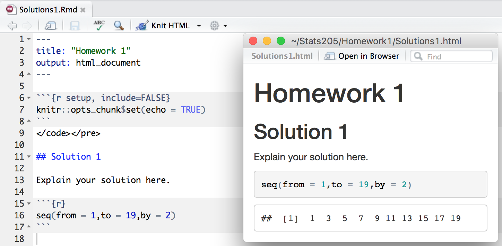

```{r setup, include=FALSE}
knitr::opts_chunk$set(echo = TRUE)
```

## Stats 205

* You can find everything on our course website: http://christofseiler.github.io/stats205/
* Homework every 8 days (send solutions to TA's)
* Midterm and finals will be a project
* Instructor's office hours: Wednesdays 10:00 to 11:30 in Sequoia Hall 105
* TA's Office hours: 2 x 1.5 hours (time and place will be announced)

## Why?

1. Few assumptions about underlying populations from which data is obtained,  
  e.g. populations don't need to follow a normal distribution
2. Often easier to understand and apply than parametric tests
3. Slightly less efficient than parametric test when parametric assumptions hold, but  
  if assumptions don't hold then wildly more efficient  
4. Can be used in many practical situations where theory is intractable
5. Bayesian methods are available so prior information can be incorporated

## Goals

### Overview

* Get an overview of classical, Bayesian, and modern methods
* Learn how to implement methods yourself and use existing R packages
* Be aware and understand underlying assumptions
* Apply to modern data analysis problems that you care about

## Goals

### Specific learning goals

The students will learn to apply methods and explain the statistical assumptions of 

1. Monte Carlo simulations for analytically intractable problems
2. rank-based methods for parameter estimation, confidence intervals, and hypothesis testing
3. permutations test for hypothesis testing
4. the bootstrap for confidence intervals

## Textbooks

* Our main textbook with lots of practical computations in R [(Stanford library link)](https://searchworks.stanford.edu/view/10718635):  
Kloke and McKean (2015). Nonparametric Statistical Methods Using R

* In-depth coverage of the bootstrap with lot of examples:  
Efron and Tibshirani (1994). An Introduction to the Bootstrap

## More Textbooks

* A Bayesian view [(Stanford library link)](https://searchworks.stanford.edu/view/11351113):  
Müller, Quintana, Jara, and Hanson (2015). Bayesian Nonparametric Data Analysis

* Very comprehensive covering most of the material of the previous books [(Stanford library link)](https://searchworks.stanford.edu/view/10356739):  
Hollander and Wolfe, and Chicken (2013). Nonparametric Statistical Methods

* Classical textbook for rank-based method with lot of mathematical details:  
Lehmann (2006). Nonparametrics Statistical Methods Based on Ranks

## Grading: Homework and Projects

* Weekly homework assignments (40%), mostly R exercises
* Class participation (10%)
* Project (50%)

* Goal of project: Write a paper on 
    * applying nonparametric statistics to your field of interest or 
    * study one particular theoretical aspects that your care about

## Grading: Details on Projects

The project will be split in two parts:

1. Midterm project (3 pages with references) (10%):
    + Project proposal and outline of planned tasks 

2. Final project (12 pages plus references) (40%):
    + A theoretical part: Explanation of the method studied and its properties
    + A computational part: Preferably in R
    + A data-analysis part: Plots and interpretations

## Modern Statistics

To quote Andrew Gelman [(source)](http://arxiv.org/pdf/1001.2968.pdf):

``
"If you wanted to do foundational research in statistics in the mid-twentieth century, you had to be bit of a mathematician, ... if you want to do statistical research at the turn of the twenty-first century, you have to be a computer programmer."
``

## History of Nonparametric Statistics

Check on Google Ngram Viewer.

```{r warning = FALSE,echo = FALSE,eval = TRUE}
library(ggplot2)
library(ngramr)
ng = ngram(c("Nonparametric Statistics"), year_start = 1950)
ggplot(ng, aes(x=Year, y=Frequency, colour=Phrase)) + geom_line()
```

## History 1930's to 1970's

* Beginning of nonparametric statistics (Hotelling and Pabst 1936)
* Wilcoxon (1945) introduced the two-sample rank sum test for equal sample sizes, and Mann and Whitney (1947) generalize it
* Pitman (1948), Hodges and Lehmann (1956), and Chernoff and Savage (1958) showed desirable efficiency properties
* Jackknife, introduced by Quenouille (1949) as a bias-reduction technique and extended by Tukey (1958, 1962) to provide approximate significance tests and confidence intervals
* Hodges and Lehmann (1963) showed how to derive estimators from rank tests and established that these estimators have desirable properties
* Cox (1972) model and methods for survival analysis

## History 1970’s to Now

Efron’s (1979) bootstrap makes use of increasing computational resources to provide standard errors and confidence intervals where difficult, if not impossible, to use a parametric approach

Some examples from special issue of Statistical Science (Randles, Hettmansperger, and Casella, 2004):

* Robust analysis of linear models (McKean, 2004)
* Density estimation (Sheather, 2004)
* Data modeling via quantile methods (Parzen, 2004)
* Kernel smoothers (Schucany, 2004)
* Permutation-based inference (Ernst, 2004)
* Multivariate signed rank tests in time series problems (Hallin and Paindaveine, 2004)
* Generalizations for nonlinear manifolds (Patrangenaru and Ellingson 2015)

## Bayesian History

* Ferguson (1973) introduced nonparametric Bayesian methods
* Susarla and van Ryzin (1976) derived nonparametric Bayesian estimators of survival curves
* Dykstra and Laud (1981) developed a Bayesian nonparametric approach to reliability
* Hjort (1990b) proposed nonparametric Bayesian estimators to model the cumulative hazard
* In the late 1980s and the 1990s, there was a surge of activity in Bayesian methods due to the Markov chain Monte Carlo (MCMC) methods, e.g. Gelfand and Smith (1990), Gamerman (1991), West (1992), Smith and Roberts (1993), and Arjas and Gasbarra (1994)
* Key algorithms for developing and implementing modern Bayesian methods include the Metropolis-Hastings-Green algorithm (see Metropolis et al. (1953), Hastings (1970), and Green (1995)) and the Tanner-Wong (1987) data augmentation algorithm

# R and R Markdown Basics

## For This Course

During this course will write a lot of R code and run computer simulations.
All my examples and homework will be written in R. 
Choosing R for your homework solutions is highly recommended.

What is R:

- R is an interpreted programming language, which means you will not have to compile your code. 
- R is very interactive, which means that you can play around with vectors and matrices, plot results.
- To keep track of your progress and to be able to construction your analysis steps, we will use R markdown. 
- R markdown is a format to make web reports that you can share with your collaborators.

## Vectors

Make a vector:

```{r}
x = c(11,218,123,36,1001)
y = rep(1,5)
z = seq(1,5,by=1)
x + y
z + 10
```

## Operations on Vectors

Some operations:

```{r}
sum(y)
c(mean(z),sd(z))
length(z)
```

## Coin Tossing

And most importantly there is a lot of functions for statistics. 

Like tossing a coin three times:

```{r}
set.seed(1)
coin = c('H','T')
samples = sample(coin,100,replace = TRUE)
```

Should come about half of the times head:

```{r}
sum(samples == 'H')
```

## Matrices

We can combine vectors of the same type into matrices.

```{r}
X = cbind(x,y,z)
X
```

## Data Frames

Data frames are used to combine variables of different types in one object.

```{r}
subjects = c('Jim','Jack','Joe','Mary','Jean')
sex = c('M','M','M','F','F')
score = c(85,90,75,100,70)
D = data.frame(subjects,sex,score)
D
```

## Generating Random Data

R provides a wide variety of distributions that we can sample from. All the ones we know from intro stats courses. For instance the normal distribution:

```{r}
z = rnorm(1000)
mean(z)
sd(z)
```

## Basic Plotting

Plotting the sample from last slide.

```{r}
hist(z,breaks=30)
```

## Fancy Plotting

The ggplot2 package is very popular to make more sophisticated plots.

```{r}
library(ggplot2)
```

You will have to learn the grammar of ggplot. There are many tutorials online. Here is one example [link](http://www.cookbook-r.com/Graphs/). 

Let's see how it looks like in action on sleep study data.

```{r}
library(Lock5Data)
data(SleepStudy)
```

## Fancy Plotting

```{r eval=TRUE,echo=TRUE}
ggplot(SleepStudy, aes(x=Drinks,y=GPA)) + 
  geom_point(position=position_jitter(w=0.1,h=0)) +
  geom_smooth() + xlab('number of alcoholic drinks per week')
```

## Repeated Tasks

In addition to the usual ``for`` loops are R provides ``apply`` and ``tapply`` functions.

```{r}
X
apply(X,1,mean)
apply(X,2,mean)
```

## Repeated Tasks

```{r}
D
tapply(D$score,D$sex,mean)
```

## User Defined Functions

To define your own functions:

```{r}
mSummary = function(x) {
  q1 = quantile(x,.25)
  q3 = quantile(x,.75) 
  list(med=median(x),iqr=q3-q1)
}
xsamp = 1:13
mSummary(xsamp)
```

## Monte Carlo Simulations

Generate a matrix with 100 rows and 10 columns elements drawn from a normal distribution:
```{r}
X = matrix(rnorm(10*100),ncol=10)
```

Each row is a distinct sample of size 10. The sample mean of each sample is
```{r}
xbar = apply(X,1,mean)
```

and the variance of the sample means is 
```{r}
var(xbar)
```
compare to theoretical result $\frac{\sigma^2}{n} = 0.1$

## R Packages

In addition to the base functionality, there are thousands of packages available. 
This is the command for installing the package ``bootstrap``:

```{r eval=FALSE}
install.packages("bootstrap")
```

once installed, you can use it in your code:

```{r}
library(bootstrap)
data(law)
head(law)
```

## Homework with R Markdown

```{r, out.width = 800, fig.retina = NULL, echo=FALSE}

```
