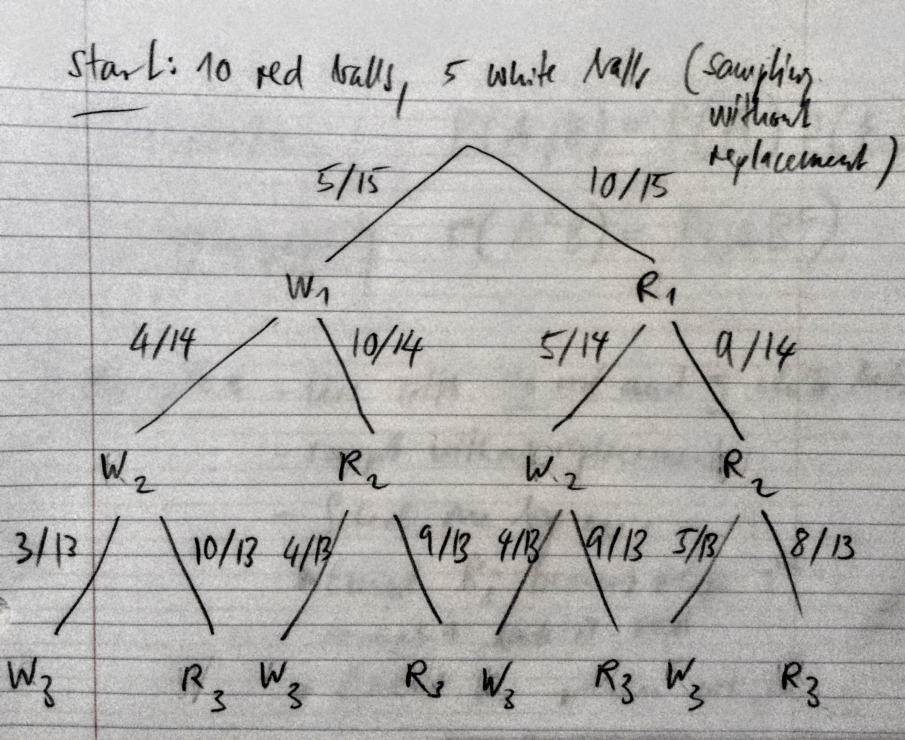
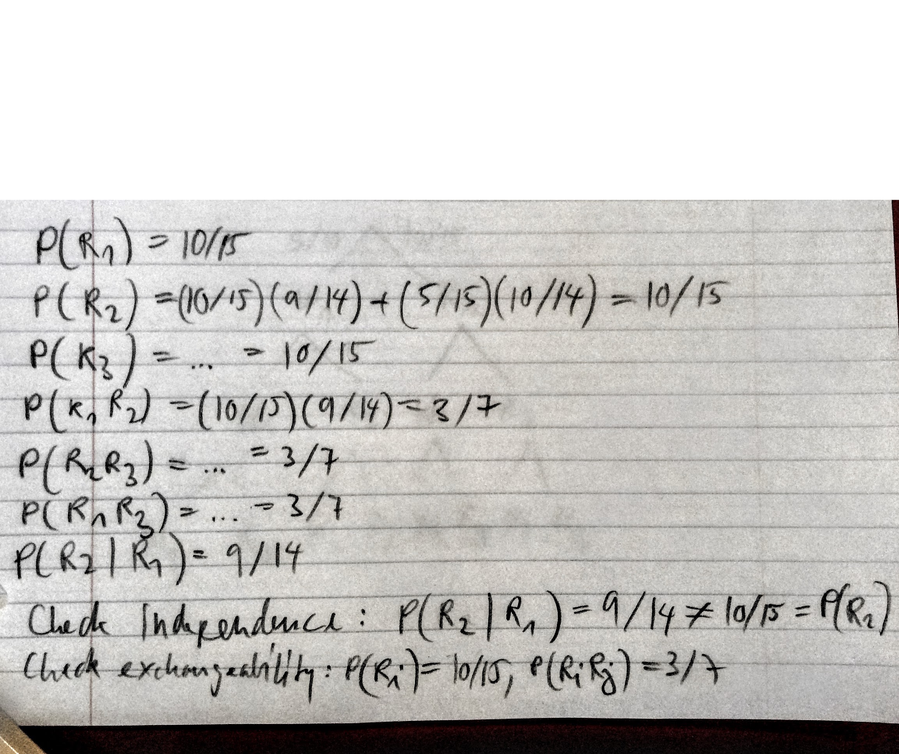
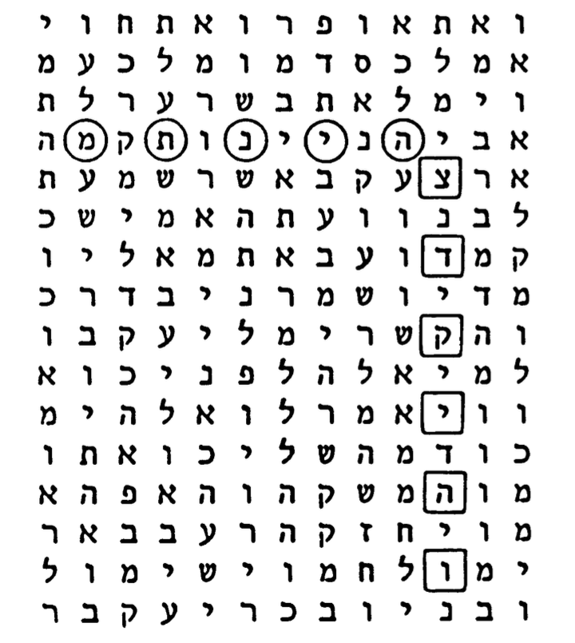
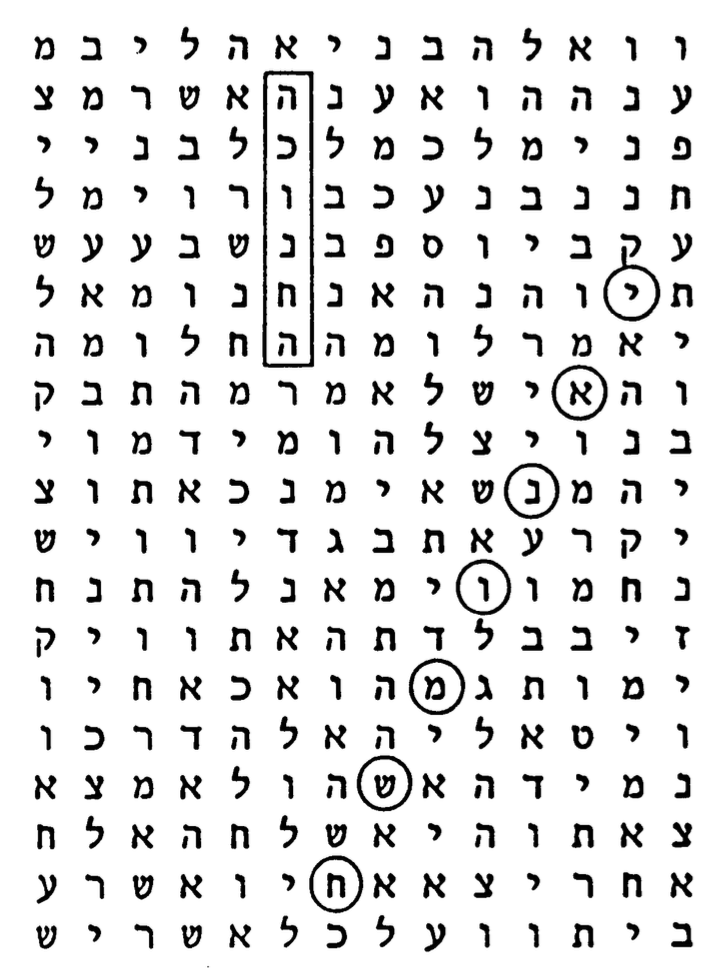
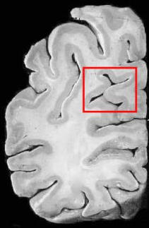
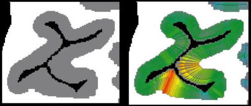
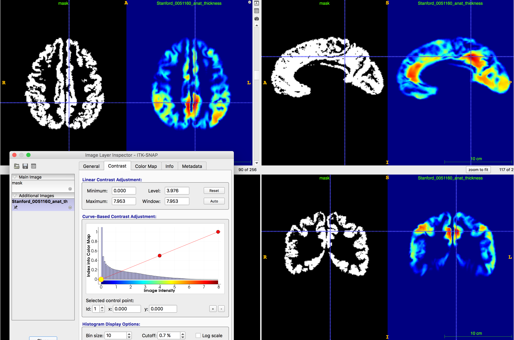
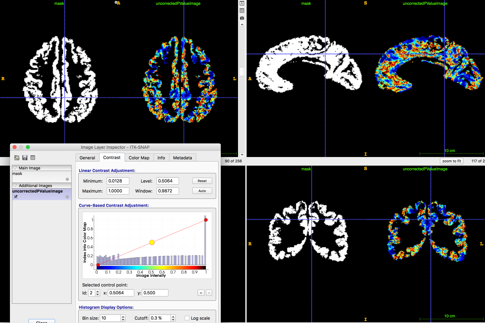

```{r setup, include=FALSE}
knitr::opts_chunk$set(echo = FALSE)
set.seed(1234)
library(ggplot2)
library(HistData)
```

## Exchangeablility

* An infinite sequence $X_1,\dots,X_n,\dots$ of random variables is said to be exchangeable if for all $n = 2,3,\dots$,
$$X_1,\dots,X_n \overset{d}{=} X_{\pi(1)},\dots,X_{\pi(n)} \text{ for all } \pi \in S(n)$$
where $S(n)$ is the group of permutations of $\{1,\dots,n\}$
* For example, for a binary sequence, we may have:
$$p(1,1,0,0,0,1,1,0) = p(1,0,1,0,1,0,0,1)$$
* If $X_1,\dots,X_n,\dots$ are independent and identically distributed, they are exchangeable, but not conversely

## Polya's Urn

* Consider an urn with $b$ black balls and $w$ white balls 
* Draw a ball at random and note its colour
* Replace the ball together with $a$ balls of the same colour
* Repeat the procedure ad infinitum
* Let $X_i =1$ if the $i$th draw yields a black ball and $X_i = 0$ otherwise
* The sequence $X_1,\dots,X_n,\dots$ is exchangeable:
$$ 
\begin{align}
p(1,1,0,1) & = \frac{b}{b+w} \frac{b+a}{b+w+a} \frac{w}{b+w+2a} \frac{b+2a}{b+w+3a} \\
           & = \frac{b}{b+w} \frac{w}{b+w+a} \frac{b+a}{b+w+2a} \frac{b+2a}{b+w+3a} = p(1,0,1,1)
\end{align}
$$
* $X_1,\dots,X_n,\dots$ are not independent
        
<!--
## Assumption: Exchangeable Observations

* A sufficient condition for permutation test is exchangeable of observations
* Consider a collection of random variables 
$$ X_1,\dots,X_n $$
* If their joint distribution are equal under all possible permuations $\pi$
$$ P\left( X_1=x_1,\dots,X_n=x_1 \right) = P \left( X_{\pi(1)}=x_1,\dots,X_{\pi(n)}=x_n \right)$$
for any sequence of possible values $x_1,\dots,x_n$, 
* then $X_1,\dots,X_n$ are called exchangable 
* This is a weaker assumption than indepdendence of observations in the combined sample

## Example: Exchangeability and Independence

* Consider an urn containing $r$ red balls and $b$ blue balls
* Experiment: 
    * draw a ball
    * note color of ball
    * replace ball back in urn along with $c$ additional balls of same color
    * denote event of observing a red ball at i$th$ trial as $R_i$ and blue $B_i$
    * then observing to red balls in three draws is same regardless of the sequence it is observed:
$P(B_1,R_2,R_3) = P(B_1) P(R_2|B_1) P(R_3|R_2,B_1) = \frac{b}{r+b} \frac{r}{r+b+c} \frac{r+c}{r+b+c}$
$P(R_1,B_2,R_3) = P(R_1) P(B_2|R_1) P(R_3|B_2,B_1) = \frac{r}{r+b} \frac{b}{r+b+c} \frac{r+c}{r+b+c}$
$P(R_1,R_2,B_3) = P(R_1) P(R_2|R_1) P(B_3|R_2,B_1) = \frac{r}{r+b} \frac{r+c}{r+b+c} \frac{b}{r+b+c}$
* The probability only depends on the number of events observed

## Example: Exchangeability and Independence

<div class="columns-2">
```{r, out.height = 400, fig.retina = NULL, echo=FALSE}

```

```{r, out.height = 400, fig.retina = NULL, echo=FALSE}

```
</div>
-->

## Exchangeability and de Finetti's Theorem

* Suppose $X_1,\dots,X_n$ are conditionally i.i.d. given some unknown parameter $\theta$ 
* Then for any permutation $\pi$ of $\{1,...,n\}$ and any set of values $(x_1,\dots,x_n)$
* $X_i$'s are conditionally i.i.d. 
$$f(x_1,\dots,x_n) = \int f(x_1,\dots,x_n | \theta) p(\theta) d\theta = \int \left( \prod_{i=1}^n f(x_i|\theta) \right) p(\theta) d\theta$$
* product does not depend on order:
$$= \int \left( \prod_{i=1}^n f(x_{\pi(i)} | \theta) \right) p(\theta) d\theta = f\left( x_{\pi(i)},\dots,x_{\pi(n)} \right)$$

## Exchangeability and de Finetti's Theorem

* This means:
$$ 
X_1,\dots,X_n \text{ are exchangeable for all $n$ }
\Leftarrow
\begin{cases}
X_1,\dots,X_n \, \big| \, \theta \text{ i.i.d. } \\
\theta \sim p(\theta)
\end{cases}
$$

* In the other direction:
    * de Finetti showed in 1931 that all infinite exchangeable binary sequences are mixtures of Bernoulli sequences
    * Hewitt and Savage (1955) generalized de Finetti's result, the main idea can be summarized
    * Diaconis and Freedman (1980) generalized it to finite sequences of random variables

## Example: Letter Sequences in Bible

* Suppose we have text written in foreign language
* We are asked whether text is meaningful or meaningless
* We have very limitted partial dictionary: e.g. umbrella and rain
* Can we decide using this limited dictionary whether text is meaningful?
* Check whether conceputally related words appear in close proximity
* If text is meaningless, we don't expect this to happen very often
* If text is meaningful, we expect this to happen more often than by pure chance

## Example: Letter Sequences in Bible

<div class="columns-2">
```{r, out.height = 400, fig.retina = NULL, echo=FALSE}

```

```{r, out.height = 400, fig.retina = NULL, echo=FALSE}

```
</div>
Source: Witztum, Rips, and Rosenberg (1994). Equidistant Letter Sequences in the Book of Genesis

## Example: Letter Sequences in Bible

* Write bible text as a big two-dimensional array of letters ignoring spaces (fix line width)
1. Define distance between two words $w$ and $w'$: Euclidean distance $d(w,w') =$  
squared distance between consecutive letters of $w$ +  
squared distance between consecutive letters of $w'$ +  
minimal distance between a letter from $w$ and $w'$
2. Define a statistic: Average distance between a set of predefined word pairs calculated over the entire text
3. Choose word pair list: From other book (Encyclopedia of Great Men in Israel): 32 Rabbi names and their birthdays
4. Compute null distribution of average distance between all the word pairs using permutations

## Example: Letter Sequences in Bible

* They computed $p$-value using $999\,999$ random name--birthday permutations (from the total of $32!$ permutations to assign $i$th name of Rabbi to randomly permuted birthday)
* Rank the observed statistics among the permutatations
* They rejected the null hypothesis that the name--birthday are not close with $p$-value $0.00002$
* For more details see: Witztum, Rips, and Rosenberg (1994). Equidistant Letter Sequences in the Book of Genesis

## Example: Final Project on Autistic Brain

* We encouter two-sample problems in many modern applications.
    * Compare two populations, such as people who are autistic and healthy controls
    * Find morphological, connectivity, and functional difference 
    * Inform new therapies and cures
* We work on preprocessed neuroimaging data from the Autism Brain Imaging Data Exchange (ABIDE). 
The data is openly avaialbe on the ABIDE [website](http://preprocessed-connectomes-project.org/abide/).
    * ABIDE is a collaboration of 16 international imaging sites that have aggregated 
    * Open sharing neuroimaging data from 539 individuals suffering from ASD and 573 typical controls
    * We will use a subset of 39 paricipants to speedup our analysis

## Data: Cortical Thickness Measurements

```{r, out.height = 400, fig.retina = NULL, echo=FALSE}
knitr::include_graphics("Brain_Cortex_Harvard.png")
```

Source: [multiple-sclerosis-research.blogspot.com](http://multiple-sclerosis-research.blogspot.com/2015/01/education-whats-mri.html)

## Data: Cortical Thickness Measurements

<div class="columns-2">
```{r, out.height = 400, fig.retina = NULL, echo=FALSE}

```

```{r, out.height = 200, fig.retina = NULL, echo=FALSE}

```
</div>

Source: Das, Avants, Grossman, and Gee (2009). Registration based cortical thickness measurement

----

```{r, out.height = 700, fig.retina = NULL, echo=FALSE}

```

## Data Preprocessing: Image Registration

```{r, out.height = 250, fig.retina = NULL, echo=FALSE}
knitr::include_graphics("TemplateDeformations.pdf")
```

* Analyze geometric difference through deformation
* Find deformations $\varphi_k$ from template $\boldsymbol{I}_0$ to participant images $\boldsymbol{I}_k$

## Data Preprocessing: Image Registration

* Parametrize $\varphi_k(x,\boldsymbol{q})$  with B-Splines (coordinates $x_i \in \boldsymbol{I}_0$, parameters $\boldsymbol{q}$)
$$\sum_{i=1}^N \left( \boldsymbol{I}_k(x_i) \circ \varphi_k(x_i,\boldsymbol{q}) - \boldsymbol{I}_0(x_i) \right)^2 + \| \operatorname{Jac} \varphi_k(x_i,q) \|_{\ell_2}^2$$
* minimize this with fixed $\lambda$
$$\widehat{\boldsymbol{q}} = \operatorname{minimize}_\boldsymbol{q} \Big\{ \operatorname{Similarity}(\boldsymbol{I}_0,\boldsymbol{I}_k,\boldsymbol{q}) + \lambda \operatorname{Regularity}(\boldsymbol{q}) \Big\}$$

----

```{r, out.height = 600, fig.retina = NULL, echo=FALSE}
knitr::include_graphics("RegistrationElipsoidToCircle/Page1.pdf")
```

----

```{r, out.height = 600, fig.retina = NULL, echo=FALSE}
knitr::include_graphics("RegistrationElipsoidToCircle/Page2.pdf")
```

----

```{r, out.height = 600, fig.retina = NULL, echo=FALSE}
knitr::include_graphics("RegistrationElipsoidToCircle/Page3.pdf")
```

----

```{r, out.height = 600, fig.retina = NULL, echo=FALSE}
knitr::include_graphics("RegistrationElipsoidToCircle/Page4.pdf")
```

----

```{r, out.height = 600, fig.retina = NULL, echo=FALSE}
knitr::include_graphics("RegistrationElipsoidToCircle/Page5.pdf")
```

----

```{r, out.height = 600, fig.retina = NULL, echo=FALSE}
knitr::include_graphics("RegistrationElipsoidToCircle/Page6.pdf")
```

----

```{r, out.height = 600, fig.retina = NULL, echo=FALSE}
knitr::include_graphics("RegistrationElipsoidToCircle/Page7.pdf")
```

----

```{r, out.height = 600, fig.retina = NULL, echo=FALSE}
knitr::include_graphics("RegistrationElipsoidToCircle/Page8.pdf")
```

----

```{r, out.height = 600, fig.retina = NULL, echo=FALSE}
knitr::include_graphics("RegistrationElipsoidToCircle/Page9.pdf")
```

----

```{r, out.height = 600, fig.retina = NULL, echo=FALSE}
knitr::include_graphics("RegistrationElipsoidToCircle/Page10.pdf")
```

----

```{r, out.height = 600, fig.retina = NULL, echo=FALSE}
knitr::include_graphics("RegistrationElipsoidToCircle/Page11.pdf")
```

----

```{r, out.height = 600, fig.retina = NULL, echo=FALSE}
knitr::include_graphics("RegistrationElipsoidToCircle/Page12.pdf")
```

----

```{r, out.height = 600, fig.retina = NULL, echo=FALSE}
knitr::include_graphics("RegistrationElipsoidToCircle/Page13.pdf")
```

----

```{r, out.height = 600, fig.retina = NULL, echo=FALSE}
knitr::include_graphics("RegistrationElipsoidToCircle/Page14.pdf")
```

----

```{r, out.height = 600, fig.retina = NULL, echo=FALSE}
knitr::include_graphics("RegistrationElipsoidToCircle/Page15.pdf")
```

----

```{r, out.height = 600, fig.retina = NULL, echo=FALSE}
knitr::include_graphics("RegistrationElipsoidToCircle/Page16.pdf")
```

----

```{r, out.height = 600, fig.retina = NULL, echo=FALSE}
knitr::include_graphics("RegistrationSpine/Page1.pdf")
```

----

```{r, out.height = 600, fig.retina = NULL, echo=FALSE}
knitr::include_graphics("RegistrationSpine/Page20.pdf")
```

----

```{r, out.height = 600, fig.retina = NULL, echo=FALSE}
knitr::include_graphics("RegistrationSpine/Page40.pdf")
```

## Data Analysis: Voxelwise Hypothesis Testing

Split the data in two groups: autistic (1) and healthy participants (2).

```{r echo=TRUE,eval=FALSE}
PaInfo <- read.csv("Phenotypic_V1_0b_preprocessed1.csv", header=TRUE)
copiedFilesInd = PaInfo$FILE_ID %in% substr(fileNames,1,16)
copiedFilesGroup = PaInfo$DX_GROUP[copiedFilesInd]
ThicknessAutistic = brainMatrix[copiedFilesGroup==1,mask==1]
ThicknessHealthy = brainMatrix[copiedFilesGroup==2,mask==1]
```

Peform voxelwise nonparametric test Wilcoxon two-sample rank test.

```{r echo=TRUE,eval=FALSE}
uncorrectedPValues = sapply(1:dim(ThicknessAutistic)[2], 
                            function(i) 
                              wilcox.test(ThicknessAutistic[,i],
                                          ThicknessHealthy[,i],
                                          alternative = "two.sided")$p.value)
```

----

```{r, out.height = 700, fig.retina = NULL, echo=FALSE}

```

## Data Analysis: Clusterwise Significance

* One could now proceed and correct for multiple comparisons using Gaussian random field theory or controlling the false discorvery rate
* An alternative options is to use permutations tests
* The idea (do the following $N$ times):
    * Permute group assignments
    * Compute voxelwise $p$-value
    * Threshold $p$-value image at fixed level (say $0.001$)
    * Note largest contiguous voxel clusters
* This forms our null distribution of largest contiguous voxel clusters
* Declare unpermuted observed clusters as significant when larger than $\operatorname{floor}(\alpha \times N + 1)$ in permutation distribution

## Data Analysis: Clusterwise Significance

* This approach comes at the price of reduced localization power
* The null hypotheses for voxels within a significant cluster are not tested, so individual voxels cannot be declared significant.
* Only the omnibus null hypothesis for the cluster can be rejected
* Further, the choice of primary threshold dic- tates the power of the test in detecting different types of deviation from the omnibus null hypothesis
* With a lowthreshold,largesuprathresholdclustersaretobe expected, so intense focal "signals" will be missed
* At higher thresholds these focal activations will be detected, but lower intensity diffuse "signals" may go undetected below the primary threshold.

## References

* Diaconis and Freedman (1980). Finite exchangeable sequences
* de Finetti (1972). Probability Induction and Statistics
* Hewitt and Savage (1955). Symmetric measures on Cartesian products
* Peter Hoff (2009). A First Course in Bayesian Statistical Methods
* Good (2005). Permutations, Parametric, and Boostrap Test of Hypothesis
* Witztum, Rips, and Rosenberg (1994). Equidistant Letter Sequences in the Book of Genesis
* Nichols and Holmes (2001). Nonparametric Permutation Tests For Functional Neuroimaging: A Primer with Examples
* Das, Avants, Grossman, and Gee (2009). Registration Based Cortical Thickness Measurement
* Steffen Lauritzen (2007). [Lecture notes](http://www.stats.ox.ac.uk/~steffen/teaching/grad/definetti.pdf)
