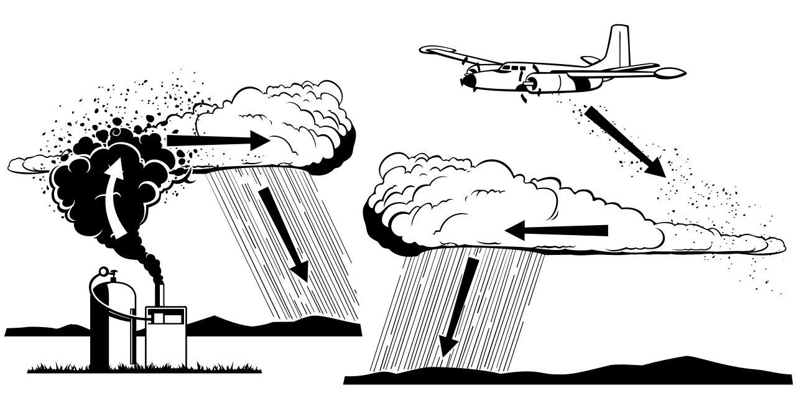
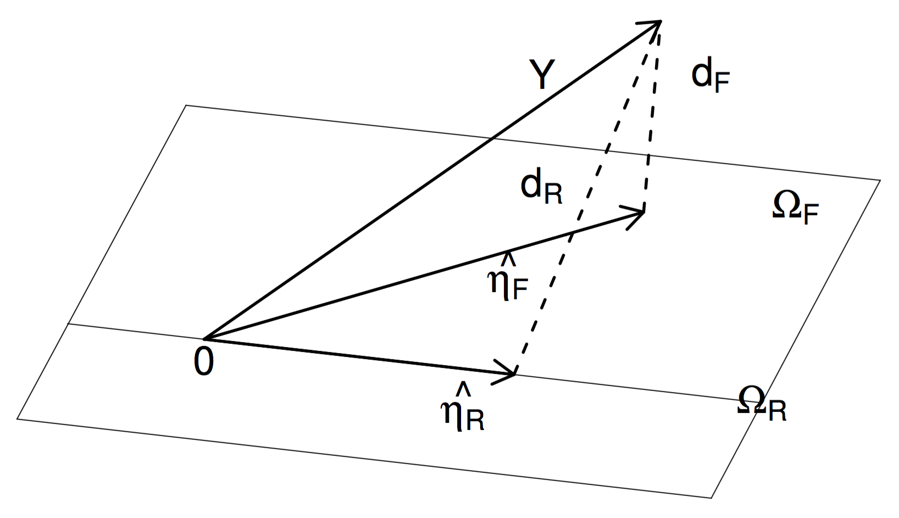

```{r setup, include=FALSE}
knitr::opts_chunk$set(echo = FALSE)
set.seed(1234)
library(ggplot2)
library(Rfit)
library(npsm)
```

## Overview

* Smoothing or estimating curves
    * Density Estimation
    * Non-linear regression
* Rank-based linear regression

## Curve Estimation

* A curve of interest can be a probability density function $f$ or a regression function $r$
* In density estimation, we observe $X_1,\dots,X_n$ from some unknown cdf $F$ with density $f$
$$ X_1,\dots,X_n \sim f $$
and the goal is to estimate density $f$
* In regression, we observe pairs $(x_1,Y_1),\dots,(x_n,Y_n)$ that are related as
$$ Y_i = r(x_i) + e_i $$
with $E(e_i) = 0$, and the goal is to estimate the regression function $r$

## Density Estimation

```{r fig.width=10,fig.height=5}
dat <- data.frame(cond = factor(rep(c("A","B"), each=200)), 
                   rating = c(rnorm(200),rnorm(200, mean=.8)))
ggplot(dat, aes(x=rating)) + 
  geom_histogram(aes(y=..density..),binwidth=.1,colour="black", fill="white") +
  geom_density(alpha=.2, fill="#FF6666")
```

## Non-Linear Regression

```{r fig.width=10,fig.height=5}
data(poly)
x = poly[,1]
y = poly[,2]
plot(y~x,xlab=expression(x),ylab=expression(y))
title("Bandwidth 0.5")
lines(ksmooth(x,y,"normal",0.5),lwd=2,col="red")
```

## Rank-Based Linear Regression

* But today, we focus on linear regression
* We generalize rank-based methods from two-sample location problems to general linear models

## Linear Regression in Two-Sample Problem

* Recall that we framed the two-sample location problem as a regression problem
* Combine sample in one vector $\boldsymbol{Z} = (X_1,\dots,X_{n_1},Y_1,\dots,Y_{n_2}^T)$
* Let $\boldsymbol{c}$ be a $n \times 1$ vector with 
    * zeros at position $1$ to $n_1$ and 
    * ones at positions $n_1+1$ to $n$
* Then we can rewrite the location model as
$$Z_i = \alpha + c_i \Delta + e_i$$
where $e_1,\dots,e_n$ are iid with pdf $f(t)$

## Rank-Based Linear Regression

```{r message=FALSE,fig.width=10,fig.height=5}
data(engel)
plot(engel)
abline(rfit(foodexp~income,data=engel))
abline(lm(foodexp~income,data=engel),lty=2)
legend("topleft",c('R','LS'),lty=c(1,2))
```

## Test for Slope

* For a single regression model ($i = 1,\dots,n$)
$$ Y_i = \alpha + \beta x_i + e_i $$
* Intercept $\alpha$ and slope $\beta$ are unkown
* Error $e_1,\dots,e_n$ are sample from continous population with median 0
* Theil (1950) tested for: $H_0: \beta = \beta_0$
* Which means for every unit increase in the value of the independent (predictor) variable $x$, we expect an increase (or decrease, depending on the sign) of the dependent (response) varibale $Y$

## Test for Slope

* Difference 
$$D_i = Y_i - \beta_0 x_i \hspace{1cm}\text{for}\hspace{1cm} n = 1,\dots,n$$
* Let 
$$C = \sum_{i=1}^{n-1} \sum_{j=i+1}^n \operatorname{sign}(D_j - D_i)$$

## Test for Slope

* Motivation for the Test:
$$ D_j - D_i = Y_j - \beta_0 x_j - (Y_i - \beta_0 x_i) = Y_j - Y_i + \beta_0 (x_i - x_j)$$
* under null the median of $Y_j - Y_i = \beta(x_j - x_i) + (e_j - e_i)$ is $\beta (x_j - x_i)$
* under null the median of $D_j - D_i$ is $\beta (x_j - x_i) + \beta_0 (x_j - x_i) = (\beta - \beta_0)(x_j - x_i)$
* hence, we tend to obtain positive $D_j - D_i$ difference when $\beta > \beta_0$ which leads to large $C$
* The statistics $C$ is the Kendall's correlation statistics, and can be interpreted as a test for correlation between $x$ and $Y$

## Test for Slope (Example)

```{r, out.height = 400, fig.retina = NULL, echo=FALSE}

```

* Smith (1967) described experiment in Australia on cloud seeding
* To investigate impact of cloud seeding on rainfall

## Test for Slope (Example)

* Two area on montain served as target and control
* During any period a random process was used to determine whether to clouds over the target area should be seeded
* The effect of seeding was measured by double ratio 
$$\frac{T/Q \text{ (seeded)}}{T/Q \text{ (unseeded)}}$$
* $T$ total rainfalls in the target areas
* $G$ total rainfalls in the control areas
* Slope parameter $\beta$ represenents the rate of change in $Y$ (double ratio) per unit change in $x$ (year)
* Test $H_0: \beta = 0$ versus $H_A: \beta \ne 0$ (seeding no impact on rainfall)

## Test for Slope (Example)

Data collected over 5 years:
```{r}
year = 1:5
doubleRatio = c(1.26,1.27,1.12,1.16,1.03)
df = data.frame(year=year,doubleRatio=doubleRatio)
df
```

Under the null $\beta_0 = 0$ we have $D_i = Y_i$:

## Test for Slope (Example)

```{r}
pairs = t(combn(5,2))
diff = doubleRatio[pairs[,2]]-doubleRatio[pairs[,1]]
df = data.frame(i=pairs[,1],j=pairs[,2],D=diff,signD=sign(diff))
df
```

```{r echo=TRUE}
C = sum(sign(diff)); C
```

## Test for Slope (Example)

```{r echo = TRUE}
ken = cor.test(year,doubleRatio,method="kendall",alternative = "two.sided")
ken$p.value
```

No evidence for cloud seeding impacting rainfall

## Correlation

* In a simple linear regression setting as before, we have reponse variable $Y$ predictor variable $X$, and the fit of the model is of main interest
* Often, we want to predict random variable $Y$ from $x$ and we treat $x$ as nonstochastic
* In correltaion analysis, we consider random pairs $(X,Y)$, and the strength of of a relationship or association between $X$ and $Y$ is of main interest
* No association means that $X$ and $Y$ are independent:  
$$ H_0: X \text{ and } Y \text{ are independent versus } H_A: X \text{ and } Y \text{ are dependent} $$
* We assume that $(X,Y)$ is a continuous random vector with cdf $F(x,y)$ and pdf $f(x,y)$
* Recall that $X$ and $Y$ are independent if their joint cdf factors into the product of marginals cdfs
$$ F(x,y) = F_X(x) F_Y(y) $$

## Correlation

* Last week, we discussed $\chi^2$ goodness-of-fit test for discrete random variables
* In the discrete case, independence was $P(X=x,Y=y) = P(X=x) P(Y=y)$ for all $x$ and $y$
* In the continuous case, we have the Pearson's measure of association and two popular nonparametric measures (Kendall and Spearman)
* Random sample $(X_1,Y_1),\dots,(X_n,Y_n)$

## Pearson's Correlation Coefficient

* The traditional correlation coefficient
$$ \rho = \frac{ E\left( (X - \mu_X) (Y - \mu_Y) \right)}{\sigma_X \sigma_Y} $$
* Measure of linear association 
* Note that if $X$ and $Y$ are independent then $\rho = 0$
* And if $\rho \ne 0$ then are dependent

## Pearson's Correlation Coefficient

* The numenator is estimated by the sample covariance 
* The denominator is estimated by the product of sample standard deviations
$$ r = \frac{n^{-1} \sum_{i=1}^n (X_i- \bar{X} )(Y_i-\bar{Y})}{\sqrt{\sum_{i=1}^n(X_i-\bar{X})^2 \cdot \sum_{i=1}^n (Y_i-\bar{Y})^2}} $$
* The estimate of the correlation coefficient is directly related to simple least squares regression
* Let $\widehat{\sigma}_x$ and $\widehat{\sigma}_y$ denote the respective sample standard deviations of $X$ and $Y$, then
$r = \frac{ \widehat{\sigma}_x }{ \widehat{\sigma}_y } \widehat{\beta}$
* $\widehat{\beta}$ is least squares estimate of slope in simple regression of $Y_i$ on $X_i$
* Under the null $\sqrt{n} r$ is asymptotically normal

## Kendall's $\tau_K$

* Kendall's $\tau_K$ is a measure of monotonicity between X and Y
* Let two pairs of random variables $(X_1,Y_1)$ and $(X_2,Y_2)$ be independent random vectors with the same distribution as $(X,Y)$
* The pairs $(X_1,Y_1)$ and $(X_2,Y_2)$ are *concordant* or *discordant* if
$$ \operatorname{sign}\{ (X_1-X_2)(Y_1-Y_2) \} = 1 \hspace{1cm}\text{or}\hspace{1cm} \operatorname{sign}\{ (X_1-X_2)(Y_1-Y_2) \} = -1 $$
* Concordant pairs are indicative of increasing monotonicity between $X$ and $Y$
* Discordant pairs indicate decreasing monotonicity
$$ \tau_K = P\left( \text{concordant} \right) - P\left( \text{discordant} \right)$$
* If $X$ and $Y$ are independent then $\tau_K = 0$
* If $\tau_K = 0$ then $X$ and $Y$ are dependent

## Kendall's $\tau_K$

* Using a random sample $(X_1,Y_1),(X_2,Y_2),\dots,(X_n,Y_n)$
* Estimator: count the number of concordant pairs and subtract from that the number of discordant pairs
* In standardized form
$$ \widehat{\tau}_K = {n \choose 2}^{-1} \sum_{i < j} \operatorname{sign} \{ (X_i-X_j)(Y_i-Y_j) \} $$
* Tests of the hypotheses can be based on the exact finite sample distribution

## Spearman $\rho_S$

* Random sample $(X_1,Y_1),(X_2,Y_2),\dots,(X_n,Y_n)$
* Denote by $\operatorname{R}(X_i)$ the rank of $X_i$ among $X_1,X_2,\dots,X_n$
* Denote by $\operatorname{R}(Y_i)$ as the rank of $Y_i$ among $Y_1,Y_2,\dots,Y_n$
* Estimate of $\rho_S$ is the sample correlation coefficient
$$ r_S = \frac{\sum_{i=1}^n \left(\operatorname{R}(X_i)-((n+1)/2))(\operatorname{R}(Y_i)-((n+1)/2)\right)}{n(n^2-1)/12} $$
* We accept $HA:$ $X$ and $Y$ are dependent for large values of $|r_S|$
* This test can be carried out using the exact distribution

## The Geometry of Linear Models

* Setup the following linear model (for $i = 1,\dots,n$)
$$ Y_i = x_i^T \boldsymbol{\beta} + e_i^* $$
where $\boldsymbol{\beta}$ is a $1 \times p$ vector of unkown parameters
* $\boldsymbol{\beta}$ are the parameter of interst
* Center (usually using the median $T(e_i^*) = \alpha$) the errors $e_i = e_i^* - \alpha$
$$ Y_i = \alpha + \boldsymbol{x}_i \boldsymbol{\beta} + e_i$$
* Let $f(t)$ be the pdf of the erros $e_i$
* Assumption: $f(t)$ can be either asymmetric or symmetric depending on whether signs or ranks are used
* The intercept $\alpha$ is independent of the slope $\boldsymbol{\beta}$

## The Geometry of Linear Models

* Let $\boldsymbol{Y} = (Y_1,\dots,Y_n)^T$ denote the $n \times 1$ vector of observations
* Let $\boldsymbol{X}$ denote the $n × p$ matrix with rows $x^T_i$
* Then we can write the linear model in matrix form:
$$ \boldsymbol{Y} = \boldsymbol{1}\alpha + \boldsymbol{X}\boldsymbol{\beta} + \boldsymbol{e} $$
* $\boldsymbol{X}$ is centered (that's fine since we have $\alpha$ in the model), and assume $\boldsymbol{X}$ is full column rank
* Let $\Omega_F$ be the column space spanned by coluns of $\boldsymbol{X}$
* So we can rewrite the linear model as (coordinate-free because not restricited to any specific basis vectors)
$$ \boldsymbol{Y} = \boldsymbol{1}\boldsymbol{\beta} + \boldsymbol{\eta} + \boldsymbol{e} $$
with $\boldsymbol{\eta} = \Omega_F$

## The Geometry of Linear Models

* Now we can estimate $\boldsymbol{\beta}$
* And test hypothesis
$$ H_0: \boldsymbol{M}\boldsymbol{\beta} = 0 \hspace{2cm} H_A: \boldsymbol{M}\boldsymbol{\beta} \ne 0 $$
* $\boldsymbol{M}$ is a $q \times p$ matrix of full rank

## The Geometry of Estimation

$$ \boldsymbol{Y} = \boldsymbol{1}\boldsymbol{\beta} + \boldsymbol{\eta} + \boldsymbol{e} \hspace{1cm}\text{with}\hspace{1cm} \boldsymbol{\eta} = \Omega_F$$

* Task is to minimize some distance between $\boldsymbol{Y}$ and subspace $\Omega_F$
* Think of $\boldsymbol{\eta}$ as a hyperplane and the task as projecting $\boldsymbol{Y}$ onto it
* For the projection we need to define a distance
* Instead of using the usual Euclidean distance, we use a distance based on signs and ranks
$$ \| v_i \|_{\varphi} = \sum_{i=1}^n a(R(v_i)) v_i $$
* with scores $a(1) \le a(2) \le \cdots \le a(n)$ and score function $a(i) = \varphi(i/(n+1))$ 
* $\varphi$ is nondecreasing, centered, standardized and defined on the interval $(0,1)$

## The Geometry of Estimation

* $\|\boldsymbol{v}\|_{\varphi}$ is a pseudo-norm:
    * triangle inequality, non-negative, $\|\alpha \boldsymbol{v}\|_{\varphi} = |\alpha \|\boldsymbol{v}\|_{\varphi}$, and 
    * additionally $\|\boldsymbol{v}\|_{\varphi} = 0$ if and only if $v_1 = \dots = v_n$
* By setting $\varphi_R(u) = \sqrt{12}(u − 1/2)$, we get the Wilcoxon pseudo-norm
* By setting $\varphi_S(u) = \operatorname{sgn}(u − 1/2)$, we get the sign pseudo-norm (equivalent to using the $L_1$ norm)
* In general
$$ D(\boldsymbol{Y},\Omega_F) = \| \boldsymbol{Y} - \widehat{\boldsymbol{Y}}_{\varphi} \|_{\varphi} = \underset{\boldsymbol{\eta \in \Omega_F}}{\min} \| \boldsymbol{Y}-\boldsymbol{\eta} \|_{\varphi} $$

## The Geometry of Estimation

$$\widehat{\boldsymbol{\eta}} = D(\boldsymbol{Y},\Omega_F) = \| \boldsymbol{Y} - \widehat{\boldsymbol{Y}}_{\varphi} \|_{\varphi} = \underset{\boldsymbol{\eta \in \Omega_F}}{\min} \| \boldsymbol{Y}-\boldsymbol{\eta} \|_{\varphi}$$

```{r, out.height = 250, fig.retina = NULL, echo=FALSE}

```
Source: Hettmansperger & McKean (2011)

* Estimate $\widehat{\boldsymbol{\eta}}_{\varphi}$
* Distance between $Y$ and the space $\Omega_F$ is $d_F$
* Reduced model subspace $\Omega_R \subset \Omega_F$

## The Geometry of Estimation

* Written in coordinate form, we can estimate 
$$ D_{\varphi}(\boldsymbol{\beta}) = \| \boldsymbol{Y}-\boldsymbol{X}\boldsymbol{\beta} \|_{\varphi} $$
* $D_{\varphi}(\boldsymbol{\beta})$ is a piecewise linear, continious, and convex function of $\boldsymbol{\beta}$, 
* and the gradient with respect to $\boldsymbol{\beta}$ is given by
$$ \nabla D_{\varphi}(\boldsymbol{\beta}) = \boldsymbol{X}^T \boldsymbol{a}(R(\boldsymbol{Y}-\boldsymbol{X}\boldsymbol{\beta})) $$
with $\boldsymbol{a}(R(\boldsymbol{Y}-\boldsymbol{X}\boldsymbol{\beta})^T = \left( a(R(Y_1-x_1^T\boldsymbol{\beta}),\dots,a(R(Y_n-x_n^T\boldsymbol{\beta}) \right)$
* Our estimate is $\nabla D_{\varphi}(\boldsymbol{\beta}) = 0$

## The Geometry of Testing

```{r, out.height = 250, fig.retina = NULL, echo=FALSE}

```

* $\Omega_R$ is the reduced model space of $\Omega_F$ subject to $H_0$: $\Omega_R = \{ \boldsymbol{\eta} \in \Omega_F: \boldsymbol{\eta} = \boldsymbol{X}\boldsymbol{\beta} \}$
* for some $\boldsymbol{\beta}$ such that $\boldsymbol{M}\boldsymbol{\beta} = 0$
* $RD_{\varphi} = D_{\varphi}(Y,\Omega_R) - D_{\varphi}(Y,\Omega_F)$
* Large values of $RD_{\varphi}$ indicate $H_A$ while small values support $H_0$

## References

* Hettmansperger and McKean (2011). Robust Nonparametric Statistical Methods
* Wassermann (2006). All of Nonparametric Statistics
* Hollander, Wolfe, and Chicken (2014). Nonparametric Statistical Methods
