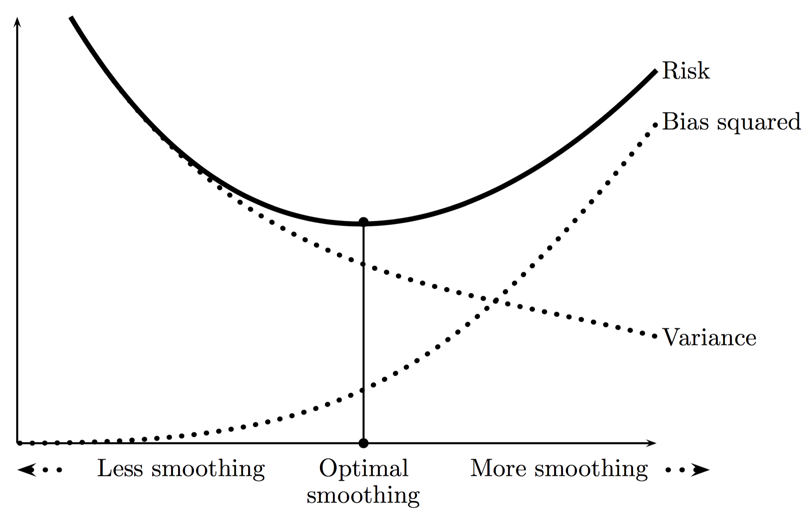

```{r setup, include=FALSE}
knitr::opts_chunk$set(echo = FALSE)
set.seed(1234)
library(ggplot2)
library(ElemStatLearn)
```

## Overview

* Smoothing or estimating curves
    * Density Estimation
    * Nonlinear regression
* Rank-based linear regression

## Curve Estimation

* A curve of interest can be a probability density function $f$
* In density estimation, we observe $X_1,\dots,X_n$ from some unknown cdf $F$ with density $f$
$$ X_1,\dots,X_n \sim f $$
and the goal is to estimate density $f$

## Density Estimation

```{r fig.width=10,fig.height=5}
dat <- data.frame(cond = factor(rep(c("A","B"), each=200)), 
                   rating = c(rnorm(200),rnorm(200, mean=.8)))
ggplot(dat, aes(x=rating)) + 
  geom_histogram(aes(y=..density..),binwidth=.1,colour="black", fill="white") +
  geom_density(alpha=.2, fill="#FF6666")
```

## Non-Linear Regression

* A curve of interest can be a regression function $r$
* In regression, we observe pairs $(x_1,Y_1),\dots,(x_n,Y_n)$ that are related as
$$ Y_i = r(x_i) + e_i $$
with $E(e_i) = 0$, and the goal is to estimate the regression function $r$

## Non-Linear Regression

```{r fig.width=10,fig.height=5}
data(bone)
ggplot(bone, aes(x=age, y=spnbmd, color=gender, shape=gender)) +  geom_point() +
  labs(title = "Bone Mineral Density Data") + labs(x = "Age") + labs(y = "Change in BMD")
```

## Non-Linear Regression

```{r fig.width=10,fig.height=5}
ggplot(bone, aes(x=age, y=spnbmd, color=gender, shape=gender)) +  geom_point() + geom_smooth(span = 0.05) +
  labs(title = "Bone Mineral Density Data") + labs(x = "Age") + labs(y = "Change in BMD")
```

## Non-Linear Regression

```{r fig.width=10,fig.height=5}
ggplot(bone, aes(x=age, y=spnbmd, color=gender, shape=gender)) +  geom_point() + geom_smooth(span = 10) +
  labs(title = "Bone Mineral Density Data") + labs(x = "Age") + labs(y = "Change in BMD")
```

## Non-Linear Regression

```{r fig.width=10,fig.height=5}
ggplot(bone, aes(x=age, y=spnbmd, color=gender, shape=gender)) +  geom_point() + geom_smooth() +
  labs(title = "Bone Mineral Density Data") + labs(x = "Age") + labs(y = "Change in BMD")
```

## The Bias–Variance Tradeoff

* Let $\widehat{f_n}(x)$ be an estimate of a function $f(x)$
* Define the *squared error* loss function as 
$$\operatorname{Loss} = L(f(x),\widehat{f_n}(x)) = (f(x)-\widehat{f_n}(x))^2$$
* Define average of this loss as *risk* or *Mean Squared Error* (MSE) 
$$\operatorname{MSE} = R(f(x),\widehat{f_n}(x)) = \operatorname{E}(\operatorname{Loss})$$
* The expectation is taken with respect to $\widehat{f_n}$ which is random
* The MSE can be decomposed into a bias and variance term
$$ \operatorname{MSE} = \operatorname{Bias}^2 + \operatorname{Var}$$
* The decomposition is easy to show

## The Bias–Variance Tradeoff

* Expand
$$\operatorname{E}((f - \widehat{f})^2 ) = \operatorname{E}( f^2 + \widehat{f}^2 + 2 f \widehat{f} ) = \operatorname{E}(f^2) + \operatorname{E}(\widehat{f}^2) - \operatorname{E}(2 f \widehat{f})$$
* Use $\operatorname{Var}(X) = \operatorname{E}(X^2) - \operatorname{E}(X)^2$
$$\operatorname{E}((f - \widehat{f})^2 ) = \operatorname{Var}(f) + \operatorname{E}(f)^2 + \operatorname{Var}(\widehat{f}) + \operatorname{E}(\widehat{f})^2 - \operatorname{E}(2f\widehat{f})$$
* Use $\operatorname{E}(f) = f$ and $\operatorname{Var}(f) = 0$
$$\operatorname{E}((f - \widehat{f})^2 ) = f^2 + \operatorname{Var}(\widehat{f}) + \operatorname{E}(\widehat{f})^2 - 2f\operatorname{E}(\widehat{f})$$
* Use $(\operatorname{E}(\widehat{f}) - f)^2 = f^2 + \operatorname{E}(\widehat{f})^2 - 2f\operatorname{E}(\widehat{f})$
$$\operatorname{E}((f - \widehat{f})^2 ) = (\operatorname{E}(\widehat{f}) - f)^2 + \operatorname{Var}(\widehat{f}) = \operatorname{Bias}^2 + \operatorname{Var}$$

## The Bias–Variance Tradeoff

* This described the risk at one point
* To summarize the risk, for density problems, we need to integrate
$$R(f,\widehat{f_n}) = \int R(f(x),\widehat{f_n}(x)) dx$$
* For regression problems, we sum over all 
$$R(r,\widehat{r_n}) = \sum_{i=1}^n R(r(x_i),\widehat{r_n}(x_i))$$

## The Bias–Variance Tradeoff

* Consider the regression model
$$Y_i = r(x_i) + e_i$$
* Suppose we draw new observation $Y_i^* = r(x_i) + e_i^*$ for each $x_i$
* If we predict $Y_i^*$ with $\widehat{r_n}(x_i)$ then the *squared prediction error* is 
$$(Y_i^* - \widehat{r_n}(x_i^*))^2 = (r(x_i) + e_i^* - \widehat{r_n}(x_i))^2$$
* Define *predictive risk* as 
$$\operatorname{E}\left( \frac{1}{n} \sum_{i=1}^n (Y_i^* - \widehat{r_n}(x_i))^2 \right)$$

## The Bias–Variance Tradeoff

* Up to a constant, the average risk and the predictive risk are the same
$$\operatorname{E}\left( \frac{1}{n} \sum_{i=1}^n (Y_i^* - \widehat{r_n}(x_i))^2 \right) = R(r,\widehat{r}_n) + \frac{1}{n}\sum_{i=1}^n \operatorname{E}((e_i^*)^2)$$
* and in particular, if error $e_i$ has variance $\sigma^2$, then
$$\operatorname{E}\left( \frac{1}{n} \sum_{i=1}^n (Y_i^* - \widehat{r_n}(x_i))^2 \right) = R(r,\widehat{r_n}) + \sigma^2$$

## The Bias–Variance Tradeoff

* Challenge in smoothing is to determine how much smoothing to do
* When the data are oversmoothed, the bias term is large and the variance is small 
* When the data are undersmoothed the opposite is true
* This is called the bias–variance tradeoff
* Minimizing risk corresponds to balancing bias and variance

## The Bias–Variance Tradeoff

```{r out.width=".8\\linewidth"}

```

Source: Wassermann (2006)

## The Bias–Variance Tradeoff (Example)

* Let $f$ be a pdf
* Consider estimating $f(0)$
* Let $h$ be a small and positive number
* Define 
$$p_h := \operatorname{P}\left(-\frac{h}{2} < X < \frac{h}{2} \right) = \int_{-h/2}^{h/2} f(x) dx \approx hf(0)$$
* Hence $$f(0) \approx \frac{p_h}{h}$$

## The Bias–Variance Tradeoff (Example)

* Let $X$ be the number of observations in the interval $(-h/2,h/2)$
* Then $X \sim \operatorname{Binom}(n,p_h)$
* An estimate of $p_h$ is $\widehat{p_h} = X/n$ and estimate of $f(0)$ is
$$\widehat{f_n}(0) = \frac{\widehat{p_h}}{h} = \frac{X}{nh}$$
* We now show that the MSE of $\widehat{f_n}(0)$ is (for some constants $A$ and $B$)
$$\operatorname{MSE} = Ah^4 + \frac{B}{nh} = \operatorname{Bias}^2+ \operatorname{Variance}$$

## The Bias–Variance Tradeoff (Example)

* Taylor expand around $0$
$$f(x) \approx f(0) + x f'(0) + \frac{x^2}{2}f''(0)$$
* Plugin
$$p_h = \int_{-h/2}^{h/2} f(x) dx \approx \int_{-h/2}^{h/2} \left( f(0) + xf'(0) + \frac{x^2}{2}f''(0) \right) dx$$
$$ = hf(0) + \frac{f''(0)h^3}{24}$$

## The Bias–Variance Tradeoff (Example)

* Since $X$ is binomial, we have $\operatorname{E}(X) = np_h$
* Use Taylor approximation $p_h \approx hf(0) + \frac{f''(0)h^3}{24}$ and combine
$$\operatorname{E}(\widehat{f_n}(0)) = \frac{\operatorname{E}(X)}{nh} = \frac{p_h}{h} \approx f(0) + \frac{f''(0)h^2}{24}$$
* After rearranging, the bias is
$$\operatorname{Bias} = \operatorname{E}(\widehat{f_n}(0)) - f(0) \approx \frac{f''(0)h^2}{24}$$

## The Bias–Variance Tradeoff (Example)

* For the variance term, note that $\operatorname{X} = n p_h (1-p_h)$, then
$$\operatorname{Var}(\widehat{f_n}(0)) = \frac{\operatorname{Var}(X)}{n^2h^2} = \frac{p_h(1-p_h)}{nh^2}$$
* Use $1-p_h \approx 1$ since $h$ is small
$$\operatorname{Var}(\widehat{f_n}(0)) \approx \frac{p_h}{nh^2}$$
* Combine with Taylor expansion
$$\operatorname{Var}(\widehat{f_n}(0)) \approx \frac{hf(0) + \frac{f''(0)h^3}{24}}{nh^2} = \frac{f(0)}{nh} + \frac{f''(0)h}{24n} \approx \frac{f(0)}{nh}$$

## The Bias–Variance Tradeoff (Example)

* And combinding both terms
$$ \operatorname{MSE} = \operatorname{Bias}^2 + \operatorname{Var}(\widehat{f_n}(0)) = \frac{(f''(0)^2h^4)}{576} + \frac{0}{nh} \equiv Ah^4 + \frac{B}{nh}$$
* As we smooth more (increase $h$),  
the bias term increases and the variance term decreases
* As we smooth less (decrease $h$),  
the bias term decreases and the variance term increases
* This is a typical bias–variance analysis

## References

* Wassermann (2006). All of Nonparametric Statistics
