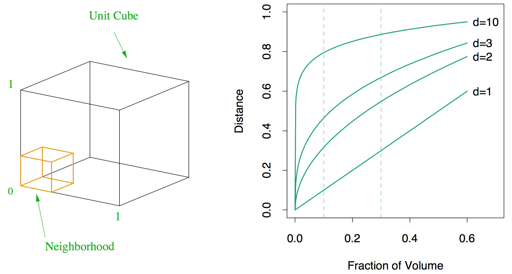

```{r setup, include=FALSE}
knitr::opts_chunk$set(echo = FALSE)
set.seed(1234)
library(ggplot2)
library(ElemStatLearn)
```

## Overview

* Smoothing or estimating curves
    * Density Estimation
    * Nonlinear regression
* Rank-based linear regression

## Curve Estimation

* A curve of interest can be a probability density function $f$
* In density estimation, we observe $X_1,\dots,X_n$ from some unknown cdf $F$ with density $f$
$$ X_1,\dots,X_n \sim f $$
and the goal is to estimate density $f$

## Density Estimation

```{r fig.width=10,fig.height=5}
dat <- data.frame(cond = factor(rep(c("A","B"), each=200)), 
                   rating = c(rnorm(200),rnorm(200, mean=.8)))
ggplot(dat, aes(x=rating)) + 
  geom_histogram(aes(y=..density..),binwidth=.1,colour="black", fill="white") +
  geom_density(alpha=.2, fill="#FF6666")
```

## Nonlinear Regression

* A curve of interest can be a regression function $r$
* In regression, we observe pairs $(x_1,Y_1),\dots,(x_n,Y_n)$ that are related as
$$ Y_i = r(x_i) + \epsilon_i $$
with $E(\epsilon_i) = 0$, and the goal is to estimate the regression function $r$

## Nonlinear Regression

```{r fig.width=10,fig.height=5}
data(bone)
ggplot(bone, aes(x=age, y=spnbmd, color=gender, shape=gender)) +  geom_point() +
  labs(title = "Bone Mineral Density Data") + labs(x = "Age") + labs(y = "Change in BMD")
```

## Nonlinear Regression

```{r fig.width=10,fig.height=5}
ggplot(bone, aes(x=age, y=spnbmd, color=gender, shape=gender)) +  geom_point() + geom_smooth(span = 0.05) +
  labs(title = "Bone Mineral Density Data") + labs(x = "Age") + labs(y = "Change in BMD")
```

## Nonlinear Regression

```{r fig.width=10,fig.height=5}
ggplot(bone, aes(x=age, y=spnbmd, color=gender, shape=gender)) +  geom_point() + geom_smooth(span = 10) +
  labs(title = "Bone Mineral Density Data") + labs(x = "Age") + labs(y = "Change in BMD")
```

## Nonlinear Regression

```{r fig.width=10,fig.height=5}
ggplot(bone, aes(x=age, y=spnbmd, color=gender, shape=gender)) +  geom_point() + geom_smooth() +
  labs(title = "Bone Mineral Density Data") + labs(x = "Age") + labs(y = "Change in BMD")
```

## The Bias–Variance Tradeoff

* Let $\widehat{f_n}(x)$ be an estimate of a function $f(x)$
* Define the *squared error* loss function as 
$$\operatorname{Loss} = L(f(x),\widehat{f_n}(x)) = (f(x)-\widehat{f_n}(x))^2$$
* Define average of this loss as *risk* or *Mean Squared Error* (MSE) 
$$\operatorname{MSE} = R(f(x),\widehat{f_n}(x)) = \operatorname{E}(\operatorname{Loss})$$
* The expectation is taken with respect to $\widehat{f_n}$ which is random
* The MSE can be decomposed into a bias and variance term
$$ \operatorname{MSE} = \operatorname{Bias}^2 + \operatorname{Var}$$
* The decomposition is easy to show

## The Bias–Variance Tradeoff

* Expand
$$\operatorname{E}((f - \widehat{f})^2 ) = \operatorname{E}( f^2 + \widehat{f}^2 + 2 f \widehat{f} ) = \operatorname{E}(f^2) + \operatorname{E}(\widehat{f}^2) - \operatorname{E}(2 f \widehat{f})$$
* Use $\operatorname{Var}(X) = \operatorname{E}(X^2) - \operatorname{E}(X)^2$
$$\operatorname{E}((f - \widehat{f})^2 ) = \operatorname{Var}(f) + \operatorname{E}(f)^2 + \operatorname{Var}(\widehat{f}) + \operatorname{E}(\widehat{f})^2 - \operatorname{E}(2f\widehat{f})$$
* Use $\operatorname{E}(f) = f$ and $\operatorname{Var}(f) = 0$
$$\operatorname{E}((f - \widehat{f})^2 ) = f^2 + \operatorname{Var}(\widehat{f}) + \operatorname{E}(\widehat{f})^2 - 2f\operatorname{E}(\widehat{f})$$
* Use $(\operatorname{E}(\widehat{f}) - f)^2 = f^2 + \operatorname{E}(\widehat{f})^2 - 2f\operatorname{E}(\widehat{f})$
$$\operatorname{E}((f - \widehat{f})^2 ) = (\operatorname{E}(\widehat{f}) - f)^2 + \operatorname{Var}(\widehat{f}) = \operatorname{Bias}^2 + \operatorname{Var}$$

## The Bias–Variance Tradeoff

* This described the risk at one point
* To summarize the risk, for density problems, we need to integrate
$$R(f,\widehat{f_n}) = \int R(f(x),\widehat{f_n}(x)) dx$$
* For regression problems, we sum over all 
$$R(r,\widehat{r_n}) = \sum_{i=1}^n R(r(x_i),\widehat{r_n}(x_i))$$

## The Bias–Variance Tradeoff

* Consider the regression model
$$Y_i = r(x_i) + \epsilon_i$$
* Suppose we draw new observation $Y_i^* = r(x_i) + \epsilon_i^*$ for each $x_i$
* If we predict $Y_i^*$ with $\widehat{r_n}(x_i)$ then the *squared prediction error* is 
$$(Y_i^* - \widehat{r_n}(x_i^*))^2 = (r(x_i) + \epsilon_i^* - \widehat{r_n}(x_i))^2$$
* Define *predictive risk* as 
$$\operatorname{E}\left( \frac{1}{n} \sum_{i=1}^n (Y_i^* - \widehat{r_n}(x_i))^2 \right)$$

## The Bias–Variance Tradeoff

* Up to a constant, the average risk and the predictive risk are the same
$$\operatorname{E}\left( \frac{1}{n} \sum_{i=1}^n (Y_i^* - \widehat{r_n}(x_i))^2 \right) = R(r,\widehat{r}_n) + \frac{1}{n}\sum_{i=1}^n \operatorname{E}((\epsilon_i^*)^2)$$
* and in particular, if error $\epsilon_i$ has variance $\sigma^2$, then
$$\operatorname{E}\left( \frac{1}{n} \sum_{i=1}^n (Y_i^* - \widehat{r_n}(x_i))^2 \right) = R(r,\widehat{r_n}) + \sigma^2$$

## The Bias–Variance Tradeoff

* Challenge in smoothing is to determine how much smoothing to do
* When the data are oversmoothed, the bias term is large and the variance is small 
* When the data are undersmoothed the opposite is true
* This is called the bias–variance tradeoff
* Minimizing risk corresponds to balancing bias and variance

## The Bias–Variance Tradeoff

```{r out.width=".8\\linewidth"}
knitr::include_graphics("BiasVarianceTradeoff.png")
```

Source: Wassermann (2006)

## The Bias–Variance Tradeoff (Example)

* Let $f$ be a pdf
* Consider estimating $f(0)$
* Let $h$ be a small and positive number
* Define 
$$p_h := \operatorname{P}\left(-\frac{h}{2} < X < \frac{h}{2} \right) = \int_{-h/2}^{h/2} f(x) dx \approx hf(0)$$
* Hence $$f(0) \approx \frac{p_h}{h}$$

## The Bias–Variance Tradeoff (Example)

* Let $X$ be the number of observations in the interval $(-h/2,h/2)$
* Then $X \sim \operatorname{Binom}(n,p_h)$
* An estimate of $p_h$ is $\widehat{p_h} = X/n$ and estimate of $f(0)$ is
$$\widehat{f_n}(0) = \frac{\widehat{p_h}}{h} = \frac{X}{nh}$$
* We now show that the MSE of $\widehat{f_n}(0)$ is (for some constants $A$ and $B$)
$$\operatorname{MSE} = Ah^4 + \frac{B}{nh} = \operatorname{Bias}^2+ \operatorname{Variance}$$

## The Bias–Variance Tradeoff (Example)

* Taylor expand around $0$
$$f(x) \approx f(0) + x f'(0) + \frac{x^2}{2}f''(0)$$
* Plugin
$$p_h = \int_{-h/2}^{h/2} f(x) dx \approx \int_{-h/2}^{h/2} \left( f(0) + xf'(0) + \frac{x^2}{2}f''(0) \right) dx$$
$$ = hf(0) + \frac{f''(0)h^3}{24}$$

## The Bias–Variance Tradeoff (Example)

* Since $X$ is binomial, we have $\operatorname{E}(X) = np_h$
* Use Taylor approximation $p_h \approx hf(0) + \frac{f''(0)h^3}{24}$ and combine
$$\operatorname{E}(\widehat{f_n}(0)) = \frac{\operatorname{E}(X)}{nh} = \frac{p_h}{h} \approx f(0) + \frac{f''(0)h^2}{24}$$
* After rearranging, the bias is
$$\operatorname{Bias} = \operatorname{E}(\widehat{f_n}(0)) - f(0) \approx \frac{f''(0)h^2}{24}$$

## The Bias–Variance Tradeoff (Example)

* For the variance term, note that $\operatorname{X} = n p_h (1-p_h)$, then
$$\operatorname{Var}(\widehat{f_n}(0)) = \frac{\operatorname{Var}(X)}{n^2h^2} = \frac{p_h(1-p_h)}{nh^2}$$
* Use $1-p_h \approx 1$ since $h$ is small
$$\operatorname{Var}(\widehat{f_n}(0)) \approx \frac{p_h}{nh^2}$$
* Combine with Taylor expansion
$$\operatorname{Var}(\widehat{f_n}(0)) \approx \frac{hf(0) + \frac{f''(0)h^3}{24}}{nh^2} = \frac{f(0)}{nh} + \frac{f''(0)h}{24n} \approx \frac{f(0)}{nh}$$

## The Bias–Variance Tradeoff (Example)

* And combinding both terms
$$ \operatorname{MSE} = \operatorname{Bias}^2 + \operatorname{Var}(\widehat{f_n}(0)) = \frac{(f''(0)^2h^4)}{576} + \frac{0}{nh} \equiv Ah^4 + \frac{B}{nh}$$
* As we smooth more (increase $h$),  
the bias term increases and the variance term decreases
* As we smooth less (decrease $h$),  
the bias term decreases and the variance term increases
* This is a typical bias–variance analysis

## The Curse of Dimensionality

* Problem with smoothing is the curse of dimensionality in high dimensions
* Estimation gets harder as the dimensions of the observations increases
* **Computational:** Computational burden increases exponentially with dimension, and
* **Statistical:** If data have dimension $d$ then we need sample size $n$ to grow exponentially with $d$
* We will see that the MSE of any nonparametric estimator of a smooth function curve has form (for $c > 0$)
$$\operatorname{MSE} \approx \frac{c}{n^{4/(4+d)}}$$
* If we want to have a fixed $\operatorname{MSE} = \delta$ equal to some small number $\delta$, then solving for $n$
$$n \propto \left( \frac{c}{\delta} \right)^{d/4}$$

## The Curse of Dimensionality

* We see that $n \propto \left( \frac{c}{\delta} \right)^{d/4}$ grows exponentially with dimension $d$
* The reason for this is that smoothing involves estimating a function in a local neighborhood
* But in high-dimensional problems the data are very sparse, so local neighborhood contain very few points

## The Curse of Dimensionality (Example)

* Suppose $n$ data points uniformly distributed on the interval $[0,1]$
* How many data points will we find in the interval $[0,0.1]$?
* The answer: about $n/10$ points
* Now suppose $n$ point in 10 dimensional unit cube $[0,1]^{10}$
* How many data points in $[0,0.1]^{10}$?
* The answer: about 
$$n \times \left(\frac{0.1}{1}\right)^{10} = \frac{n}{10,000,000,000}$$
* Thus, $n$ has to be huge to ensure that small neighborhoods have any data in them
* Smoothing methods can in principle be used in high-dimensions problems 
* But estimator won't be accurate, confidence interval around the estimate will be distressingly large

## The Curse of Dimensionality (Example)

```{r out.width=".8\\linewidth"}

```

Source: Hastie, Tibshirani, and Friedman (2009)

* In ten dimensions 80% of range to capture 10% of the data

## Nonlinear Regression

* We are given $n$ pairs of obserations $(x_1,Y_1),\dots,(x_n,Y_n)$
* The **response variable** is related to the **covariate** 
$$Y_i = r(x_i) + \epsilon_i \hspace{2cm} \operatorname{E}(\epsilon_i) = 0, i = 1,\dots,n$$
with $r$ being the **regression function**
* For now, assume that variance $\operatorname{Var}(\epsilon_i) = \sigma^2$ is independent of $x$
* The covariates $x_i$ are fixed

## Linear Smoothers

* All the nonparametric estimators that we will treat in this class are linear smoothers
* An estimator $\widehat{r_n}$ is a linear smoothers if, for each $x$, there exists a vector $l(x) = (l_1(x),\dots,l_n(x))^T$ such that
$$\widehat{r_n}(x) = \sum_{i=1}^n l_i(x) Y_i$$
* Define the vector of fitted values 
$$\boldsymbol{r} = (\widehat{r_n}(x_1),\dots,\widehat{r_n}(x_n))^T$$
* Then we can write in matrix form ($L_{ij} = l_j(x_i)$)
$$\boldsymbol{r} = L Y$$
* The $i$th row shows weights given to each $Y_i$ in forming the estimate $\widehat{r_n}(x_i)$

## Regressogram Estimator

* Suppose that $a \leq x_i \leq b, i = 1,\dots,n$ 
* Divide $(a,b)$ into $m$ equally spaced bins denoted by $B_1,B_2,\dots,B_m$
* Define estimator as 
$$\widehat{r_n} = \frac{1}{k_j} \sum_{i:x_i \in B_j} Y_i \hspace{0.5cm}\text{for}\hspace{0.5cm} x \in B_j$$
where $k_j$ is the number of points in $B_j$
* In this case, 
$$l(x)^T = \left( 0,0,\dots,\frac{1}{k_j},\dots,\frac{1}{k_j},0,\dots,0 \right)$$

## Regressogram Estimator

* For example, $n = 9, m = 3$
$$L = \frac{1}{3} \times 
\begin{bmatrix}
1 & 1 & 1 & 0 & 0 & 0 & 0 & 0 & 0 \\
1 & 1 & 1 & 0 & 0 & 0 & 0 & 0 & 0 \\
1 & 1 & 1 & 0 & 0 & 0 & 0 & 0 & 0 \\
0 & 0 & 0 & 1 & 1 & 1 & 0 & 0 & 0 \\
0 & 0 & 0 & 1 & 1 & 1 & 0 & 0 & 0 \\
0 & 0 & 0 & 1 & 1 & 1 & 0 & 0 & 0 \\
0 & 0 & 0 & 0 & 0 & 0 & 1 & 1 & 1 \\
0 & 0 & 0 & 0 & 0 & 0 & 1 & 1 & 1 \\
0 & 0 & 0 & 0 & 0 & 0 & 1 & 1 & 1 
\end{bmatrix}$$

## Local Averages Estimator

* Fix bandwidth $h > 0$ and let $B_x = \{ i: |x_i - x| \le h \}$
* Let $n_x$ be the number of points in $B_x$
* Estimator is 
$$ \widehat{r_n}(x) = \frac{1}{n_x} \sum_{i \in B_x} Y_i$$
* This is a special case of the kernel estimator that we will discuss next
* In this case, $l(x) = 1/n_x$ if $|x_i - x| \le h$ and $l(x) = 0$ otherwise

## Local Averages Estimator

* For example, $n = 9,x_i = i/9,h = 1/9$
$$L = 
\begin{bmatrix}
1/2 & 1/2 & 0 & 0 & 0 & 0 & 0 & 0 & 0 \\
1/3 & 1/3 & 1/3 & 0 & 0 & 0 & 0 & 0 & 0 \\
0 & 1/3 & 1/3 & 1/3 & 0 & 0 & 0 & 0 & 0 \\
0 & 0 & 1/3 & 1/3 & 1/3 & 0 & 0 & 0 & 0 \\
0 & 0 & 0 & 1/3 & 1/3 & 1/3 & 0 & 0 & 0 \\
0 & 0 & 0 & 0 & 1/3 & 1/3 & 1/3 & 0 & 0 \\
0 & 0 & 0 & 0 & 0 & 1/3 & 1/3 & 1/3 & 0 \\
0 & 0 & 0 & 0 & 0 & 0 & 1/3 & 1/3 & 1/3 \\
0 & 0 & 0 & 0 & 0 & 0 & 0 & 1/2 & 1/2 
\end{bmatrix}$$

## Linear Smoothers

* This is a rowise weighted average with constrain $\sum_{i=1}^n l_i(x) = 1$
* Define the effective degrees of freedom by
$$\nu = \operatorname{tr}(L)$$
* The effective degrees of freedom behave very much like the number of parameters in a linear regression model
* For example: $L_{ii} = 1$, $L_{ij} = 0$, we have $\nu = n$
* For example: $L_{ij} = 1/n$, we have $\nu = 1$
* For the regressogram estimator: $\nu = m$ (number of bins)

## Choosing the Smoothing Parameter

* The smoothers depend on some smoothing parameter $h$
* We define a risk 
$$R(h) = \operatorname{E}\left( \frac{1}{n} \sum_{i=1}^n (\widehat{r_n}(x_i) - r(x_i))^2 \right)$$
* Ideally, we would like to choose $h$ to minimize $R(h)$ 
* But $R(h)$ depends on unkown function $r(x)$
* Instead we minimize an estimate $\widehat{R}(h)$
* As first guess, we might try minimizing the **training error**
$$\frac{1}{n} \sum_{i=1}^n (Y_i - \widehat{r_n}(x_i))^2$$
* This is a poor estimator, because it overfits (undersmoothing)
* We use the data twice: to estimate the function and to estimate the risk

## Choosing the Smoothing Parameter

* A better idea is to use leave-one-out cross-validation
$$\operatorname{cv} = \widehat{R}(h) = \frac{1}{n} \sum_{i=1}^n (Y_i - \widehat{r}_{(-i)}(x_i))^2$$
with $\widehat{r}_{(-i)}$ estimator obtained by omitting the ith pair $(x,Y)$
* Define 
$$\widehat{r}_{(-i)} = \sum_{j=1}^n Y_j l_{j,(-i)}(x)$$
* and we set the weight on $x_i$ to $0$ and renormalize the other weights to sum to one
$$l_{j,(-i)}(x) = 
\begin{cases}
0 & \text{if } j = i \\
\frac{l_j(x)}{\sum_{k \ne i} l_k(x)} & \text{if } j \ne i
\end{cases}$$
* Cross-validation is approximately the predictive risk (predicting the left-one-out observation)

## Local Regression

* We still use the regression model 
$$Y_i = r(x_i) + \epsilon_i, \operatorname{E}(\epsilon_i) = 0, i = 1,\dots,n$$
* But now, we consider weighted averages of $Y_i$'s giving higher weights to points close to $x$
* One option is kernel regression estimator called the Nadaraya–Watson kernel estimator
$$\widehat{r_n}(x) = \sum_{i=1}^n l_i(x)Y_i$$
with kernel $K$ and weights $l_i(x)$ given by
$$
l_i(x) = \frac{K(\frac{x-x_i}{h})}{\sum_{i=1}^n K(\frac{x-x_i}{h})}
$$

## Local Regression

* For example, the Gaussian $K(x) = \frac{1}{2} e^{-x^2/2}$
* Think of them as basis functions anchored at observation locations $x_i$

## References

* Wassermann (2006). All of Nonparametric Statistics
* Hastie, Tibshirani, Friedman (2009). The Elements of Statistical Learning
