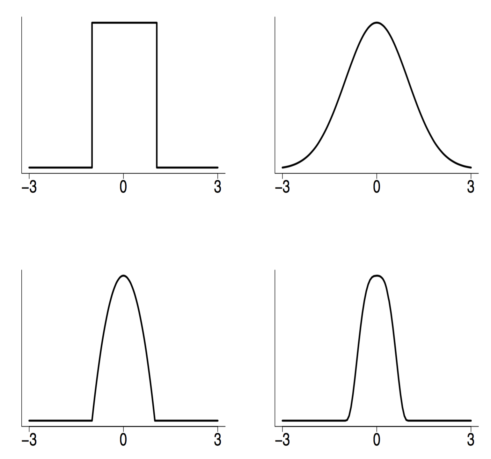

```{r setup, include=FALSE}
knitr::opts_chunk$set(echo = FALSE)
set.seed(1234)
library(ggplot2)
library(ElemStatLearn)
```

## Overview

Last time:

* The bias-variance tradeoff
* The curse of dimensionality

## Nonlinear Regression

* We are given $n$ pairs of obserations $(x_1,Y_1),\dots,(x_n,Y_n)$
* The **response variable** is related to the **covariate** 
$$Y_i = r(x_i) + \epsilon_i \hspace{2cm} \operatorname{E}(\epsilon_i) = 0, i = 1,\dots,n$$
with $r$ being the **regression function**
* For now, assume that variance $\operatorname{Var}(\epsilon_i) = \sigma^2$ is independent of $x$
* The covariates $x_i$ are fixed

## Linear Smoothers

* All the nonparametric estimators that we will treat in this class are linear smoothers
* An estimator $\widehat{r_n}$ is a linear smoother if, for each $x$, there exists a vector $l(x) = (l_1(x),\dots,l_n(x))^T$ such that
$$\widehat{r_n}(x) = \sum_{i=1}^n l_i(x) Y_i$$
* Define the vector of fitted values 
$$\boldsymbol{r} = (\widehat{r_n}(x_1),\dots,\widehat{r_n}(x_n))^T$$
* Then we can write in matrix form ($L_{ij} = l_j(x_i)$)
$$\boldsymbol{r} = L Y$$
* The $i$th row shows weights given to each $Y_i$ in forming the estimate $\widehat{r_n}(x_i)$

## Regressogram Estimator

* Suppose that $a \leq x_i \leq b, i = 1,\dots,n$ 
* Divide $(a,b)$ into $m$ equally spaced bins denoted by $B_1,B_2,\dots,B_m$
* Define estimator as 
$$\widehat{r_n} = \frac{1}{k_j} \sum_{i:x_i \in B_j} Y_i \hspace{0.5cm}\text{for}\hspace{0.5cm} x \in B_j$$
where $k_j$ is the number of points in $B_j$
* In this case, 
$$l(x)^T = \left( 0,0,\dots,\frac{1}{k_j},\dots,\frac{1}{k_j},0,\dots,0 \right)$$

## Regressogram Estimator

* For example, $n = 9, m = 3$
$$L = \frac{1}{3} \times 
\begin{bmatrix}
1 & 1 & 1 & 0 & 0 & 0 & 0 & 0 & 0 \\
1 & 1 & 1 & 0 & 0 & 0 & 0 & 0 & 0 \\
1 & 1 & 1 & 0 & 0 & 0 & 0 & 0 & 0 \\
0 & 0 & 0 & 1 & 1 & 1 & 0 & 0 & 0 \\
0 & 0 & 0 & 1 & 1 & 1 & 0 & 0 & 0 \\
0 & 0 & 0 & 1 & 1 & 1 & 0 & 0 & 0 \\
0 & 0 & 0 & 0 & 0 & 0 & 1 & 1 & 1 \\
0 & 0 & 0 & 0 & 0 & 0 & 1 & 1 & 1 \\
0 & 0 & 0 & 0 & 0 & 0 & 1 & 1 & 1 
\end{bmatrix}$$

## Local Averages Estimator

* Fix bandwidth $h > 0$ and let $B_x = \{ i: |x_i - x| \le h \}$
* Let $n_x$ be the number of points in $B_x$
* Estimator is 
$$ \widehat{r_n}(x) = \frac{1}{n_x} \sum_{i \in B_x} Y_i$$
* This is a special case of the kernel estimator that we will discuss next
* In this case, $l_i(x) = 1/n_x$ if $|x_i - x| \le h$ and $l(x) = 0$ otherwise

## Local Averages Estimator

* For example, $n = 9,x_i = i/9,h = 1/9$
$$L = 
\begin{bmatrix}
1/2 & 1/2 & 0 & 0 & 0 & 0 & 0 & 0 & 0 \\
1/3 & 1/3 & 1/3 & 0 & 0 & 0 & 0 & 0 & 0 \\
0 & 1/3 & 1/3 & 1/3 & 0 & 0 & 0 & 0 & 0 \\
0 & 0 & 1/3 & 1/3 & 1/3 & 0 & 0 & 0 & 0 \\
0 & 0 & 0 & 1/3 & 1/3 & 1/3 & 0 & 0 & 0 \\
0 & 0 & 0 & 0 & 1/3 & 1/3 & 1/3 & 0 & 0 \\
0 & 0 & 0 & 0 & 0 & 1/3 & 1/3 & 1/3 & 0 \\
0 & 0 & 0 & 0 & 0 & 0 & 1/3 & 1/3 & 1/3 \\
0 & 0 & 0 & 0 & 0 & 0 & 0 & 1/2 & 1/2 
\end{bmatrix}$$

## Linear Smoothers

* This is a rowise weighted average with constrain $\sum_{i=1}^n l_i(x) = 1$
* Define the effective degrees of freedom by
$$\nu = \operatorname{tr}(L)$$
* The effective degrees of freedom behave very much like the number of parameters in a linear regression model
* For example: $L_{ii} = 1$, $L_{ij} = 0$, we have $\nu = n$
* For example: $L_{ij} = 1/n$, we have $\nu = 1$
* For the regressogram estimator: $\nu = m$ (number of bins)

## Local Regression

* We still use the regression model 
$$Y_i = r(x_i) + \epsilon_i, \operatorname{E}(\epsilon_i) = 0, i = 1,\dots,n$$
* But now, we consider weighted averages of $Y_i$'s giving higher weights to points close to $x$
* One option is kernel regression estimator called the Nadaraya–Watson kernel estimator
$$\widehat{r_n}(x) = \sum_{i=1}^n l_i(x)Y_i$$
with kernel $K$ and weights $l_i(x)$ given by
$$
l_i(x) = \frac{K(\frac{x-x_i}{h})}{\sum_{i=1}^n K(\frac{x-x_i}{h})}
$$

## Local Regression

* For example, the Gaussian $K(x) = \frac{1}{2} e^{-x^2/2}$
* Think of them as basis functions anchored at observation locations $x_i$

```{r out.width=".5\\linewidth"}

```
Source: Wassermann (2006)

## Local Regression

* For points $x_1,\dots,x_n$ drawn from some density $f$
* Let $h \to 0, nh \to \infty$ 
* The bias-variance tradeoff for the Nadaraya–Watson kernel estimator
$$R(\widehat{r_n},r) \approx \frac{h^4}{4} \operatorname{Bias}^2 + \frac{1}{nh} \operatorname{Variance}$$
* Depends first and second derivatives of the density $f$
$$\operatorname{Bias}^2 = \left( \int x^2 K(x) dx \right)^2 \int \left( r''(x) + 2r'(x)\frac{f'(x)}{f(x)} \right)^2 dx$$
* The term $2 r'(x) \frac{f'(x)}{f(x)}$ is called **design bias**
* It depends on the distribution of the points $x_1,\dots,x_n$

## Local Regression

* The bias term has two disturbing properties: 
      * it is large if $p'(x)$ is non-zero and 
      * it is large if $p(x)$ is small
* The dependence of the bias on the density $p(x)$ is called design bias
* It can also be shown that the bias is large if $x$ is close to the boundary of the support of $p$
* Later, we'll see that this bias can be reduced by by using a refinement called local polynomial regression

## Local Polynomials

TODO

## Choosing the Smoothing Parameter

* The smoothers depend on some smoothing parameter $h$
* We define a risk 
$$R(h) = \operatorname{E}\left( \frac{1}{n} \sum_{i=1}^n (\widehat{r_n}(x_i) - r(x_i))^2 \right)$$
* Ideally, we would like to choose $h$ to minimize $R(h)$ 
* But $R(h)$ depends on unkown function $r(x)$
* Instead we minimize an estimate $\widehat{R}(h)$
* As first guess, we might try minimizing the **training error**
$$\frac{1}{n} \sum_{i=1}^n (Y_i - \widehat{r_n}(x_i))^2$$
* This is a poor estimator, because it overfits (undersmoothing)
* We use the data twice: to estimate the function and to estimate the risk

## Choosing the Smoothing Parameter

* A better idea is to use leave-one-out cross-validation
$$\operatorname{cv} = \widehat{R}(h) = \frac{1}{n} \sum_{i=1}^n (Y_i - \widehat{r}_{(-i)}(x_i))^2$$
with $\widehat{r}_{(-i)}$ estimator obtained by omitting the ith pair $(x,Y)$
* Define 
$$\widehat{r}_{(-i)} = \sum_{j=1}^n Y_j l_{j,(-i)}(x)$$
* and we set the weight on $x_i$ to $0$ and renormalize the other weights to sum to one
$$l_{j,(-i)}(x) = 
\begin{cases}
0 & \text{if } j = i \\
\frac{l_j(x)}{\sum_{k \ne i} l_k(x)} & \text{if } j \ne i
\end{cases}$$
* Cross-validation is approximately the predictive risk (predicting the left-one-out observation)

## Choosing the Smoothing Parameter

* We can compute leave-one-out cross-validation without leaving one observation out
$$
\widehat{R}(h) = \frac{1}{n} \sum_{i=1}^n \left( \frac{Y_i - \widehat{r_n}(x_i)}{1-L_{ii}} \right)
$$
* This is exactly true not an approximation!
* After some algebra, we can see that
$$\widehat{r}(x_i) = (1-L_{ii})\widehat{r}_{(-i)}(x_i) + L_{ii}Y_i$$

## References

* Wassermann (2006). All of Nonparametric Statistics
