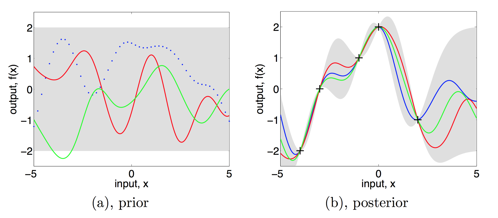

```{r setup, include=FALSE}
knitr::opts_chunk$set(echo = FALSE)
set.seed(1234)
```

## Overview

Last time:

* Bayesian estimating of CDF's and densities

Today:

* Bayesian nonlinear regression

## Nonlinear Regression

* Consider the nonparametric regression model
$$Y_i = r(x_i) + \epsilon_i, \hspace{0.5cm} i = 1,\dots,n, \hspace{0.5cm} \operatorname{E}(\epsilon_i) = 0$$
* The frequentist kernel estimator for $r$ is
$$\widehat{r}(x) = \frac{\sum_{i=1}^n Y_i K \left(\frac{\|x - x_i\|}{h}\right)}{\sum_{i=1}^n K\left(\frac{\|x-x_i\|}{h}\right)}$$
with kernel $K$ and bandwith $h$
* The Bayesian version requires a prior on $\pi$ on the set of all regression functions $\mathcal{R}$
* A common choise is the **Gaussian process prior**

## Nonlinear Regression

* A stochastic process $r(x)$ indexed by $x \in \mathcal{X} \subset \mathbb{R}^d$ is a Gaussian process if for each $x_1,\dots,x_n \in \mathcal{X}$ 
$$\begin{bmatrix}
r(x_i) \\
r(x_2) \\
\vdots \\
r(x_n)
\end{bmatrix}
\sim N(\mu(x),K(x))$$

## Nonlinear Regression

* Assume that $\mu = 0$, then for $x_1,x_2,\dots,x_n$, the Gaussian process prior is 
$$\pi(r) = (2\pi)^{-n/2} |K|^{-1/2} \exp\left( -\frac{1}{2} r^T K^{-1} r \right)$$
* Under change of variables $r = K\alpha$, we can rewrite it as 
$$\pi(\alpha) = (2\pi)^{-n/2} |K|^{-1/2} \exp\left( -\frac{1}{2} \alpha^T K \alpha \right)$$
* Using the usual model 
$$Y_i = r(x_i) + \epsilon_i \hspace{0.5cm} \epsilon \sim N(0,\sigma^2)$$

## Nonlinear Regression

* The log-likelihood is
$$\log f(y|r) = -\frac{1}{2\sigma^2} \sum_{i=1}^n (y_i - r(x_i))^2 + \operatorname{constant}$$
* The log-posterior is
$$\log \pi(r|y) = \log f(y|r) \pi(r) = -\frac{1}{2\sigma^2} \| y - K\alpha \|^2_2 - \frac{1}{2} \alpha^T K \alpha + \operatorname{constant}$$

## Nonlinear Regression

* What functions have high probability according to the Gaussian process prior?
* The prior favors $\alpha^T K^{-1} \alpha$ being small
* Suppose we consider an eigenvector $v$ of $K$ with eigenvalue $\lambda$, so that $K v = \lambda v$, then 
$$\frac{1}{\lambda} = v^T K^{-1} v$$
* Thus eigenfunctions with large eigenvalues are favored by the prior
* These corresponds to smooth functions
* The eigenfunctions that are very wiggly correspond to small eigenvalues

## Nonlinear Regression

* The posterior mean is
$$\operatorname{E}(\alpha|Y) = (K + \sigma^2 I)^{-1} Y$$
and thus
$$\widehat{r} = \operatorname{E}(r|Y) = K(K+\sigma^2 I)^{-1} Y$$
* We see that this is a linear smoother

## Nonlinear Regression

```{r out.width="1.0\\linewidth"}

```

Source: Wasserman

## References

* [Wasserman Lecture Notes](http://www.stat.cmu.edu/~larry/=sml/nonparbayes.pdf)
* Rasmussen and Williams (2006), Gaussian Processes for Machine Learning
