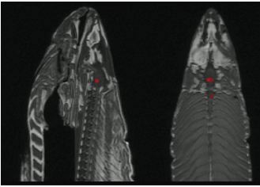

```{r setup, include=FALSE}
knitr::opts_chunk$set(echo = FALSE)
set.seed(1234)
```

## Overview

* 16 projects
* 10 singles, 6 pairs
* Wide range:
    * Medicine (microbiome, lung cancer, genetics)
    * Environment (seafood, global warming)
    * Sports (basketball and baseball)
    * Conflict predictions in the Congo
    * Police killings
    * University rankings
    * Virtual Architecture
    * Digital humanities
    * Natural language processing
    * Linear smoothers
    * Finance

## Overview

* Very creative, some a bit too ambitious
* Try to start simple, and make it more complicated as you go along
* Do it stepwise, so that you always know which step doesn't work
* Otherwise, in the end you won't know where the problem is, and you'll have to start from scratch

## A Dead Fish Can See

* Scientists put a dead fish in a fMRI scanner
* They measured brain activation of the dead fish while showing photos of human faces
```{r out.width="0.5\\linewidth"}

```

Source: Bennet et al. (2009)

## Multiple Comparison Problem

* What happened? Random noise from scanner
* The problem is that we are testing around 130,000 voxels in a typical fMRI scan
* Using the common significance level $\alpha = 0.05$, we will see 6,500 discoveries just by chance alone
* We have to adjust for this multiple testing problem
* Here are the common tools and R functions
* For detailed treatment take for instance Stats 300C

## Multiple Comparison Problem

* We have four types of outcomes in multiple testing:
$$
\begin{tabular}{c|cc|c}
 & $H_0$ accepted & $H_0$ rejected & Total \\
\hline
$H_0$ true & $U$ & $V$ & $n_0$ \\
$H_0$ false & $T$ & $S$ & $n - n_0$ \\
\hline
 & $n-R$ & $R$ & $n$
\end{tabular}
$$
* $U,V,S,T$ are unobserved random variables 
* $R$ is an observed random variable
* **Familywise Error Rate**: Classical multiple comparison procedures aim to control
$$\operatorname{FWER} = P(V \ge 1)$$
* Holm's procedure is not as conservative as Bonferroni; we typically make more rejections (have more power)
* Holm's procedure can always be used instead of Bonferroni

## Multiple Comparison Problem

* The FWER makes sense when we are testing a small number of hypotheses
* For example, in comparing six or ten different treatments, it is very reasonable to control the probability of returning even one ineffective treatment
* If we are testing millions of hypotheses at once, for example in genome-wide association studies, and making a **false discovery** is not the end of the world
* We prefer to return some **false positives** along with many potentially interesting genes, because this enables scientists to follow these leads and to distinguish the important genes from the false discoveries

## Multiple Comparison Problem

$$
\begin{tabular}{c|cc|c}
 & $H_0$ accepted & $H_0$ rejected & Total \\
\hline
$H_0$ true & $U$ & $V$ & $n_0$ \\
$H_0$ false & $T$ & $S$ & $n - n_0$ \\
\hline
 & $n-R$ & $R$ & $n$
\end{tabular}
$$

* False discovery proportion (FDP): 
$$\operatorname{FDP} = \begin{cases} V/R & \text{if } R \ge 1 \\ 0 & \text{otherwise} \end{cases}$$
* We observe $R$, we do not observe $V$, and so FDP is an unobserved random variable
* **False Discovery Rate** controls the expectation
$$\operatorname{FDR} = \operatorname{E}(\operatorname{FDP})$$

## Multiple Comparison Problem

* Consider what it means to control **FDR**: if we repeat our experiment many times, on average we control the FDP
*  This is **not** a statement about our **individual experiment**, and does not say much about the chance of having our FDP exceed a certain threshold
* **FWER**, on the other hand, does control for an **individual experiment**

## Reproducible Reserach

* Create a github repository for your project
* Do version control every day
* Keep track of everything
* Do all the anlaysis in a Rmd
* Never try out things without writing them down in a script!
* Some examples: [(link)](http://statweb.stanford.edu/~susan/papers/PSBRR.html)

## References

* Candes (2016). Lecture Notes [(link)](http://statweb.stanford.edu/~candes/stats300c/lectures.html)
* R function: ``p.adjust``
* Bennet et al. (2009). Salmon Poster. [(link)](http://prefrontal.org/files/posters/Bennett-Salmon-2009.jpg)
