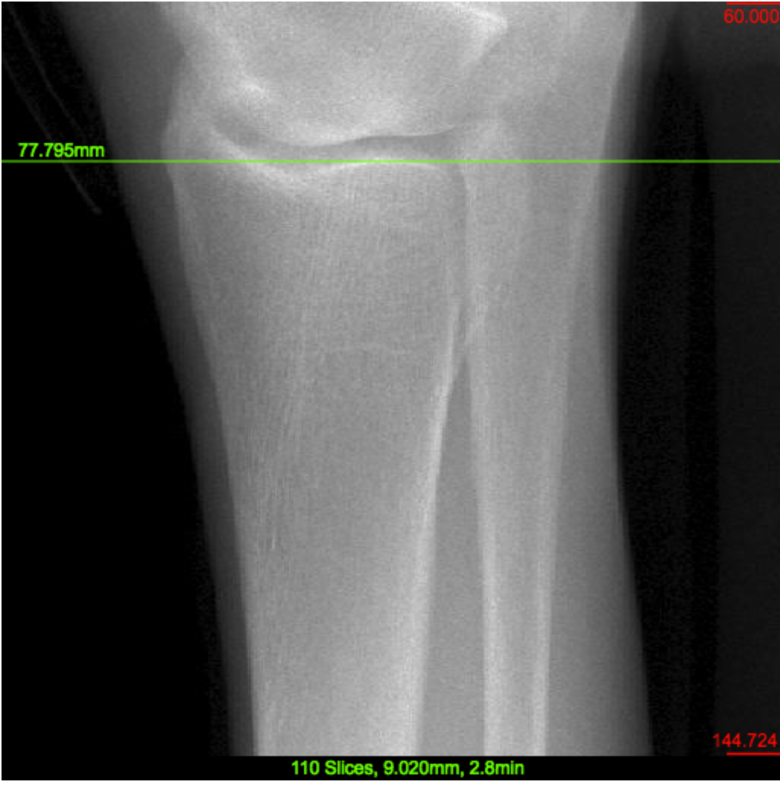
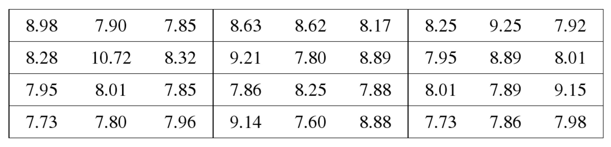
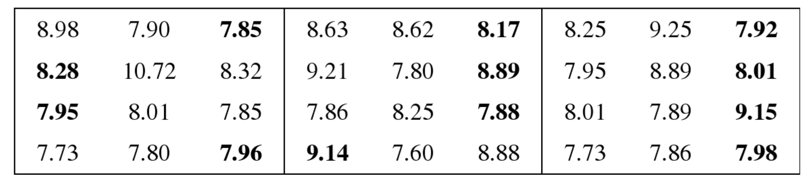
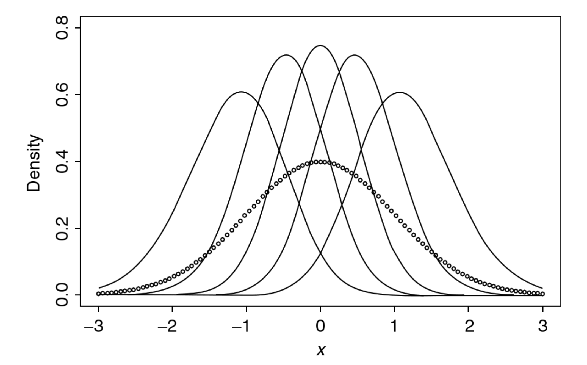

```{r setup, include=FALSE}
knitr::opts_chunk$set(echo = FALSE)
set.seed(1234)
```

## Introduction

* Keys to any statistical inference most commonly is random sample from the population in question
* Goal is to get the best possible representation of the population for the quantity of interest
* How to collect sample data?
* Are there alternative to a random sample?
* Usually, once the sample items have been chosen, the desired measurements are collected from each of the selected items
* **Ranked set sampling**: It is not a sampling technique; it is a data measurement techniques

## Introduction

* First introduced by McIntyre in 1952 for situations where
    * actual measurements for one sample observations is expensive
    * ranking observations is cheap
    * collecting sample units is cheap and reliable
* Example: Bone Mineral Density (BMD) in a human population
    * Subjects for such a study are plentiful
    * Measurements of BMD via Dual X-ray Absorptiometry (DXA) on selected subject is expensive
    * Because we need medical experts (e.g. orthopedic surgeons or anatomists) to manually segment images
    * Thus it is important to minimize the number of measurements required for the study without sacrificing information about the BMD makeup of the population

## Introduction

* Radiograph of the radius bone

```{r out.width="0.5\\linewidth"}

```

Source: http://webapps.radiology.ucsf.edu/refline/

## Introduction

* Consider random sample $X_1,\dots,X_n$
* Additionally to simple random sampling, there is stratified sampling, proportional sampling, and concomitant variable based sampling
* These are different kinds of sampling techniques defined **prior** to data collection
* Ranked set sampling is a techniques **during** data collection
* It helps to direct attention toward measurements of more representative units
* As a result, we get measurements that are more likely to span the range of values in the population

## Collecting a Ranked Set Sample

* To obtain $k$ observations from a population
* First, use simple random sampling to select $k$ units from a population
* Then, rank order them according to a predefined attribute
* A variety of mechanisms are: 
    * Visual comparison
    * Expert opinion
    * Auxiliary variable
    * Cannot involve your quantity of interest!
* The unit that is judged the smallest is included in your ranked set sample
* This first unit is called the **first judgement order statistics** and denoted by $X_{[1]}$
* Square brackets are used because this may not coincide with true order statistics usually denoted by $X_{(1)}$

## Collecting a Ranked Set Sample

* The remaining $k-1$ units are not considered further (their role was only to assist selecting the smallest ranked unit)
* Then we repeat the same procedure to select the second $X_{[2]}$ by picking the second smallest judgement order statistic
* And continue this procedure until $X_{[k]}$
* One such run sequence $X_{[1]},\dots,X_{[k]}$ is called a **cycle**
* This is called a **balanced** ranked set sample since we collect one unit for each rank
* To obtain $n = k\times m$ observations we repeat the entire process
$$
\begin{tabular}{lccc}
\hline 
Cycle $1$ & $X_{{[1]1}}$ & $\dots$ & $X_{{[k]1}}$ \\
\vdots & \vdots & \vdots & \vdots \\
Cycle $m$ & $X_{{[1]m}}$ & $\dots$ & $X_{{[k]m}}$ \\
\hline
\end{tabular}
$$

## Collecting a Ranked Set Sample (Example)

* Unburned hydrocarbons emitted from automobile tailpipes and via evaporation are among the primary contributions to ozone and smog in large cities
* One way to reduce pollution is to use reformulated gasoline, designed to reduce volatility measured through Reid Vapor Pressure (RVP) value
* To enforce this, regular gasoline samples are taken from pumps at stations and RVP is measured
* There is crude field measure and a more refined lab measure
* The goal is to use the cruder and cheaper measure as a surrogate for the more expansive lab measure in order to reduce the actual amount of lab measures

## Collecting a Ranked Set Sample (Example)

```{r out.width="0.6\\linewidth"}
knitr::include_graphics("FieldRVP.png")
```

Source: Hollander and Wolfe, and Chicken (2013)

## Collecting a Ranked Set Sample (Example)

* Group of triples $k=3$ in four cycles $m=4$
* Random triples from all 36 original observations
```{r out.width="0.8\\linewidth"}

```

* Circled values are the ranked set sample (these are now send to the lab for further analysis)
```{r out.width="0.8\\linewidth"}

```

## Collecting a Ranked Set Sample

* Marginal densities of the order statistics $X_{(1)},\dots,X_{(5)}$ for random sample of size 5 from the standard normal
```{r out.width="0.8\\linewidth"}

```

Source: Hollander and Wolfe, and Chicken (2013)

## Ranked Set Sample Estimation of Population Mean

* Two sets of $n$ observations each from a population
* One set $X_1,\dots,X_n$ is collected using simple random sampling
* The second using balanced ranked set sampling with set size $k$ and cycles $m$, $n = k\times m$
* Assumptions: 
    * Population is continuous with distribution $F$ and density $f$, finite mean $\mu$, and finite variance $\sigma^2$
    * All $2n$ are mutually independent
* Ranked Set Sample (RSS) mean
$$\mu_{\text{RSS}} = \overline{X}_{\text{RSS}} = \sum_{j=1}^m \sum_{i=1}^k \frac{X_{[i]j}}{km}$$

## Ranked Set Sample Estimation of Population Mean

* The $\mu_{\text{RSS}}$ is an unbiased estimator for the population mean $\mu$ regardless of ranking quality
* This is valid in general, but we'll show it under assumption of perfect rankings
* Meaning that RSS rankings are order statistics: $X_{[i]} = X_{(i)}$
* Consider only one cycle $m = 1$
* Under perfect rankings assumptions
$$\operatorname{E}(\widehat{\mu}_{\text{RSS}}) = \operatorname{E}(\overline{X}_{\text{RSS}}) = \frac{1}{k} \sum_{i=1}^k \operatorname{E}(X_{(i)}^*)$$

## Ranked Set Sample Estimation of Population Mean

* Since $\operatorname{E}(X_{(i)}^*)$ is distributed like the $i$th order statistics for random sample of size $k$ from a continuous distribution $F(x)$ and density $f(x)$ under perfect ranking (for $i = 1,\dots,k$):
$$\operatorname{E}(X_{(i)}^*) = \int_{-\infty}^{\infty} x \, \frac{k!}{(i-1)!(k-i)!} F(x)^{i-1} (1-F(x))^{k-i} f(x) dx$$
* This can be written as (with $q = i - 1$)
$$
\operatorname{E}(\overline{X}_{\text{RSS}}) = \int_{-\infty}^{\infty} x \, f(x)
\left\{ 
\sum_{q=0}^{k-1}
{k-1 \choose q}
F(x)^q (1-F(x))^{(k-i)-q} 
\right\}
dx
$$
* The expression $\{ \cdot \}$ is sum over the entire sample space of the probabilities for a binomial random variable with parameter $k-1$ and $p = F(x)$, thus $\{ \cdot \} = 1$

## Ranked Set Sample Estimation of Population Mean

* Therefore $\widehat{\mu}_{\text{RSS}}$ is an unbiased estimator for $\mu$
$$\operatorname{E}(\widehat{\mu}_{\text{RSS}}) = \operatorname{E}(\overline{X}_{\text{RSS}}) = \int_{-\infty}^{\infty} x \, f(x) dx  = \mu$$
* To obtain the variance of $\widehat{\mu}_{\text{RSS}}$, mutual independence allows us to write
$$\operatorname{Var}(\overline{X}_{\text{RSS}}) = \frac{1}{k^2} \sum_{i=1}^k \operatorname{Var}(X_{(i)}^*)$$
* Recall bias and variance decomposition
$$\operatorname{E}((X_{(i)}^* - \mu)^2) = (\operatorname{E}(X_{(i)}^*)-\mu))^2 + \operatorname{Var}(X_{(i)}^*)$$

## Ranked Set Sample Estimation of Population Mean

* Combine
$$\operatorname{Var}(\overline{X}_{\text{RSS}}) = \frac{1}{k^2} \sum_{i=1}^k \operatorname{E}((X_{(i)}^*-\mu)^2) - \frac{1}{k^2} \sum_{i=1}^k (\operatorname{E}(X_{(i)}^*)-\mu)^2$$
* We can proceed like with the expectation and use the "binomial distribution trick", which results in the first term being $k \sigma^2$
$$\operatorname{Var}(\overline{X}_{\text{RSS}}) = \frac{\sigma^2}{k} - \frac{1}{k^2} \sum_{i=1}^k (\operatorname{E}(X_{(i)}^*)-\mu)^2$$

## Ranked Set Sample Estimation of Population Mean

* Comparison of Simple Random Sampling (SRS) and Ranked Set Sampling (RSS) estimators
* For SRS, we have $\operatorname{E}(\mu_{\text{SRS}}) = \operatorname{E}(\overline{X}) = \mu$ and $\operatorname{Var}(\mu_{\text{SRS}}) = \frac{\sigma^2}{k}$
* Thus both SRS and RSS are unbiased estimators
* And the variance
$$
\begin{aligned}
\operatorname{Var}(\overline{X}_{\text{RSS}}) & = \frac{\sigma^2}{k} - \frac{1}{k^2} \sum_{i=1}^k (\operatorname{E}(X_{(i)}^*)-\mu)^2 \\
& = \operatorname{Var}(\overline{X}) -\frac{1}{k^2} \sum_{i=1}^k (\operatorname{E}(X_{(i)}^*)-\mu)^2 \le \operatorname{Var}(\overline{X})
\end{aligned}
$$
since $$\frac{1}{k^2} \sum_{i=1}^k (\operatorname{E}(X_{(i)}^*)-\mu)^2 \ge 0$$

## Ranked Set Sample Estimation of Population Mean

* So since
$$\operatorname{Var}(\overline{X}_{\text{RSS}}) \le \operatorname{Var}(\overline{X})$$
* In the case of perfect rankings, not only is $\overline{X}_{\text{RSS}}$ an unbiased estimator but its variance is also never larger than the variance of the SRS estimator $\overline{X}$ based on the same number of measured observations
* In fact, this is a strict inequality unless $$\operatorname{E}(X_{(i)}^*) = \mu$$ 
* Which is the case only if the rankings are purely random

## Ranked Set Sample Estimation of Population Mean

* The $k$ components of the **SRS** estimator are **mutually independent and identically distributed** and each is itself an unbiased estimator
* While the $k$ components of the **RSS** estimator are also mutually independent, they are **not identically distributed** and **none** of them (except for the middle order statistic when $k$ is odd and the underlying distribution is symmetric about $\mu$) are **individually unbiased**
* Yet the **averaging** process leaves $\widehat{\mu}_{\text{RSS}}$ **unbiased**
* Interestingly, it is the additional structure associated with the nonidentical nature of the distributions for the terms in $\widehat{\mu}_{\text{RSS}}$ that leads to the improvement in precision for $\widehat{\mu}_{\text{RSS}}$ relative to $\widehat{\mu}_{\text{SRS}}$

## Quinine Content in Cinchona Plants

```{r out.width="0.3\\linewidth"}

```

* Primary source of quinine for use in treatment of malaria
* One source of these plants are in steep hills of southern India
* Indian government wanted to estimate dry bark and quinine content of these plants
* Full measurement requires uprooting plant, stripping the bark, and drying
* Luckily, easy measurements such as volume, height, etc. of plant correlate with quinine yield

## Auditing to Detect Fraud

```{r out.width="0.5\\linewidth"}

```

* Assessing the true value of an account can be expansive
* Goal is to check whether sales invoices are fraudulent (over the value that an auditor would assign)
* Instead of auditing all sales invoices, we can use the book value (readily available in the company's electronic ledgers) as the auxiliary ranking variable to select a subset
* Then the audit is done only on this subset of invoices
* To estimate the percentage of fraudulent sales or total amount of fraud
    
## Other Important Issues

* Set size $k$
* Imperfect rankings
* Unbalanced ranked set sampling
* Cost considerations

## References

* Nahhas, Wolfe, and Chen (2002). Ranked Set Sampling: Cost and Optimal Set Size
* Wolfe (2004). Ranked Set Sampling: An Approach to More Efficient Data Collection
* Hollander, Wolfe, and Chicken (2013). Nonparametric Statistical Methods
