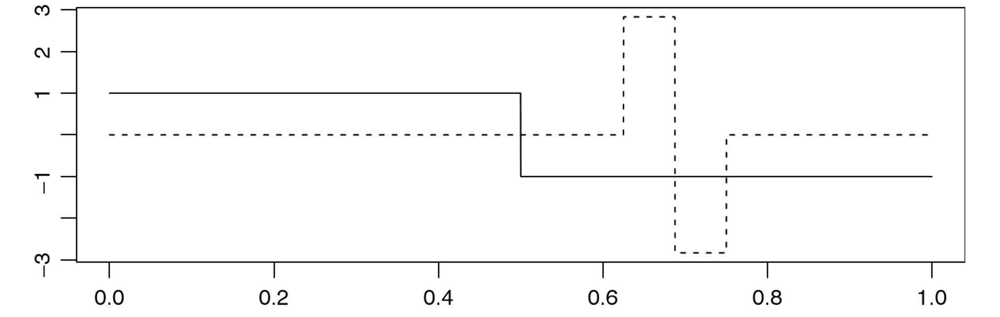
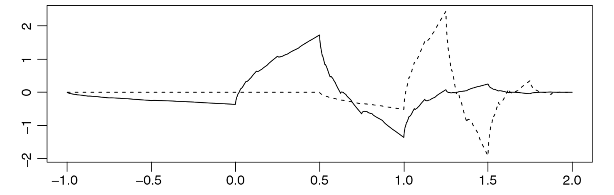
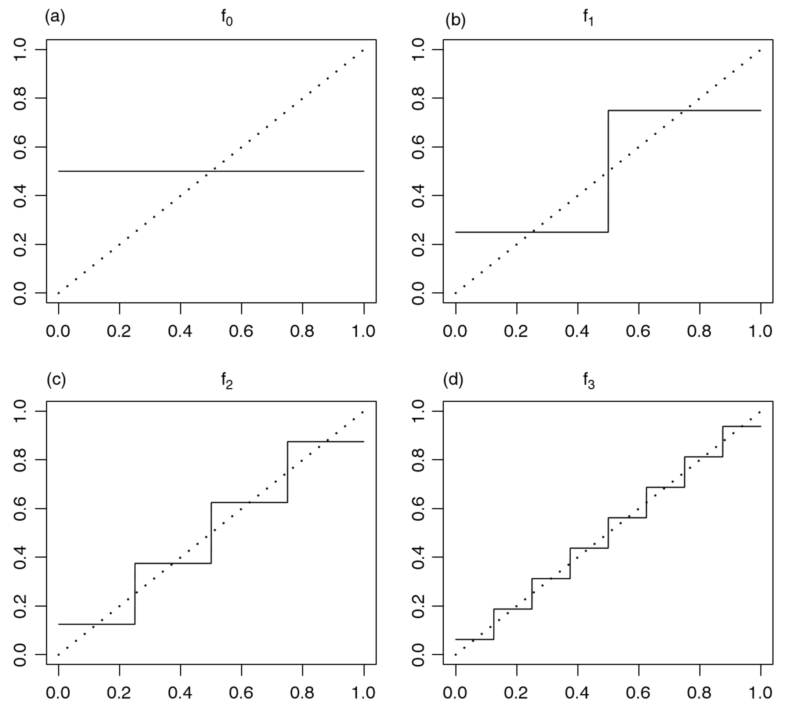
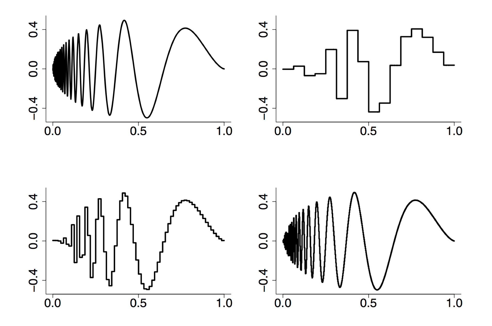
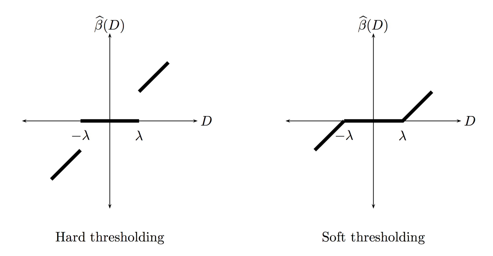

```{r setup, include=FALSE}
knitr::opts_chunk$set(echo = FALSE)
set.seed(1234)
```

## Introduction

What we've seen so far

* Nonparametric regression using smoothers
* Different types of smoothers: e.g. kernel and local polynomial

Today

* Construct basis functions that are 
    * Multiscale
    * Adaptive 
* Find sparse set of coefficients for a given basis

## Introduction

* In nonparametric regression we estimated the unkonwn function $f$ directly
* With wavelets we use a orthogonal series representation of $f$
* This shifts the estimation problem 
    * from directly estimating $f$ 
    * to estimating a set of scalar coefficients that represents $f$
* Wavelets are used in the image file format JPEG 2000 to compress data 

## Sparsity

* Wavelet methods are closely related to the concept of sparity
* A function 
$$f(x) = \sum_j \theta_j \psi_j(x)$$ 
is sparse in a basis $\psi_1,\psi_2,\dots$ if most of the $\theta_j$ are zero (or close it zero)
* Sparsity is not captured well by the $L_2$ norm but it is capture by the $L_1$ norm

## Sparsity

* For example,
$$a = (1,0,\dots,0) \hspace{1cm} b = (1/\sqrt{n},\dots,1/\sqrt{n})$$
* then both have the same $L_2$ norm
$$
\begin{aligned}
\|a\|_2 & = \sqrt{1 + 0 + \dots + 0} = 1 \\
\|b\|_2 & = \sqrt{1/n + \dots + 1/n} = \sqrt{n \times 1/n} = 1
\end{aligned}
$$
* but with $L_1$ norm
$$
\begin{aligned}
\|a\|_1 & = 1 + 0 + \dots + 0 = 1 \\
\|b\|_1 & = 1/\sqrt{n} + \dots + 1/\sqrt{n} = n \times 1/\sqrt{n} = \sqrt{n}
\end{aligned}
$$

## Assumptions

* Obervations
$$Y_i = f(x_i) + \epsilon_i \hspace{1cm} i = 1,\dots,n$$
* The $\epsilon_i$ are iid
* The function $f$ is square integrable $\int f^2 < \infty$
* Defined on a close interval $[a,b]$

## Basis Function

* A set of functions $\Psi = \{\psi_1,\psi_2,\dots\}$ is called a basis for a class of functions $\mathcal{F}$
* If any function $f \in \mathcal{F}$ can be represented as a linear combination of the basis functions $\psi_i$
* Written as
$$f(x) = \sum_{i=1}^{\infty} \theta_i \psi_i (x)$$
with $\theta_i$ are scalar constants refered to as coefficients
* The constants $\theta_i$ are inner products of the function $f$ and the basis functions $\psi_i$ 
$$\theta_i = \langle f,\psi_i \rangle = \int f(x) \psi_i(x) \, dx$$
* The basis is orthogonal if $\langle \psi_i,\psi_j \rangle = 0$ for $i \ne j$
* The basis is orthonormal if orthogonal and $\langle \psi_i,\psi_j \rangle = 1$

## Basis Function

* Many sets of basis functions
* We consider orthonomal wavelet bases
* A simple wavelet function was first introduced by Haar in 1910

```{r out.width="0.7\\linewidth"}

```

* More flexible and powerful wavelets were developed by Daubechies in 1992 and many others

```{r out.width="0.7\\linewidth"}

```

## Multiresolution Analysis

* If $\psi$ is a wavelet function, then the collection of functions
$$\Psi = \{ \psi_{jk}: j,k \text{ integers}\}$$
with 
$$\psi_{jk} = 2^{j/2} \psi(2^j x -k)$$
forms a basis for square-integrable functions
* $\Psi$ is a collection of translations and dilations of $\psi$
* The $\psi$ is constructed to ensure the the set $\Psi$ is orthonormal
* The property $\int \psi_i^2 = 1$ implies that the value of $\psi$ is near 0 except over a small range
* This property combined with the constrution above means that as $j$ increases $\psi_{jk}$ becomes increasingly localized

## Multiresolution Analysis

* A careful construction of $\psi$ leads to a multiresolution analysis
* It provides an interpretation of the wavelet representation $f$ in terms of location and scale by rewritting 
$$f(x) = \sum_{i=1}^{\infty} \theta_i \psi_i(x)$$
in terms of translation $k$ and scaling $j$ as ($\mathbb{Z}$ is set of integers)
$$f(x) = \sum_{j \in \mathbb{Z}} \sum_{k \in \mathbb{Z}} \theta_{jk} \psi_{jk}(x)$$
* This can be intepreted as approximation at different scale $j$
* Here scale $j$ is the same as frequency
* For a fixed $j$ the index $k$ represents behavior of $f$ at resolution $j$ and a particular location

## Multiresolution Analysis

* Consider the approximation
$$f_J(x) = \sum_{j < J} \sum_{k \in \mathbb{Z}} \theta_{jk} \psi_{jk}(x)$$
* As $J$ increases $f_J$ is able to model smaller scales (higher frequncy) behavior of $f$
* Corresponds to changes that occur over smaller interval of the $x$-axis
* As $J$ deceases $f_J$ models larger scale (lower frequency) behavior of $f$
* Adding gloabl scaling term
$$f_J(x) = \sum_{k \in \mathbb{Z}} \xi_{j_0k}\phi_{j_0k}(x) + \sum_{j_0 < j < J} \sum_{k \in \mathbb{Z}} \theta_{jk} \psi_{jk}(x)$$

## Multiresolution Analysis

* Consider a simple example 
$$f(x) = x, \hspace{0.5cm} x \in [0,1)$$
* The Haar wavelet functions are defined as
$$
\psi(x) = 
\begin{cases}
1, & \hspace{0.5cm} x \in [0,1/2), \\
-1, & \hspace{0.5cm} x \in [1/2,1)
\end{cases}
$$
* and
$$\phi(x) = 1, \hspace{0.5cm} x \in [0,1)$$

## Linear Example

```{r out.width="0.7\\linewidth"}

```

Source: Hollander, Wolfe, and Chicken (2013)

## Doppler Example

```{r out.width="0.8\\linewidth"}

```

Source: Wasserman (2006)

## Discrete Wavelet Transform

* The simple linear function example has exact solution to determine coefficients
* Usually this is not the case and numerical approximations are necessary to estimate coefficients
* One numerical methods is called the **cascade algorithm** by Mallat 1989
* It works for if the sample size is a power of $2$ 
$$n = 2^J$$
for some positive integer $J$
* Using this algorithm restricts the upper level of summation to $J-1$ with
$$J = \log_2(n)$$

## Wavelet Thresholding

TODO

## Wavelet Thresholding

* Hard and soft thresholding

```{r out.width="0.8\\linewidth"}

```

Source: Wasserman (2006)

## Other Important Topics

* Practical, simultaneous confidence bands for wavelet estimators are not available (Wasserman 2006)
* Standard wavelet basis functions are not invariant to translation and rotations
* Recent work by Mallat (2012) and Bruna & Mallat (2013) extend wavelets to handle these kind of invariances
* This provides a promising new direction for the theory of convolutional neural network

## References

* Hollander, Wolfe, and Chicken (2013). Nonparametric Statistical Methods
* Wasserman (2006). All of Nonparametric Statistics
* Mallat (2012). Group Invariant Scattering
* Bruna and Mallat (2013). Invariant Scattering Convolution Networks
