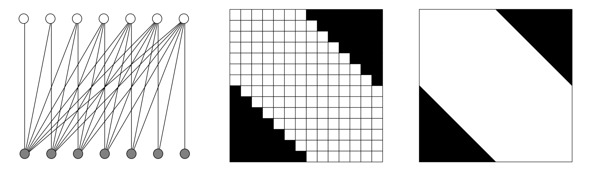
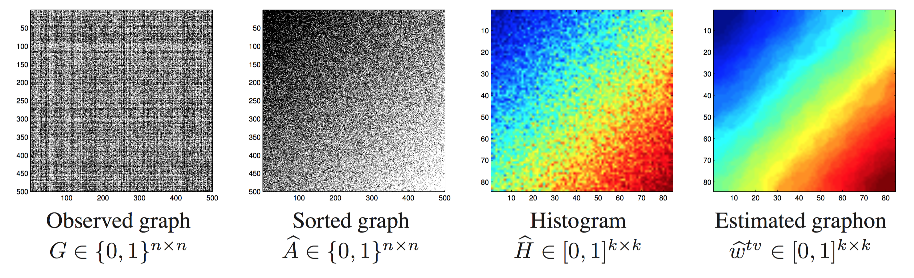
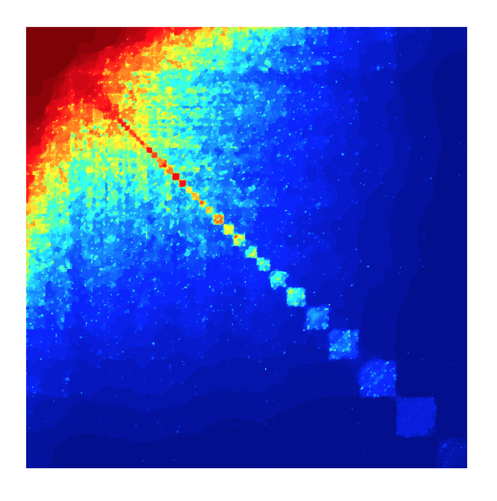
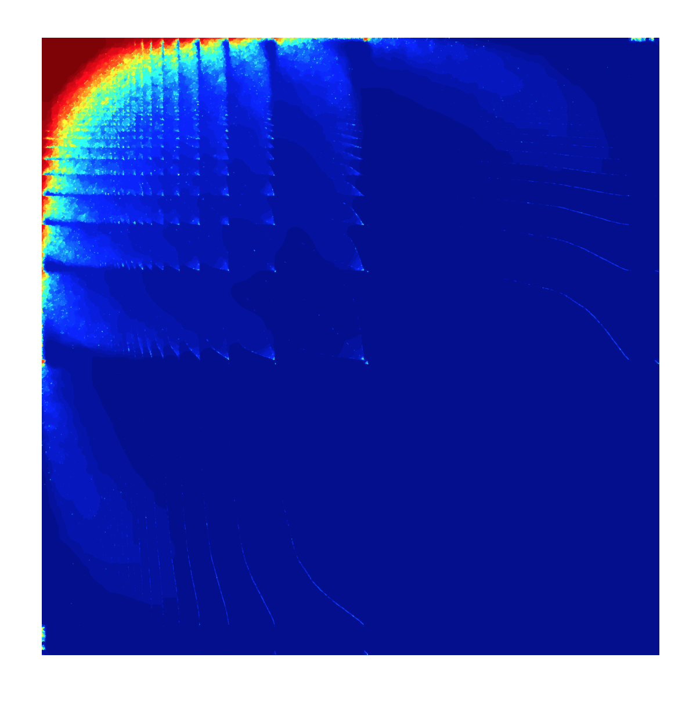

```{r setup, include=FALSE}
knitr::opts_chunk$set(echo = FALSE)
set.seed(1234)
```

## Overview

* We consider very large graphs (number of nodes $n \to \infty$)
* Modeling graphs using functions (graph limits)
* Statistical estimation of graph limits, also called graphons
* Approximation with stochastic blockmodels

## Random Graphs

* Simplest random graph model Erd\H{o}s and Rèni: 
    * Given a positive integer $n$ and a real number $0 \le p \le 1$
    * Generate a random graph by taking node pairs (independent)
    * Connecting them with probability $p$
* Random graph models on a fixed set of nodes fail to reproduce important properties of real-life networks
* Degree of a node: number of incoming and outgoing edges
* For example, the degrees of Erd\H{o}s and Réni random graphs follow a binomial distribution, and so they are asymptotically normal if the edge probability $p$ is a constant
* The degrees are highly concentrated around the mean, while the degrees of real life networks tend to obey the "Zipf phenomenon", which means that the tail of the distribution decreases according to a power law

## Random Graphs

* To address this, new random graph models have been created by adding not just new edges but also nodes as the graph grows
* These graphs reproduce the “heavy tail” behavior of the degree sequences of real-life graphs
* This leads us to the idea of graph limits: by making graphs grow we reach a limit
* This limit can be described by an well defined limit object: the graphon

## Graphs in Pictures

* Petersen graph

```{r out.width="1.0\\linewidth"}
knitr::include_graphics("PetersenGraph.png")
```

Source: Lovasz (2012)

## Graphs in Pictures

* Half graph

```{r out.width="1.0\\linewidth"}
knitr::include_graphics("HalfGraph.png")
```

Source: Lovasz (2012)

## Graphs in Pictures

* Random graph
* Random graph limit
* Chessboard
* Rearranged chessboard

```{r out.width="1.0\\linewidth"}
knitr::include_graphics("RandomGraph.png")
```

Source: Lovasz (2012)

## Graphs in Pictures

* Half graph limit

```{r out.width="1.0\\linewidth"}

```

Source: Lovasz (2012)

## Graphs in Pictures

* Starting with a single node (top left)
* Create a new node 
* Connect every pair of nonadjacent nodes with probability $1/n$, where $n$ is the current number of nodes

```{r out.width="1.0\\linewidth"}
knitr::include_graphics("ContinuousApproximationGraph.png")
```

Source: Lovasz (2012)

## Graphs in Pictures

```{r out.width="0.8\\linewidth"}
knitr::include_graphics("RealGraphs.png")
```

Source: Caron (2015). [Link](http://www.stats.ox.ac.uk/~caron/slides/Caron_sparsenetworks.pdf)

## Generative Model

* A graph limit or graphon is a measurable function $f$ from $[0,1]^2$ into $[0,1]$ that satisfies $f(x,y) = f(y,x)$ for all $x$ and $y$
* The ordering of a given graphon $f(x,y)$ along the $x$ and $y$ axes has no inherent meaning
* $f(x,y)$ has a built-in invariance to "rearrangements" of the $x$ and $y$ axes
* This is similar to statistical shape analysis, where we seek to describe objects in a manner that is invariant to their orientation in Euclidean space
* Thus $f(x,y)$ represents an equivalence class of all symmetric functions that can be obtained from one another through measure-preserving transformations of $[0,1]$

## Generative Model

* We can use graphons to generate random graphs
* Consider $U_1,\dots,U_n$ iid uniform random variables between 0 and 1
* Putting an edge between vertices $i$ and $j$ with probability $f(U_i,U_j)$
* Do this independently for all $1 \le i < j \le n$

## Statistical Estimation

* Given such a model, the statistical question that we can ask is
* Is it possible to estimate the graphon from a single realization of the graph?
* In other words, is it possible to estimate the numbers 
$$f(U_i,U_j), \hspace{0.5cm} 1 \le i < j \le n$$
* Written as matrix $M$ with $(i,j)$th elements that are given by $f(U_i,U_j)$

## Statistical Estimation

* Use the matrix estimation by Universal Singular Value Thresholding (USVT) by Chaterjee
1. Subtract $(a+b)/2$ from each entry of $X$ and divide by $(b-a)/2$ to make entries lie $[-1,1]$
2. For each $y_{i,j}$ (collection of $(y_{i,j})$ is matrix Y)
$$
y_{ij} = 
\begin{cases}
x_{ij} & \text{if $x_{ij}$ is observed} \\
0 & \text{if $x_{ij}$ is unobserved}
\end{cases}
$$
3. Singular value decomposition of $Y$
$$Y = \sum_{i=1}^m s_i u_i v_i^T$$
4. Define $\hat{p}$ as proportion of observed values of $X$

## Statistical Estimation

5. Choose small positive number $\eta \in (0,1)$ and let $S$ be the set of "threshold singular values" define as
$$S := \{ i: s_i \ge (2+\eta)\sqrt{n\hat{p}} \}$$
with $\eta$ is a predefined, $0.01$ seems to work
6. Define 
$$W := \frac{1}{\hat{p}} \sum_{i \in S} s_i u_i v_i^T$$
7. Define
$$
\hat{m}_{ij} = 
\begin{cases}
w_{ij} & -1 \le w_{ij} \le 1 \\
1 & w_{ij} > 1 \\
-1 & w_{ij} < -1
\end{cases}
$$
8. Map entries back from $[-1,1]$ to $[0,1]$

## Alternatives to the USVT Estimator

* The USVT estimator estimates graphon at observed pairs
* Or in other words, the estimator is conditioned on the observed pairs
* USVT tries to find a low-rank approximation of the probability matrix $M$
* The USVT estimator is a consistent estimator (as the number of nodes goes to infinity) of the probability matrix $M$ (Chatterjee 2012)
* An alternative estimator is the the histogram estimator proposed by Chan and Airoldi (2014)

## Histogram Estimator

* Chan and Airoldi recently introduced the sorting-and-smoothing algorithm

```{r out.width="1.0\\linewidth"}

```

Source: Chan and Airoldi (2014)

1. **Sorting**: Rearrange graph so that the empirical degrees are monotonically increasing
2. **Smoothing**: Fit a piecewise constant function

## Histogram Estimator (Example)

```{r out.width="0.4\\linewidth"}

```
Source: Chan and Airoldi (2014)

* Collaboration network of arXiv astro physics (ca-AstroPh) 
* Symmetric binary graph consisting of $1.8 \times 10^4$ nodes and $3.9 \times 10^5$ edges
* The graphon indicates close collaborations among a group of people concentrated around the top left corner of the graphon
* It also shows a number of small communities along the diagonal

## Histogram Estimator (Example)

```{r out.width="0.4\\linewidth"}

```
Source: Chan and Airoldi (2014)

* Who-trust-whom online social network of a general consumer review site Epinions.com
* Members of the site can decide whether to "trust" each other
* Unsymmetrical binary graph consisting of $7.5 \times 10^4$ nodes and $5.1 \times 10^5$ edges
* The graphon indicates that there are some influential nodes which consistently interact among themselves
* These can be seen from the repeated patterns of the graphon

## Other Important Topics

* The regularity lemma says:  
**Regularity Lemma**: The nodes of every graph can be partitioned into a "small" number of "almost equal" parts in such a way that for "almost all" pairs of partition classes, the bipartite graph between them is "quasirandom".

```{r out.width="1.0\\linewidth"}
knitr::include_graphics("RandomLookingGraph.png")
```

Source: Lovasz (2012)

## Other Important Topics

* In other words, every graphon can be approximated by a stochastic blockmodel
* The stochastic blockmodels (with blocks $q = 1,\dots,Q$)
* The generative model for binary graphs: 
* Draw edge strength from multinomial distribution
$$Z_i \sim \operatorname{Multi}(1,\alpha=(\alpha_1,\dots,\alpha_Q))$$ 
such that $Z_{iq} = 1$ if node $i$ belongs to block $q$
* Draw edges from Bernoulli distribution
$$X_{ij} | \{Z_{iq}Z_{jl} = 1\} \sim \operatorname{Bern}(\pi_{ql})$$
with $\pi$ being a $Q \times Q$ matrix of connection probabilities
* According to this model, the latent variables $Z_1,\dots,Z_N$ are iid
* Given this latent structure, all the edges are independent

## Example: arXiv Citation Network

```{r out.width="1.0\\linewidth"}
knitr::include_graphics("ArxivExampleSBM.png")
```

Source: Gopalan and Blei (2013). Efficient Discovery of Overlapping Communities in Massive Networks

<!--
## Bayesian Estimation

* Caron (Bayesian nonparametric for bipartite graphs)
* Robin (variational inference for stochastic blockmodels)
-->

## References

* Lovasz (2012). Large Networks and Graph Limits
* Chatterjee (2012). Matrix Estimation by Universal Singular Value Thresholding
* Chan and Airoldi (2014). A Consistent Histogram Estimator for Exchangeable Graph Models
* Latouche, Birmelé, and Ambroise (2010). Variational Bayesian Inference and Complexity Control for Stochastic Block Models
* Rohe, Chatterjee, and Yu (2011). Spectral Clustering and the High-Dimensional Stochastic Blockmodel

<!--
* Wolfe and Sofia C. Olhede (2013). Nonparametric Graphon Estimation
* Glasscock (2015). What is a Graphon?
* Yang, Han, and Airoldi (2014). Nonparametric estimation and testing of exchangeable graph models
-->
