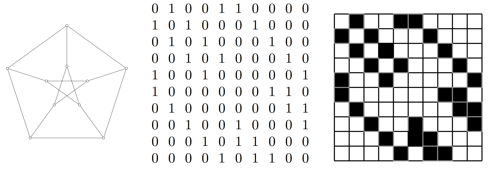
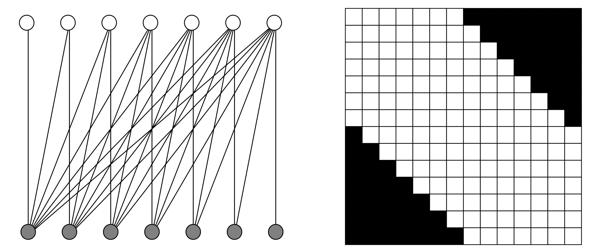
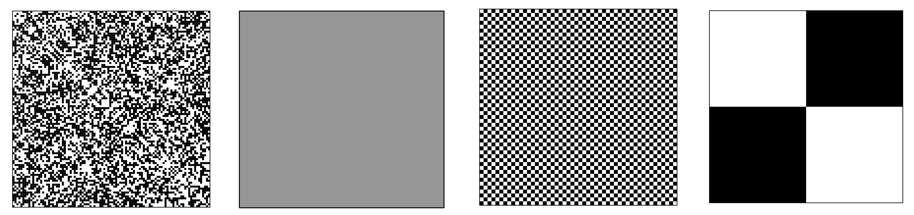
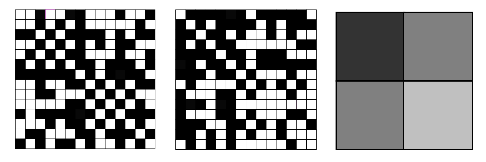
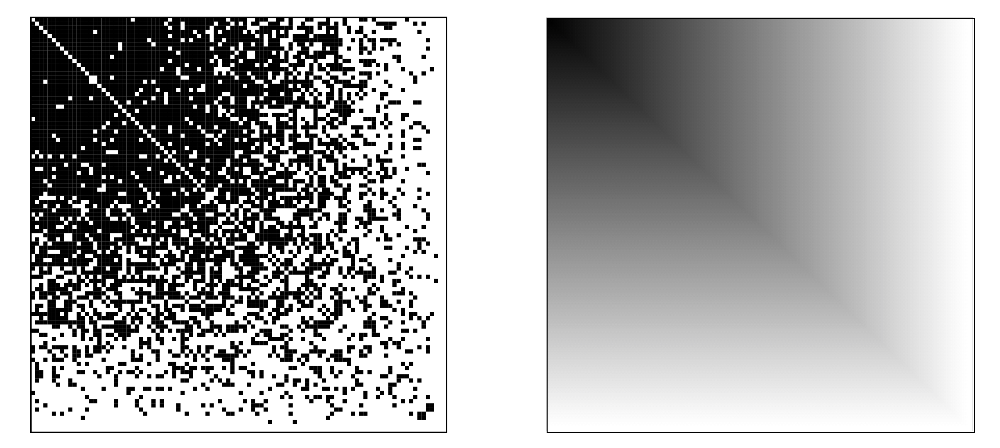
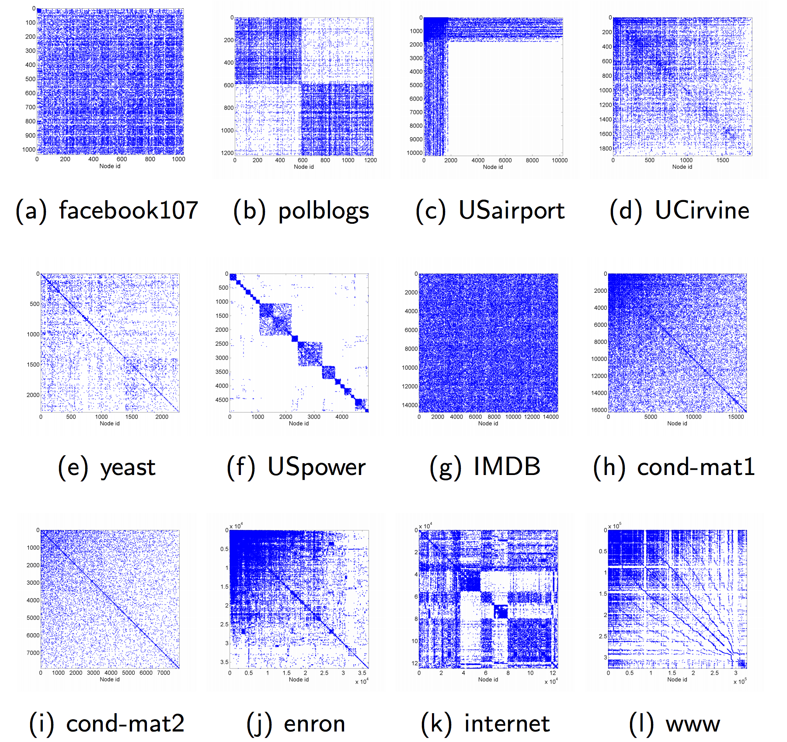

```{r setup, include=FALSE}
knitr::opts_chunk$set(echo = FALSE)
set.seed(1234)
library(datasets)
```

## Introduction

* We consider very large graphs (number of nodes $n \to \infty$)
* Modeling graphs using functions (graph limits)
* Statistical estimation of graph limits / graphons
* Parametric approximation with stochastic blockmodels

## Random Graphs

* Simplest random graph model Erd\H{o}s and R\`eni: 
    * Given a positive integer $n$ and a real number $0 \le p \le 1$
    * Generate a random graph by taking node pairs (independent)
    * Connecting them with probability $p$
* Random graph models on a fixed set of nodes fail to reproduce important properties of real-life networks
* For example, the degrees of Erd\H{o}s and R\`eni random graphs follow a binomial distribu- tion, and so they are asymptotically normal if the edge probability p is a constant
* The degrees are highly concentrated around the mean, while the degrees of real life networks tend to obey the "Zipf phenomenon", which means that the tail of the distribution decreases according to a power law

## Random Graphs

* To address this new random graph models have been created by adding not just new edges but also nodes as the graph grows
* These graphs reproduce the “heavy tail” behavior of the degree sequences of real-life graphs
* In general, this is the idea of graph limits: by making graphs grow we reach a limit that is can be described by an well defined limit object

## Graphs in Pictures

```{r out.width="1.0\\linewidth"}

```

Source: Lovasz (2012)

## Graphs in Pictures

```{r out.width="1.0\\linewidth"}

```

Source: Lovasz (2012)

## Graphs in Pictures

```{r out.width="1.0\\linewidth"}

```

Source: Lovasz (2012)

## Graphs in Pictures

```{r out.width="1.0\\linewidth"}

```

Source: Lovasz (2012)

## Graphs in Pictures

```{r out.width="1.0\\linewidth"}

```

Source: Lovasz (2012)

## Graphs in Pictures

```{r out.width="0.8\\linewidth"}

```

Source: Caron (2015). [Link](http://www.stats.ox.ac.uk/~caron/slides/Caron_sparsenetworks.pdf)

## Generative Model

* A graph limit or graphon is a measurable function $f$ from $[0,1]^2$ into $[0,1]$ that satisfies $f(x,y) = f(y,x)$ for all $x$ and $y$
* The ordering of a given graphon f(x,y) along the x and y axes has no inherent meaning
* $f(x,y)$ has a built-in invariance to "rearrangements" of the x and y axes
* This is similar to statistical shape analysis, where we seek to describe objects in a manner that is invariant to their orientation in Euclidean space
* Thus $f(x,y)$ represents an equivalence class of all symmetric functions that can be obtained from one another through measure-preserving transformations of $[0,1]$

## Generative Model

* We can use graphons to generate random graphs
* Consider $U_1,\dots,U_n$ iid uniform random variables between 0 and 1
* Putting an edge between vertices $i$ and $j$ with probability $f(U_i,U_j)$
* Do this independently for all $1 \le i < j \le n$

## Statistical Estimation

* Given such a model, the statistical question that we can ask is
* Is it possible to estimate the graphon from a single realization of the graph?
* In other words, is it possible to estimate the numbers 
$$f(U_i,U_j), \hspace{0.5cm} 1 \le i < j \le n$$
* Written in matrix $M$ with $(i,j)$th elements that are given by $f(U_i,U_j)$

## Statistical Estimation

* Use the matrix estimation by Universal Singular Value Thresholding (USVT) by Chaterjee
1. Subtract $(a+b)/2$ from each entry of $X$ and divide by $(b-a)/2$ to make entires lie $[-1,1]$
2. For each $y_{i,j}$ (collection of $(y_{i,j})$ is marix Y)
$$
y_{ij} = 
\begin{cases}
x_{ij} & \text{if $x_{ij}$ is observed} \\
0 & \text{if $x_{ij}$ is unobserved}
\end{cases}
$$
3. Singular value decomposition of $Y$
$$Y = \sum_{i=1}^m s_i u_i v_i^T$$
4. Define $\hat{p}$ as proportion of observed values of $X$

## Statistical Estimation

5. Chooose small positive number $\nu \in (0,1)$ and let $S$ be the set of "thresholding singular values" define as
$$S := \{ i: s_i \ge (2+\nu)\sqrt{n\hat{p}} \}$$
with $\nu$ is a predefined, $0.01$ seems to work
6. Define 
$$W := \frac{1}{\hat{p}} \sum_{i \in S} s_i u_i v_i^T$$
7. Define
$$
\hat{m}_{ij} = 
\begin{cases}
w_{ij} & -1 \le w_{ij} \le 1 \\
1 & w_{ij} > 1 \\
-1 & w_{ij} < -1
\end{cases}
$$

## Statistical Estimation

* Mention the other two papers as well

## Bayesian Estimation

Caron? (bipartite graphs)

Robin? (variational inference for stochastic blockmodels)

## References

* Lovasz (2012). Large Networks and Graph Limits
* Glasscock (2015). What is a Graphon?
* Chatterjee (2012). Matrix Estimation by Universal Singular Value Thresholding
* Rohe, Chatterjee, and Yu (2011). Spectral Clustering And The High-Dimensional Stochastic Blockmodel
* Wolfe and Sofia C. Olhede (2013). Nonparametric Graphon Estimation
* Rohe, Chatterjee, and Yu (2011). Spectral Clustering And The High-Dimensional Stochastic Blockmodel
* Yang, Han, and Airoldi (2014). Nonparametric estimation and testing of exchangeable graph models
* Chan and Airoldi (2014). A Consistent Histogram Estimator for Exchangeable Graph Models
