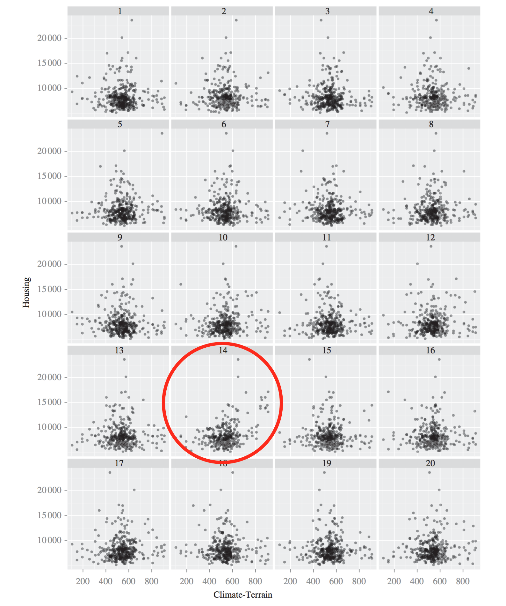
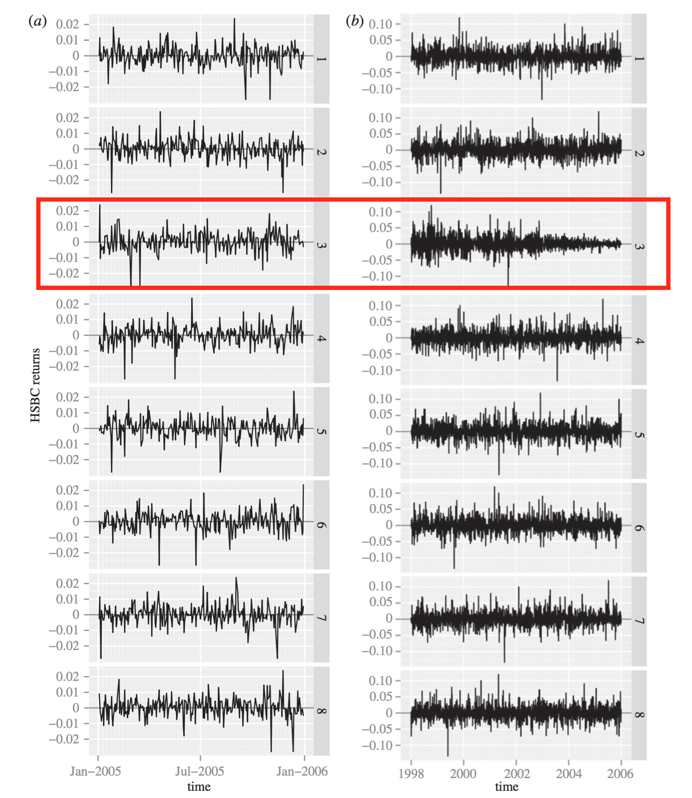

```{r setup, include=FALSE}
knitr::opts_chunk$set(echo = FALSE)
set.seed(1234)
```

## Introduction

* Exploratory data analysis is usually not parametric
* For instance, in Principle Component Analysis (PCA), we do not assume any parametric model (the data doesn't need to be normally distributed)
* What is described by PCA is a decomposition of the data into Principle Components (PCs) along which the variance is maximized after projecting the data
* But, as we have seen in this course, it is in general not necessary to assume a parametric model for inference

## Introduction

* We successfully used ranks that allowed to remove the normality assumptions in one and two-sample tests
* We successfully used the bootstrap to sample from the empirical distribution and construct confidence intervals
* We successfully used permutation tests for hypothesis testing
* In all these examples we have found ways to make inference
* Is this possible for data visualization?
* That's the topic for today

## Magical Thinking

* Professional statisticians and other scientists with statistical training were ask "How associated the two variables were"

```{r out.width="0.8\\linewidth"}
knitr::include_graphics("Rescaling.png")
```

Source: Diaconis (1983)

* Most of the subjects judged left plot as more associated than right plot (the same data points)
* Rescaling can shift the perceived association by 10 to 15%

## Inference for Plots: The Lineup

```{r out.width="0.9\\linewidth"}
knitr::include_graphics("VisualHypothesisTesting.png")
```

Source: Buja et al. (2009)

## Inference for Plots: The Lineup

* Generate 19 null plots
* Arrange all 19 plots and insert the real data at random location
* Ask human viewer to single out the real plot
* Under the null hypothesis that all plots are the same, there is a one in 20 chance to single out the real one
* If the viewer chooses the plot of the real data, then the discovery can be assigned a $p$-value of $1/20=0.05$
* Larger number of null plots could yield a smaller $p$-value
* But there is a limit of how many plots a human can consider

## Inference for Plots: The Lineup

* This protocol can be repeated with multiple independently recruited viewers
* Consider $K$ viewers and $k \le K$ selected the plot of the real data
* Then the combined $p$-value is probability $P(X \ge k)$ following a binomial distribution with $K$ trials and success probability $1/20$
* Can be as small as $0.05^K$ if all viewers picked the plot of the real data

## Inference for Plots: The Lineup (Example)

* Example comes from Boyer & Savageau (1984) where cities across the USA were rated in 1984
* Question: Is 'Climate-Terrain' associated to 'Housing'?
* Low values on 'Climate-Terrain' imply uncomfortable temperatures (either hot or cold)
* High values of 'Housing' indicate a higher cost of owning a single family residence

## Inference for Plots: The Lineup (Example)

* The null hypothesis for this example is  
$H_0$: Housing is independent of Climate-Terrain
* The null plots are generated by permuting the values of the variable Housing
* Pick out the plot of the real data: Is any plot different from the others?
* Plots on next slide are taken from Buja et al. (2009)

----

```{r out.width="0.75\\linewidth"}
knitr::include_graphics("Housing.png")
```

----

```{r out.width="0.75\\linewidth"}

```

----

* In class experiment

```{r echo=TRUE}
# number of students
K = 8
# number of correct picks
k = 2
pvalue = sum(dbinom(k:K,K,1/20)); pvalue
```

<!--
## Inference for Plots: The Lineup (Example)

* There is a slight positive association, but it is not strong
* Also, there are two clusters on the right, coastal California and the Pacific Northwest
* The so-called Climate-Terrain index is really just a measurement of how extreme versus how moderate the temperatures are, and there is nothing in the index that measures differences in cloud cover and precipitation.
* **Solution**: The real data are shown in plot 14
-->

## Inference for Plots: The Lineup (Example)

* HSBC (The Hongkong and Shanghai Banking Corporation) daily stock returns
    * two panels, the first showing the 2005 data only, 
    * the second the more extensive 1998–2005 data
* In each panel, select which plot is the most different
* Plots on next slide are taken from Buja et al. (2009)

----

```{r out.width="0.75\\linewidth"}
knitr::include_graphics("Finance.png")
```

----

```{r out.width="0.75\\linewidth"}

```

<!--
* **Solution**: In both lineups the real data are shown in plot 3
-->

----

* In class experiment

```{r echo=TRUE}
# number of students
K = 8
# number of correct picks
k = 4
pvalue = sum(dbinom(k:K,K,1/8)); pvalue
```

## Inference for Plots: The Lineup (Example)

* For 2005, the viewer should have had difficulty selecting the real data
    * This is a year of low and stable volatility
* For 1998–2005, it should be easy  
    * features two volatility bursts
    * one in 1998 due to the Russian bond default and the LTCM collapse
    * the other in 2001 due to the 9/11 event
    * after, volatility stabilizes at a low level

## Principal Component Analysis

* Principal Component Analysis (PCA) is a data exploration tool
* PCA finds a low-dimensional subspace that minimizes the distances between projections points and subspace
* Consider observations $x_1,x_2,\dots,x_n$
* Center and combine them in matrix $X$ of dimension $p \times n$
* PCA solves this minimization problem with $\langle v_1,v_1 \rangle = 1$
$$\hat{v}_1 = \underset{v_1}{\operatorname{maximize}} \Big\{ \operatorname{Var}(X v_1) \Big\}$$
* And for $v_2$ with $\langle v_1,v_2 \rangle = 0$ and $\langle v_2,v_2 \rangle = 1$
$$\hat{v}_2 = \underset{v_2}{\operatorname{maximize}} \Big\{ \operatorname{Var}(X v_2) \Big\}$$
* Keep going the same way until $\hat{v}_1,\dots,\hat{v}_q$ have been collected and put them in $\hat{V}_q$ of dimensions $p \times q$

## Principal Component Analysis (Example)

```{r out.width="1.0\\linewidth"}
knitr::include_graphics("MandibleAO.pdf")
```

Source: www.aofoundation.org

## Principal Component Analysis (Example)

```{r out.width="0.8\\linewidth"}
knitr::include_graphics("ClusteringI12_corrected.pdf")
```

Source: S., Pennec, and Reyes 2012

## Principal Component Analysis (Example)

Two animations of mandible "eigenanatomy":

* http://christofseiler.github.io/phd/

## Bootstrap PCA

* Two ways to bootstrap PCA in case of random rows $X$
* Partial bootstrap and total bootstrap
* Partial bootstrap:
    * Project $B$ replications onto initial subspace
    * Initial subspace is obtained by PCA on original $X$
    * Underestimates variation of parameters (Milan 1995)
* Total bootstrap:
    * Perform new PCA on each replication
    * Problem: Need to align PCA's
    * Nuisance variations: reflections and rotations

## Bootstrap PCA

* For the total bootstrap, need to align PCA's
* This is usually done using Procrustes analysis
* Procrustes refers to a bandit from Greek mythology who made his victims fit his bed by stretching their limbs (or cutting them off)
* Procrustes analysis is used in statistical shape analysis to compare aligned shapes after removing "nuisance" parameters:
    * translation in space
    * rotation in space
    * sometimes scaling of the objects

## Bootstrap PCA

* Shape example: landmarks for the human spine

```{r out.width="1.0\\linewidth"}
knitr::include_graphics("SpineLandmarks.pdf")
```

## Bootstrap PCA

* Same idea can be applied to align projected observations
* In PCA, shapes are the projected observations onto the lower dimensional subspace spanned by say PC1 and PC2

```{r out.width="0.8\\linewidth"}
knitr::include_graphics("Procrustes.png")
```

Source: Josse, Wager, and Husson (2014)

## Bootstrap PCA

* Collecting $B$ bootstrap sampled PCA's by resampling rows of data matrix $X$
$$\hat{V}_q^{*1},\dots,\hat{V}_q^{*B}$$
* Align all the projected point set using Procrustes alignment
* Meaning, we find rotation ($R^T R = I$)
$$\hat{R}^b = \underset{R}{\operatorname{minimize}} = \left\{ \| X^{*1} \hat{V}_q^{*1} - X^{*b} \hat{V}_q^{*b} R \|^2 \right\}$$
* and apply rotation to projected data points
$$X^{*b} \hat{V}_q^{*b} \hat{R}^{*b}$$
* Overlay points and draw contours around it

## Parametric Bootstrap PCA

* In case of fixed rows and columns $X$, we can use parametric bootstrap
* It is good alternative when the model is too difficult or before the asymptotics regime
* Steps:
1. Perform PCA on $X$ to estimate $\hat{V}_p$
2. Estimate error $\sigma^2$ from residual matrix $\epsilon_{n \times p} = X - \hat{V}_q \hat{V}_q^T X$ (assume elementwise iid normal noise)
3. Bootstrap $1,\dots,B$:
    - Draw $\epsilon_{ij}^{*b}$ from $N(0,\hat{\sigma}^2)$
    - Generate new matrix $X^{*b} = \hat{V}_q \hat{V}_q^T X + \epsilon^{*b}$
    - Perform PCA on $X^{*b}$

## Parametric Bootstrap PCA (Example)

* Consumers describe 10 white wines with 15 sensory attributes
* Consumers score wines between 1 and 10 for each attribute
* Collect averages across consumers in $10 \times 15$ matrix $X$

```{r out.width="0.6\\linewidth"}
knitr::include_graphics("WinePCA.png")
```
Source: Josse et al.

## Parametric Bootstrap PCA (Example)

* With boostraped confidence ellipses

```{r out.width="0.7\\linewidth"}
knitr::include_graphics("WinePCAWithConfidence.png")
```
Source: Josse et al.

## References

* Diaconis (1983). Theories of Data Analysis: From Magical Thinking Through Classical Statistics
* Buja, Cook, Hofmann, Lawrence, Lee, Swayne, and Wickham (2009). Statistical Inference for Exploratory Data Analysis and Model Diagnostics
* Milan and Whittaker (1995). Application of the Parametric Bootstrap to Models that Incorporate a Singular Value Decomposition
* Josse, Wager, and Husson (2014). Confidence Areas for Fixed-Effects PCA
* Seiler, Pennec, and Reyes (2012). Capturing the Multiscale Anatomical Shape Variability with Polyaffine Transformation Trees
