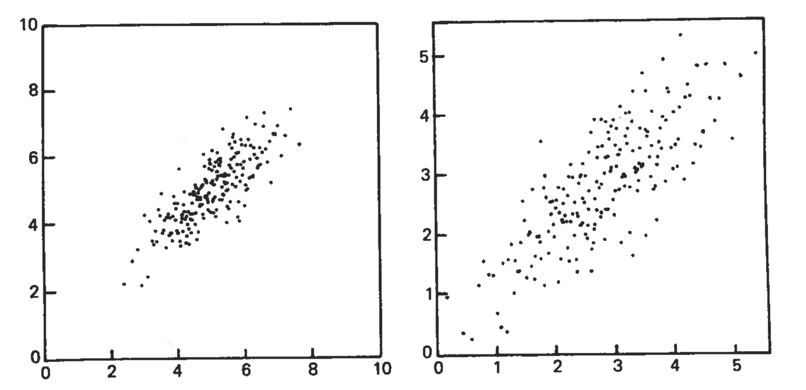
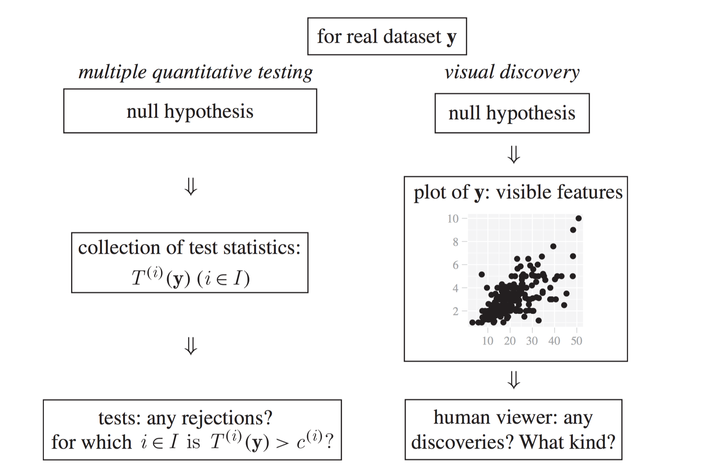
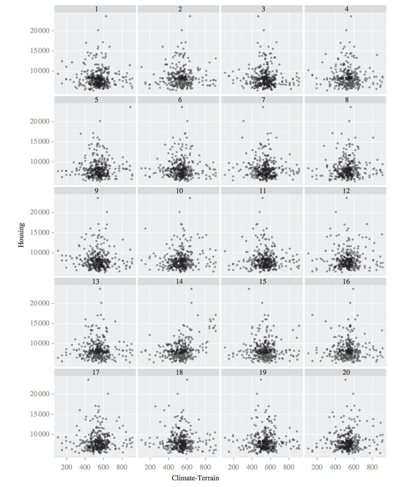
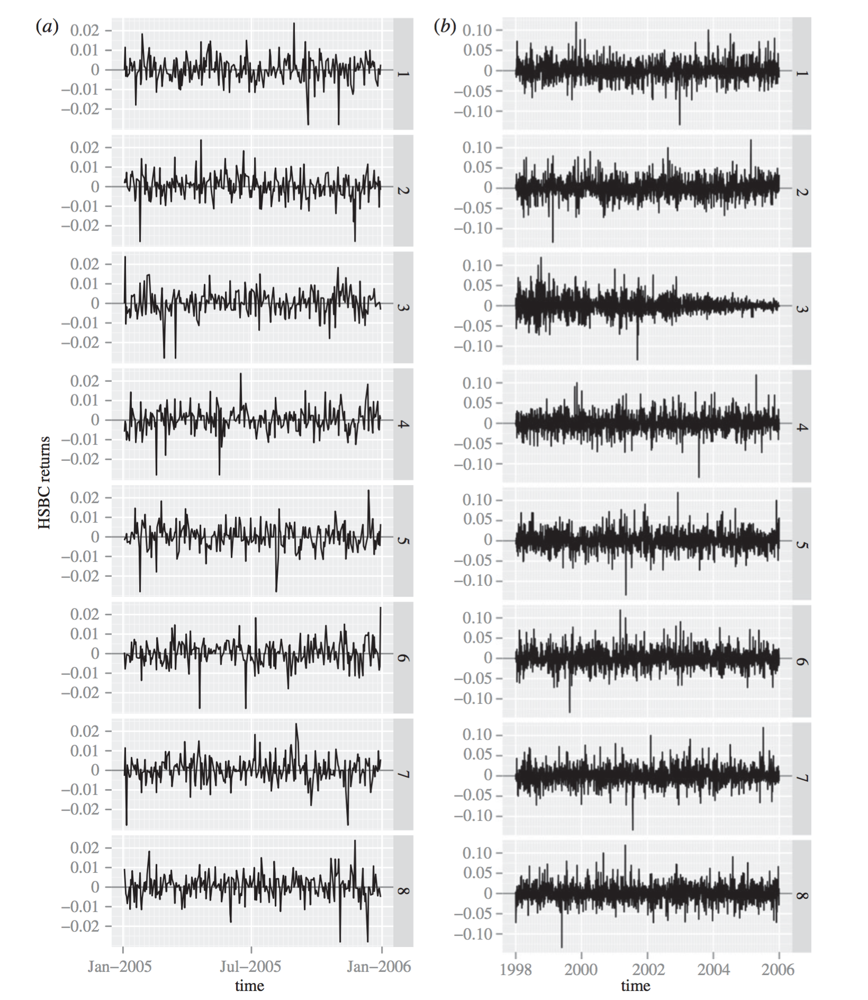
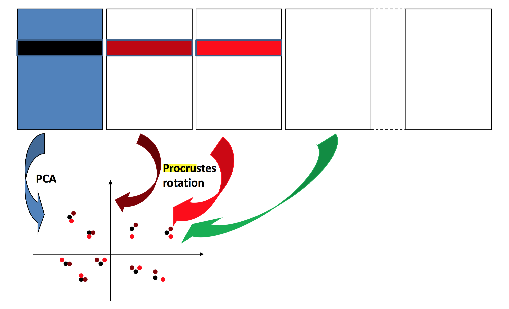
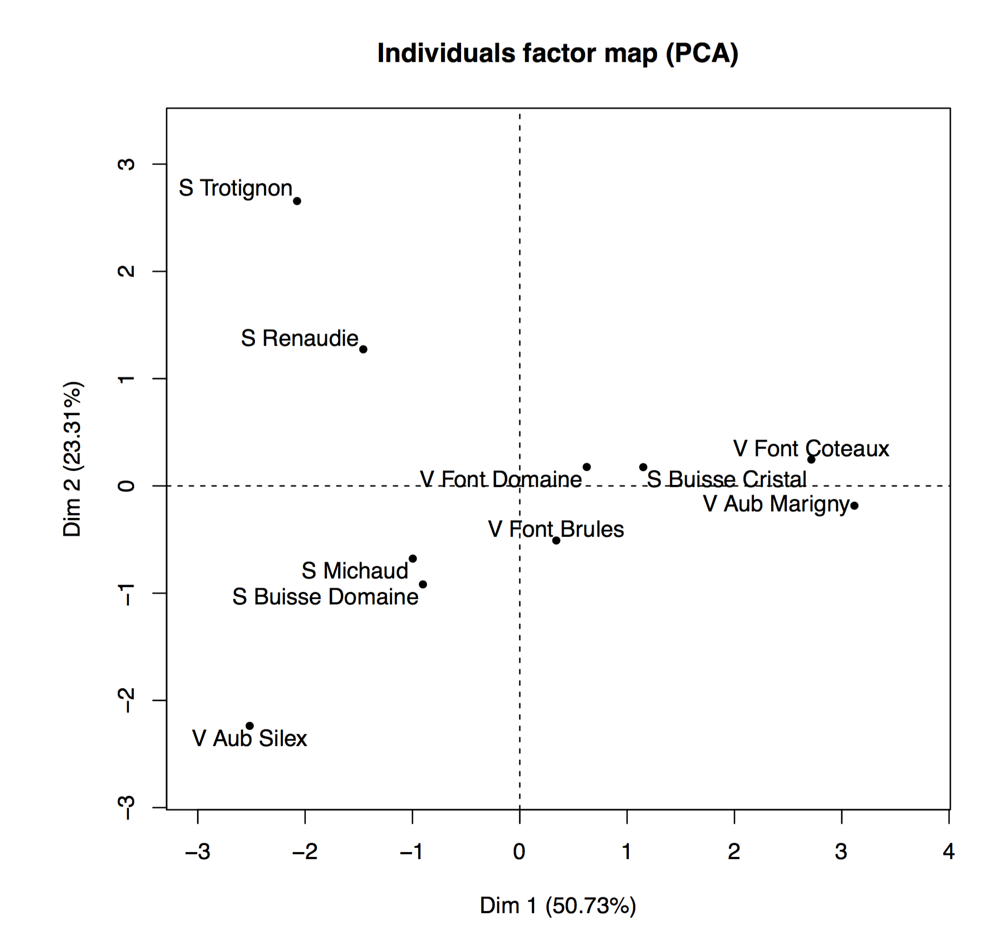
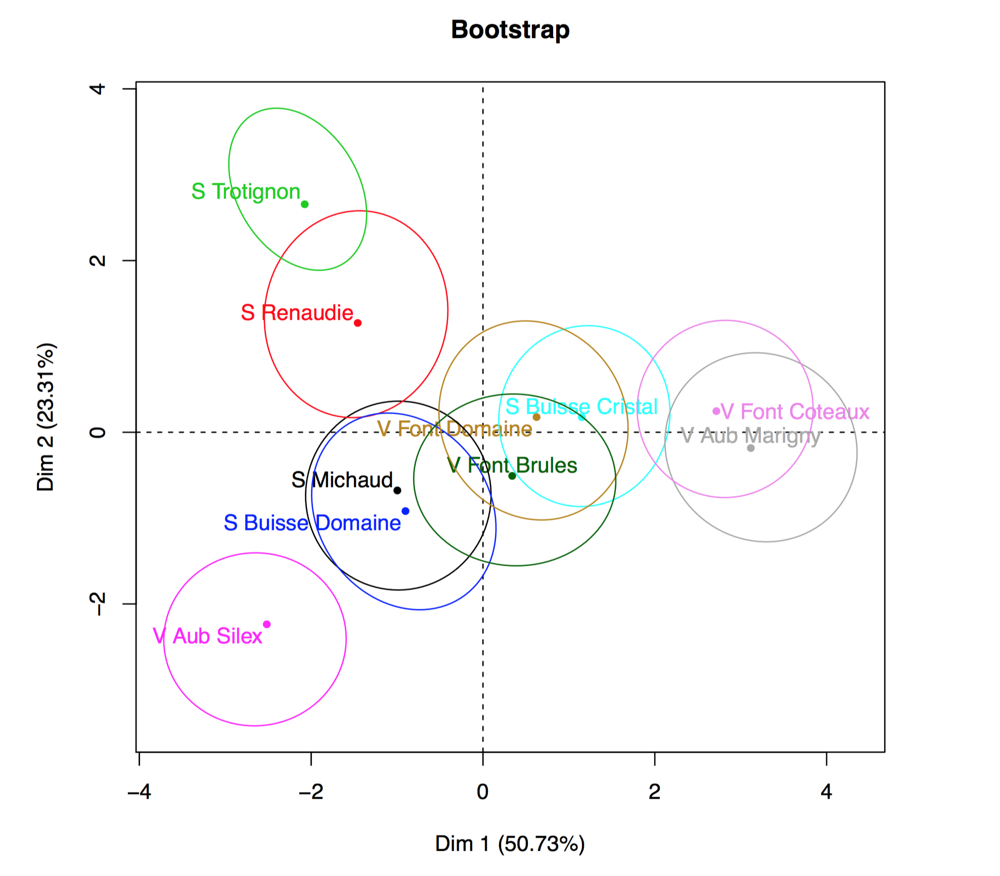

```{r setup, include=FALSE}
knitr::opts_chunk$set(echo = FALSE)
set.seed(1234)
```

## Introduction

* Exploratory data anlaysis is usually not parametric
* For instance, in Principle Component Analysis (PCA), we do not assume any parametric model (the data doesn't need to be normally distributed)
* What is described by PCA is a decomposition of the data into Principle Components (PCs) along which the variance is maximized after projecting the data
* But, as we have seen in this course, it is in general not necessary to assume a parameteric model for inference

## Introduction

* We sucessfully used ranks that allowed to remove the normality assumptions in one and two-sample tests
* We sucessfully used the bootstrap to sample from the empirical distribution and construct confidence intervals
* We sucessfully used permutation tests for hypothesis testing
* In all these examples we have found ways to make inferences even without even a completely defined underlying model
* Is this possible for data visualization?
* That's the topic for today

## Magical Thinking

* Professional statisticians and other scientists with statistical training were ask "How associated the two variables were"

```{r out.width="0.8\\linewidth"}

```

Source: Diaconis (2006)

* Most of the subjects judged left plot as more associated than right plot (the same data points)
* Rescaling can shift the perceived association by 10 to 15%

## Inference for Plots: The Lineup

```{r out.width="0.8\\linewidth"}

```

Source: Buja et al. (2009)

## Inference for Plots: The Lineup

* The protocol consists of generating, say, 19 null plots
* Inserting the plot of the real data in a random location among the null plots and asking the human viewer to single out one of the 20 plots as most different from the others 
* If the viewer chooses the plot of the real data, then the discovery can be assigned a p-value of $0.05 (=1/20)$ 
* Under the assumption that the real data also form a draw from the null hypothesis there is a one in 20 chance that the plot of the real data will be singled out
* Obviously, a larger number of null plots could yield a smaller p-value, but there are limits to how many plots a human viewer is willing and able to sift through

## Inference for Plots: The Lineup

* This protocol can be repeated with multiple independently recruited viewers
* If $K$ investigators are employed and $k (k \le K )$ selected the plot of the real data, the combined p-value is obtained as the tail probability $P(X \le k)$ of a binomial distribution $\operatorname{Bin}(K,p = 1/20)$
* It can hence be as small as $0.05^K$ if all investigators picked the plot of the real data $(k = K )$

## Inference for Plots: The Lineup (Example)

* Places Rated data: This example comes from Boyer & Savageau (1984) where cities across the USA were rated in 1984 according to many features
* The data are also of interest because of two peculiarities: they consist of aggregate numbers for US metropolitan areas, and they form a census, not a random sample
* In spite of these non-statistical features, it is legitimate to ask whether the variables in this dataset are associated, and it is intuitive to use random pairing of the variable values as a yardstick for the absence of association
* The variables we consider are 'Climate-Terrain' and 'Housing'. Low values on Climate-Terrain imply uncomfortable temperatures, either hot or cold, and high values mean more moderate temperatures
* High values of Housing indicate a higher cost of owning a single family residence. The obvious expectation is that more comfortable climates call for higher average housing costs

## Inference for Plots: The Lineup (Example)

* The null hypothesis for this example is  
$H_0$: Housing is independent of Climate-Terrain
* The decoy plots are generated by permuting the values of the variable Housing, thus breaking any dependence between the two variables while retaining the marginal distributions of each. 
* Pick out the plot of the real data
    (a) Is any plot different from the others?
    (b) Readers should explicitly note why they picked a specific plot
* Plots on next slide are taken from Buja et al. (2009)

----

```{r out.width="0.75\\linewidth"}

```

## Inference for Plots: The Lineup (Example)

* There is a slight positive association, but it is not strong
* Also, there are two clusters on the right, coastal California and the Pacific Northwest
* The so-called Climate-Terrain index is really just a measurement of how extreme versus how moderate the temperatures are, and there is nothing in the index that measures differences in cloud cover and precipitation.
* **Solution**: The real data are shown in plot 14

## Inference for Plots: The Lineup (Example)

* HSBC (The Hongkong and Shanghai Banking Corporation) daily stock returns
    * two panels, the first showing the 2005 data only, 
    * the second the more extensive 1998–2005 data
* In each panel, select which plot is the most different and explain why
* Plots on next slide are taken from Buja et al. (2009)

----

```{r out.width="0.75\\linewidth"}

```

## Inference for Plots: The Lineup (Example)

* For the short 2005 series, the reader should have had difficulty discerning the real data
    * This is a year of low and stable volatility
    * Because volatility changes are the major time dependencies in this type of data, the real and permuted stock returns are quite indistinguishable
* The long series for the years 1998–2005, however, 
    * features quite drastic changes in volatility
    * such as two volatility bursts
    * one in 1998 due to the Russian bond default and the LTCM collapse
    * the other in 2001 due to the 9/11 event
    * Thereafter, volatility peters out and stabilizes at a low level
* **Solution**: In both lineups the real data are shown in plot 3

## Principal Component Analysis

* Principal Component Analysis (PCA) is a data exporation tool
* PCA finds a low-dimensional subspace of that minimizes the distances between projections points and subspace
* Consider observations $x_1,x_2,\dots,x_n$
* Centered and combine them in matrix $X$ of dimension $p \times n$
* PCA solves this minimization problem with $\langle v_1,v_1 \rangle = 1$
$$\hat{v}_1 = \underset{v_1}{\operatorname{minimize}} \Big\{ \operatorname{Var}(X v_1) \Big\}$$
* And for $v_2$ with $\langle v_1,v_2 \rangle = 0$ and $\langle v_2,v_2 \rangle = 1$
$$\hat{v}_2 = \underset{v_2}{\operatorname{minimize}} \Big\{ \operatorname{Var}(X v_2) \Big\}$$
* Keep going the same way until $\hat{v}_1,\dots,\hat{v}_q$ have been collected and put them in $\hat{V}_q$ of dimensions $p \times q$

## Principal Component Analysis (Example)

```{r out.width="1.0\\linewidth"}
knitr::include_graphics("MandibleAO.pdf")
```

Source: www.aofoundation.org

## Principal Component Analysis (Example)

```{r out.width="0.8\\linewidth"}
knitr::include_graphics("ClusteringI12_corrected.pdf")
```

Source: S., Pennec, and Reyes 2012

## Principal Component Analysis (Example)

Two animations on visualizing mandible "eigenanatomy":

* http://christofseiler.github.io/phd/

## Bootstrap PCA

* Two ways to bootstrap PCA in case of random rows $X$
* Parital bootstrap and total bootstrap
* Parital bootstrap:
    * Project $B$ replications onto intial subspace
    * Initial subspace is obtained by PCA on original $X$
    * Underestimates variation of paramters (Milan 1995)
* Total bootstrap:
    * Perform new PCA on each replications
    * Problem: Need to align PCA's
    * Nuisance variations: reflections and rotations

## Bootstrap PCA

* In case of fixed rows and columns $X$, we can use parametric boostrap
* TODO: See Josse, Wagner, & Husson 2014 for details

## Bootstrap PCA

* In both cases, we need to align the PCA
* This is usually done using Procrustes analysis
* Procrustes refers to a bandit from Greek mythology who made his victims fit his bed either by stretching their limbs (or cutting them off)
* Procrustes anlaysis is used in statistical shape analysis to compare the aligned shapes after removing "nuisance" parameter:
    * translation in space
    * rotation in space
    * scaling of the objects

## Bootstrap PCA

* Shape example: landmarks for the human spine

```{r out.width="1.0\\linewidth"}
knitr::include_graphics("SpineLandmarks.pdf")
```

## Bootstrap PCA

* Same idea can be applied to aligned projected observations
* Here shapes are the projected observations onto a defined lower dimensional subspace spanned by say PC1 and PC2

```{r out.width="0.8\\linewidth"}

```

Source: Josse, Wager, and Husson (2014)

## Bootstrap PCA

* Collecting $B$ boostrap sampled PCA's by resampling rows of data matrix $X$
$$(X \hat{v}_1^{*1},X \hat{v}_2^{*1}),\dots,(X \hat{v}_1^{*B},X \hat{v}_2^{*B})$$
* Align all the projected point set using Procrustes alignment
* Meaning, we find rotation ($R^T R = I$)
$$\hat{R}^b = \underset{R}{\operatorname{minimze}} = \left\{ \| X^{*1} \hat{V}_q^{*1} - X^{*b} \hat{V}_q^{*b} R \|^2 \right\}$$
* and apply rotation to projected data points
$$\hat{X}^{*b} \hat{R}^b$$
* Overlay points and draw contours around it

## Bootstrap PCA (Example)

* Consumers describe 10 white wines with 15 sensory attributes
* Consumers score wines between 1 and 10 for each attribute
* Averaged across consumers into a $10 \times 15$ data matrix $X$

```{r out.width="0.6\\linewidth"}

```
Source: Josse et al.

## Bootstrap PCA (Example)

* With boostraped confidence ellipses

```{r out.width="0.7\\linewidth"}

```
Source: Josse et al.

## References

* Diaconis (2006). Theories of Data Analysis: From Magical Thinking Through Classical Statistics
* Buja, Cook, Hofmann, Lawrence, Lee, Swayne, and Wickham (2009). Statistical Inference for Exploratory Data Analysis and Model Diagnostics
* Milan and Whittaker (1995). Application of the Parametric Bootstrap to Models that Incorporate a Singular Value Decomposition
* Josse, Wager, and Husson (2014). Confidence Areas for Fixed-Effects PCA
* Seiler, Pennec, and Reyes (2012). Capturing the Multiscale Anatomical Shape Variability with Polyaffine Transformation Trees
