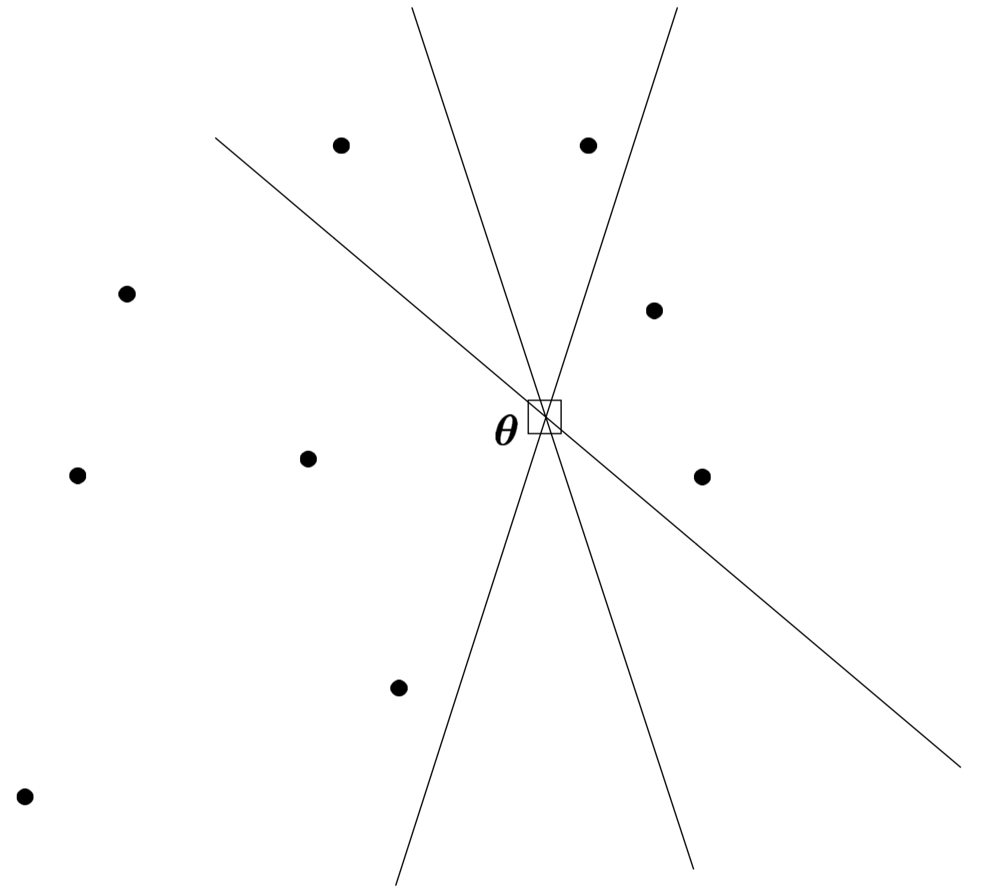
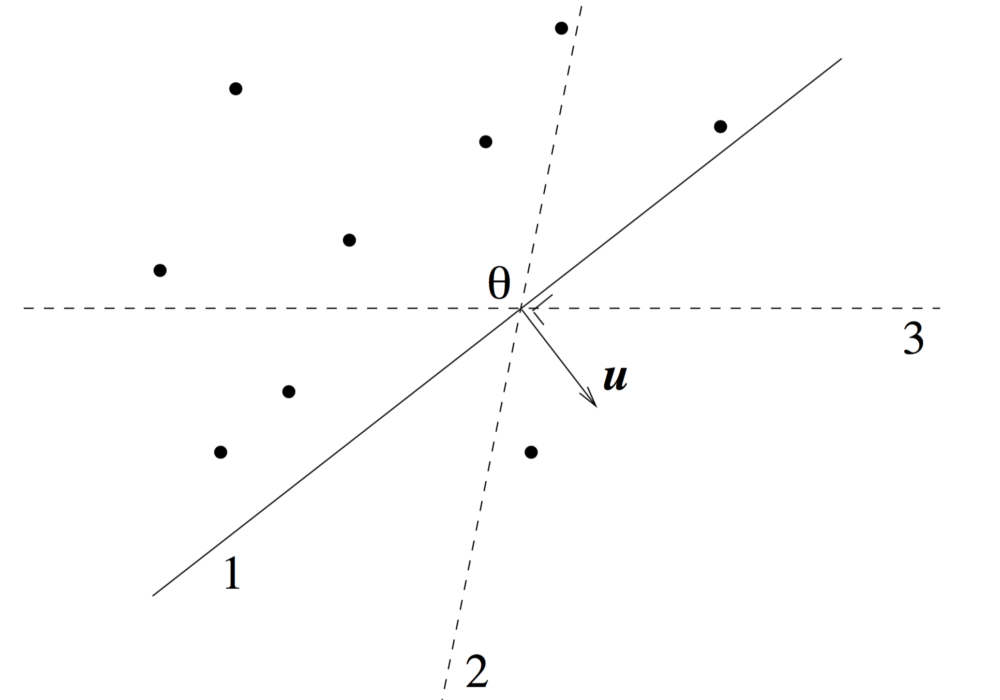

```{r setup, include=FALSE}
knitr::opts_chunk$set(echo = FALSE)
set.seed(1234)
library(aplpack)
```

## Overview

* So far, we have seen only univariate nonparametric tests
* Today, we'll cover multivariate generaliztions
1. Two-sample tests
    * Data depth-based: Depth function
    * Graph-based: Friedman and Rafsky test
2. Associations
    * Mantel test

# Data Depth-Based Two-Sample Tests

## Ranks in $\mathbb{R}^d$

* In univariate nonparametric analysis, we relied heavily on ranks
* Ranks are straigh forwared in the univariate case
* We just use the natural ordering of observations along the real line
* Moving from univariate to multivariate setting, we need to make some more considerations
* In $\mathbb{R}^d$ there is no natural ordering
* Just a straightforward extension of the median to define a center can fail
* A $\mathbb{R}^d$ coordinate-wise median can lie outside the convex hull of the data

## Ranks in $\mathbb{R}^d$

* We ranked $n$ observations in ascending order
* From that we constructed test statistics
* For instance, the median is defined as the order statistics of rank $(n+1)/2$ (when $n$ is odd)
* The median can be computed in $O(n)$ time
* The problem is that generalizing this to higher dimension is straightforward
* So we consider a different ranking system
* We rank observations as assigning 
    * the most exgtreme observation depth 1,
    * the second smallest and second largest observations depth 2
    * Until we end up with the deepest observation, the median
* This can be exteneded to higher dimensions more easily

## Ranks in $\mathbb{R}^d$

* Tukey propsed the **depth function** to address this issue
* Take a distribution $F$ on $\mathbb{R}^d$
* A depth function $D(x,F)$ 
* Then, the Half space depth function proposed by Tukey, for $x \in \mathbb{R}^2$ is:
$$D_H(x,F) = \inf\{ F(H): x \in H \text{ closed halfspace} \}$$

## Ranks in $\mathbb{R}^d$

* Example: Uniform distribution on the unit square in $\mathbb{R}^2$

```{r out.width="1.0\\linewidth"}
knitr::include_graphics("TukeyDepth.pdf")
```

Source: Serfling (2011). [(Slides)](http://www.utdallas.edu/~serfling/Serfling_Oberwolfach_Talk.pdf)

* In contrast, density function is constant with no contours of equal density

## Ranks in $\mathbb{R}^d$

* The sample halfspace depth of $x$ is the minimum fraction of data points in any closed halfspace containing $\theta$
$$D_H(\theta,X_1,\dots,X_n) = \underset{\|u\|=1}{\operatorname{minimize}} \sum_{i=1}^n I(u^T X_i \ge u^T \theta) $$

```{r out.width="0.5\\linewidth"}

```

Source: Rousseeuw and Struyf (1998)

## Ranks in $\mathbb{R}^d$

* The sample halfspace depth of $x$ is the minimum fraction of data points in any closed halfspace containing $\theta$
$$D_H(\theta,X_1,\dots,X_n) = \underset{\|u\|=1}{\operatorname{minimize}} \sum_{i=1}^n I(u^T X_i \ge u^T \theta) $$

```{r out.width="0.7\\linewidth"}

```

Source: Rousseeuw and Hubert (2015)

## Ranks in $\mathbb{R}^d$

* Let $X_1,\dots,X_{n_1} \sim F$ and $Y_1,\dots,Y_{n_2} \sim G$
* Null hypothesis $H_0: F = G$
* Alternative: location shift and/or a scale increase from $F$ to $G$
* Liu and Singh (1993) test statistic :
$$Q(F_{n1},G_{n2}) = \sum_{j=1}^{n_2} \sum_{i=1}^{n_1} I(D(X_i,F_{n_1}) \le D(Y_j,F_{n_1}))$$
* The statistic $Q$ gauges the overall "outlyingness" of the $G$ population with respect to the given $F$ population
* It can detect whether $G$ has a different location and/ or has additional dispersion as compared to $F$

## Ranks in $\mathbb{R}^d$

* Special case: Depth function for the univariate Mann-Whitney test 
$$T(F_{n1},G_{n2}) = \sum_{j=1}^{n_2} \sum_{i=1}^{n_1} I(X_i < Y_j)$$
by taking 
$$D(x,F) = F(x)$$
* Zuo and He (2006) proved asymptotic normality of this statistic

## Ranks in $\mathbb{R}^d$

```{r fig.height=5,fig.width=6,out.width="0.7\\linewidth"}
# example of Rousseeuw et al., see R-package rpart
cardata <- structure(as.integer( c(2560,2345,1845,2260,2440,
   2285, 2275, 2350, 2295, 1900, 2390, 2075, 2330, 3320, 2885,
   3310, 2695, 2170, 2710, 2775, 2840, 2485, 2670, 2640, 2655,
   3065, 2750, 2920, 2780, 2745, 3110, 2920, 2645, 2575, 2935,
   2920, 2985, 3265, 2880, 2975, 3450, 3145, 3190, 3610, 2885,
   3480, 3200, 2765, 3220, 3480, 3325, 3855, 3850, 3195, 3735,
   3665, 3735, 3415, 3185, 3690, 97, 114, 81, 91, 113, 97, 97,
   98, 109, 73, 97, 89, 109, 305, 153, 302, 133, 97, 125, 146,
   107, 109, 121, 151, 133, 181, 141, 132, 133, 122, 181, 146,
   151, 116, 135, 122, 141, 163, 151, 153, 202, 180, 182, 232,
   143, 180, 180, 151, 189, 180, 231, 305, 302, 151, 202, 182,
   181, 143, 146, 146)), .Dim = as.integer(c(60, 2)), 
   .Dimnames = list(NULL, c("Weight", "Disp.")))
bagplot(cardata,factor=3,show.baghull=TRUE,show.loophull=TRUE,precision=1,dkmethod=2,
        col.loophull="white",col.baghull="lightgray")
title("Car Data Chambers/Hastie 1992")
```

* The star is the Tukey median
* Bag: The dark area contains 50%
* Fence: Inflating the "bag" by factor 3 relative to Tukey median
* Loop: Convex hull containing all points inside the fence

## Ranks in $\mathbb{R}^d$

* Get increasingly diffuclt to compute in high dimensions
* Computation time is polynomial in $n$ but exponential in $d$
* Rousseeuw and Struyf (1998) proposed an approximation
* Out of all possible directions $n \choose d$ they propose to use a Monte Carlo simulation
* They compute $m$ random directions out of all directions perpendicular to hyperplanes through $d$ data points
* This algorithm has time complexity $O(md^3 + mdn)$

## Ranks in $\mathbb{R}^d$

* Set depth to $n$
* Repeat $m$ times:
    * Draw a random sample of size p
    * Determine a direction u perpendicular to the $d$-subset
    * Project all data points on the line $L$ through $\theta$ with direction $u$
    * Compute the univariate depth $k$ of $\theta$ on $L$
    * Set depth to $\min(\text{current depth},k)$
* TODO: conclusion

# Graph-Based Two-Sample Tests

## Computational Efficiency

* Alternative multivariate nonparametric tests are based on graphs
* We consider one test based on minimal spanning tress
* A set of $n$ points in $\mathbb{R}^d$ can be computed in $O(d n^2)$ time

## Wald-Wolfowitz Runs Test

* Is another univariate tests
* Example: Hot hand in basketball

## Friedman and Rafsky Test

* Generalization of Wald-Wolfowitz runs test to higher dimensions
* Uses minimal spanning trees

## Minimal Spanning Trees

TODO

# Associations

## Mantel Test

* Test for multivariate assocations
* Or associations between matrices

## References

* Bhattacharya (2015). Power of Graph-Based Two-Sample Tests
* Tukey (1974). Mathematics and the Picturing of Data
* Holmes (1997). Lecture Notes on [Computer Intensive Methods in Statistics](http://statweb.stanford.edu/~susan/courses/b494/node3.html#SECTION00390000000000000000)
* Serfling (2012). Depth [(pdf preprint)](http://www.utdallas.edu/~serfling/papers/Depth_EOE2.pdf)
* Rousseeuw and Hubert (2015). Statistical Depth Meets Computational Geometry: A Short Survey
* Liu and Singh (1993). A Quality Index Based on Data-Depth and Multivariate Rank Tests
* Zuo and He (2006). On the Limiting Distributions of Multivariate Depth-Based Rank Sum Statistics and Related Tests
* Rousseeuw and Struyf (1998). Computing Location Depth and Regression Depth in Higher Dimensions
