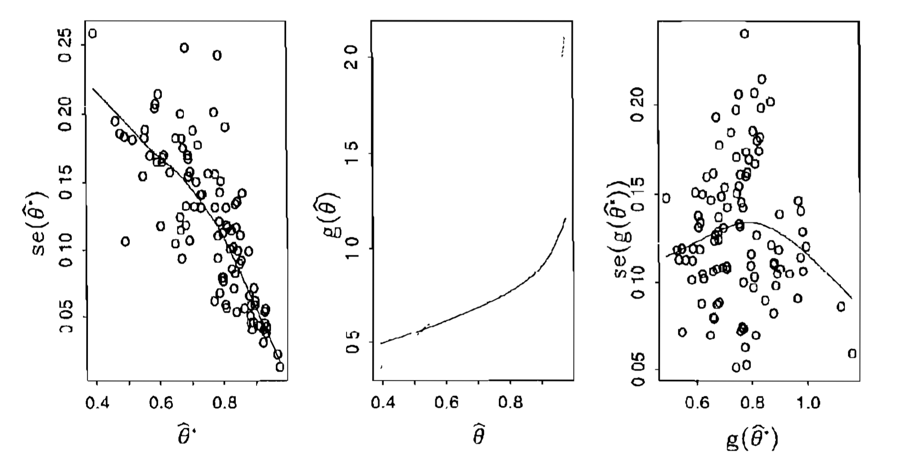

```{r setup, include=FALSE}
knitr::opts_chunk$set(echo = FALSE)
set.seed(1234)
```

## Overview

* So far we used three different bootstraps:
    * Nonparametric bootstrap on the rows (e.g. regression, PCA with random rows and columns)
    * Nonparametric bootstrap on the residuals (e.g. regression)
    * Parametric bootstrap (e.g. PCA with fixed rows and columns)
* Today, we will look at some tricks to improve the bootstrap for confidence intervals:
    * Studentized bootstrap

<!--
already done:
    * Percentile Bootstrap
-->

## Introduction

* A statistics is (asymptotically) pivotal if its limiting distribution does not depend on unknown quantities
* For example, with observations $X_1,\dots,X_n$ from a normal distribution with unknown mean and variance, a pivotal quantity is 
$$T(X_1,\dots,X_n) = \sqrt{n} \left( \frac{\theta-\hat{\theta}}{\hat{\sigma}} \right)$$
with unbiased estimates for sample mean and variance 
$$\hat{\theta} = \frac{1}{n} \sum_{i=1}^n X_i \hspace{0.5cm} \hat{\sigma}^2 = \frac{1}{n-1} \sum_{i=1}^n (X_i-\hat{\theta})^2$$
* Then $T(X_1,\dots,X_n)$ is a pivot following the Student's t-distribution with $\nu = n-1$ degrees of freedom
* Because the distribution of $T(X_1,\dots,X_n)$ does not depend on $\mu$ or $\sigma^2$

## Introduction

* The bootstrap is better at estimating the distribution of a pivotal statistics than at a nonpivotal statistics
* We will see an asymptotic argument using Edgeworth expansions
* But first, let us look at an example

## Motivation

* Take $n=20$ random exponential variables with mean 3
```{r eval=FALSE,echo=TRUE}
x = rexp(n,rate=1/3)
```
* Generate $B=1000$ bootstrap samples of $x$, and calculate the mean for each bootstrap sample
```{r eval=FALSE,echo=TRUE}
s = numeric(B)
for (j in 1:B) {  boot = sample(n,replace=TRUE)
                  s[j] = mean(x[boot]) }
```
* Form confidence interval from bootstrap samples using quantiles ($\alpha = .025$)
```{r eval=FALSE,echo=TRUE}
simple.ci = quantile(s,c(.025,.975))
```
* Repeat this process 100 times
* Check how often the intervals actually contains the true mean

## Motivation

```{r}
n <- 20
r <- 100
B <- 1000
true.mean <- 3
simple.contains <- numeric(r)
simple.ci <- matrix(NA,nrow=r,ncol=2)
for (i in 1:r) {
  x <- rexp(20,rate=1/true.mean)
  s <- numeric(B)
  for (j in 1:B) {
    boot <- sample(n,replace=TRUE)
    s[j] <- mean(x[boot])
  }
  # this is equivalent to using the 'boot' package:
  #simple.boot <- boot(x,R=B,function(x,i) mean(x[i]))
  #s <- simple.boot$t
  simple.ci[i,] <- quantile(s,c(.025,.975))
}
simple.contains <- (true.mean > simple.ci[,1] & true.mean < simple.ci[,2])
#sum(simple.contains)/r
#mean(simple.ci[,2] - simple.ci[,1])
```

```{r fig.width=6,fig.height=6}
plot(0,0,type="n",xlim=c(0,8),ylim=c(0,r),xlab="",ylab="",main="bootstrap conf intervals")
segments(simple.ci[,1],1:r,simple.ci[,2],1:r,col=ifelse(simple.contains,"black","red"))
abline(v=true.mean,col="blue")
```

## Motivation

* Another way is to calculate a pivotal quantity as the bootstrapped statistic
* Calculate the mean and standard deviation 
```{r eval=FALSE,echo=TRUE}
x = rexp(n,rate=1/3)
mean.x = mean(x)
sd.x = sd(x)
```
* For each bootstrap sample, calculate 
```{r eval=FALSE,echo=TRUE}
z = numeric(B)
for (j in 1:B) {
  boot = sample(n,replace=TRUE)
  z[j] = (mean.x - mean(x[boot]))/sd(x[boot]) }
```
* Form a confidence interval like this
```{r eval=FALSE,echo=TRUE}
pivot.ci = mean.x + sd.x*quantile(z,c(.025,.975))
```

## Motivation

```{r}
pivot.contains <- numeric(r)
pivot.ci <- matrix(NA,nrow=r,ncol=2)
for (i in 1:r) {
  x <- rexp(n,rate=1/true.mean)
  mean.x <- mean(x)
  sd.x <- sd(x)
  z <- numeric(B)
  for (j in 1:B) {
    boot <- sample(n,replace=TRUE)
    z[j] <- (mean.x - mean(x[boot]))/sd(x[boot])
  }
  pivot.ci[i,] <- mean.x + sd.x*quantile(z,c(.025,.975))
}
pivot.contains <- (true.mean > pivot.ci[,1] & true.mean < pivot.ci[,2])
#sum(pivot.contains)/r
#mean(pivot.ci[,2] - pivot.ci[,1])
```

```{r fig.width=6,fig.height=6}
plot(0,0,type="n",xlim=c(0,8),ylim=c(0,r),xlab="",ylab="",main="bootstrap conf intervals")
segments(pivot.ci[,1],1:r,pivot.ci[,2],1:r,col=ifelse(pivot.contains,"black","red"))
abline(v=true.mean,col="blue")
```

## Studentized Bootstrap

* Consider $X_1,\dots,X_n$ from $F$
* Let $\hat{\theta}$ be an estimate of some $\theta$
* Let $\hat{\sigma}^2$ be a standard error for $\hat{\theta}$ estimated using the bootstrap
* Most of the time as $n$ grows
$$\frac{\hat{\theta}-\theta}{\hat{\sigma}} \overset{.}{\sim} N(0,1)$$
* Let $z^{(\alpha)}$ be the $100\cdot\alpha$th percentile of $N(0,1)$
* Then a standard confidence interval with coverage probability $1-2\alpha$ is
$$\hat{\theta} \pm z^{(1-\alpha)} \cdot \hat{\sigma}$$
* As $n \to \infty$, the bootstrap and standard intervals converge

## Studentized Bootstrap

* How can we improve the standard confidence interval?
* These intervals are valid under assumption that
$$Z = \frac{\hat{\theta}-\theta}{\hat{\sigma}} \overset{.}{\sim} N(0,1)$$
* But this is only valid as $n \to \infty$
* And are approximate for finite $n$
* When $\hat{\theta}$ is the sample mean, a better approximation is 
$$Z = \frac{\hat{\theta}-\theta}{\hat{\sigma}} \overset{.}{\sim} t_{n-1}$$
and $t_{n-1}$ is the Student's $t$ distribution with $n-1$ degrees of freedom

## Studentized Bootstrap

* With this new approximation, we have
$$\hat{\theta} \pm t_{n-1}^{(1-\alpha)} \cdot \hat{\sigma}$$
* As $n$ grows the $t$ distribution converges to the normal distribution
* Intuitively, it widens the interval to account for unknown standard error
* But, for instance, it does not account for skewness in the underlying population
* This can happen when $\hat{\theta}$ is not the sample mean
* The Studentized bootstrap can adjust for such errors

## Studentized Bootstrap

* We estimate the distribution of 
$$Z = \frac{\hat{\theta}-\theta}{\hat{\sigma}} \overset{.}{\sim} \hspace{0.5cm} ?$$
* by generating $B$ bootstrap samples $X^{*1},X^{*2},\dots,X^{*B}$
* and computing
$$Z^{*b} = \frac{\hat{\theta}^{*b}-\hat{\theta}}{\hat{\sigma}^{*b}}$$
* Then the $\alpha$th percentile of $Z^{*b}$ is estimated by the value $\hat{t}^{(\alpha)}$ such that
$$\frac{\#\{Z^{*b} \le \hat{t}^{(\alpha)}\}}{B} = \alpha$$
* Which yields the studentized bootstrap interval
$$(\hat{\theta}-\hat{t}^{(1-\alpha)}\cdot\hat{\sigma},\hat{\theta}-\hat{t}^{(\alpha)}\cdot\hat{\sigma})$$

## Asymptotic Argument in Favor of Pivoting

* Consider parameter $\theta$ estimated by $\hat{\theta}$ with variance $\frac{1}{n}\sigma^2$
* Take the pivotal statistics 
$$S = \sqrt{n} \left( \frac{\hat{\theta}-\theta}{\hat{\sigma}} \right)$$
with estimate $\hat{\theta}$ and asymptotic variance estimate $\hat{\sigma}^2$
* Then, we can use Edgeworth expansions
$$P(S \le x) = \Phi(X) + \sqrt{n} q(x) \phi(x) + O(\sqrt{n})$$
with  
$\Phi$ standard normal distribution,  
$\phi$ standard normal density, and  
$q$ even polynomials of degree 2

## Asymptotic Argument in Favor of Pivoting

* Bootstrap estimates are 
$$S = \sqrt{n} \left( \frac{\hat{\theta}^*-\hat{\theta}}{\hat{\sigma}^*} \right)$$
* Then, we can use Edgeworth expansions
$$P(S^* \le x | X_1,\dots,X_n) = \Phi(X) + \sqrt{n} \hat{q}(x) \phi(x) + O(\sqrt{n})$$
* $\hat{q}$ is obtain by replacing unknowns in $q$ with bootstrap estimates
* Asymptotically, we further have
$$\hat{q}-q = O(\sqrt{n})$$

## Asymptotic Argument in Favor of Pivoting

* Then, the bootstrap approximation to the distribution of $S$ is 
$$P(S \le x) - P(S^* \le x | X_1,\dots,X_n) = $$
$$\bigg(\Phi(X) + \sqrt{n} q(x) \phi(x) + O(\sqrt{n})\bigg) - \bigg(\Phi(X) + \sqrt{n} \hat{q}(x) \phi(x) + O(\sqrt{n})\bigg)$$
$$= O\left( \frac{1}{n} \right)$$
* Compared to the normal approximation $\sqrt{n}$
* Which the same as the error when using standard bootstrap (can be shown with the same argument)

## Studentized Bootstrap

* These pivotal intervals are more accurate in large samples than that of standard intervals and $t$ intervals
* Accuracy comes at the cost of generality
    * standard normal tables apply to all samples and all samples sizes
    * $t$ tables apply to all samples of fixed $n$
    * studentized bootstrap tables apply only to given sample
* The studentized bootstrap can be asymmetric
* It can be used for simple statistics, like mean, median, trimmed mean, and sample percentile
* But for more general statistics like the correlation coefficients, there are some problems:
    * Interval can fall outside of allowable range
    * Computational issues if both parameter and standard error have to be bootstrapped

## Studentized Bootstrap

* The Studentized bootstrap works better for variance stabilized parameters
* Consider a random variable $X$ with mean $\theta$ and standard deviation $s(\theta)$ that varies as a function of $\theta$
* Using the delta method and solving an ordinary differential equation, we can show that
$$g(x) = \int^x \frac{1}{s(u)} du$$
will make the variance of $g(X)$ constant
* Usually $s(u)$ is unknown
* So we need to estimate $s(u) = \operatorname{se}(\hat{\theta}|\theta=u)$ using the bootstrap

## Studentized Bootstrap

1. First bootstrap $\hat{\theta}$, second bootstrap $\hat{\operatorname{se}}(\hat{\theta})$ from $\hat{\theta}^*$
2. Fit curve through points $(\hat{\theta}^{*1},\hat{\operatorname{se}}(\hat{\theta}^{*1})),\dots,(\hat{\theta}^{*B},\hat{\operatorname{se}}(\hat{\theta}^{*B}))$
3. Variance stabilization $g(\hat{\theta})$ by numerical integration
4. Studentized bootstrap using $g(\hat{\theta}^*)-g(\hat{\theta})$  
(no denominator, since variance is now approximately one)
5. Map back through transformation $g^{-1}$

```{r out.width="0.8\\linewidth"}

```

Source: Efron and Tibshirani (1994)

## Studentized Bootstrap in R

```{r echo=TRUE}
library(boot)
mean.fun = function(d, i) { 
  m = mean(d$hours[i])
  n = length(i)
  v = (n-1)*var(d$hours[i])/n^2
  c(m, v) }
air.boot <- boot(aircondit, mean.fun, R = 999)
results = boot.ci(air.boot, type = c("basic", "stud"))
```

## Studentized Bootstrap in R

```{r echo=TRUE}
results
```

<!--
already done

## Percentile Bootstrap

* One way to improve upon the Studentized bootstrap
-->

## References

* Efron (1987). Better Bootstrap Confidence Intervals
* Hall (1992). The Bootstrap and Edgeworth Expansion
* Efron and Tibshirani (1994). An Introduction to the Bootstrap
* Love (2010). Bootstrap-$t$ Confidence Intervals [(Link to blog entry)](https://mikelove.wordpress.com/2010/02/15/bootstrap-t/)

<!--
* Fisher and Hall (1989). Bootstrap Confidence Regions for Directional Data
* Fisher, Hall, Jing, and Wood (1996). Pivotal Methods for Constructing Confidence Regions With Directional Data
-->
