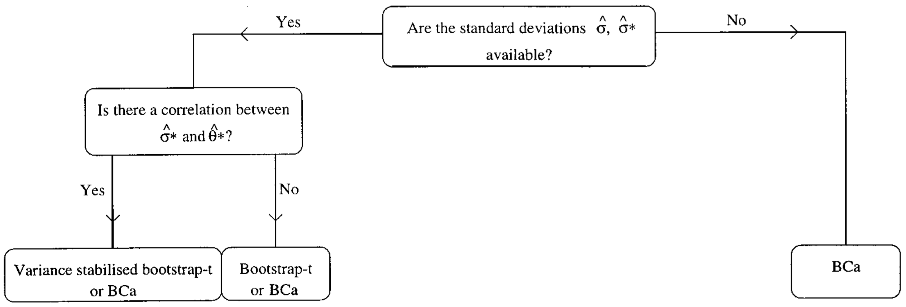

```{r setup, include=FALSE}
knitr::opts_chunk$set(echo = FALSE)
set.seed(1234)
```

## Overview

* So far:
    * Nonparametric bootstrap on the rows (e.g. regression, PCA with random rows and columns)
    * Nonparametric bootstrap on the residuals (e.g. regression)
    * Parametric bootstrap (e.g. PCA with fixed rows and columns)
    * Studentized bootstrap
* Today:
    * Bias-corrected-accelerated BCa bootstrap

## Motivation

TODO: 

Similar example as in previous lecture

Example shoing when Studentized boostrap fails and BCa bootstrap is better

This is the case when it is hard to esimate the $\hat{\sigma}$ and $\hat{\sigma}^*$

An example could be correlation coefficient or difference of means

Use model to generate data that works fine for BCa and not for Studentize bootstrap

## Bias-Corrected Bootstrap

* The bias-corrected bootstrap is similar to the percentile bootstrap
* Recall the percentile bootstrap:
* Take bootstrap samples $$\hat{\theta}^{*1},\dots,\hat{\theta}^{*B}$$
* Order them $$\hat{\theta}^{(*1)},\dots,\hat{\theta}^{(*B)}$$
* Define interval as $$(\hat{\theta}^{(*B\alpha)},\hat{\theta}^{(*B(1-\alpha))})$$ (assuming that $B\alpha$ and $B(1-\alpha)$ are integers)

## Bias-Corrected Bootstrap

* Assume that there is an increasing transfomration such that 
$$\phi = g(\theta) \hspace{0.5cm}\text{and}\hspace{0.5cm} \hat{\phi} = g(\hat{\theta})$$
* The bias-corrected bootstrap is based on this model
$$\frac{\hat{\phi}-\phi}{\sigma_{\phi}} \sim N(-z_0,1) \hspace{0.5cm} \text{with} \hspace{0.5cm} \sigma_{\phi} = 1+a\phi$$
with $\phi$ being uknown monotone increasing transformation of $\theta$
* Which is a generalization of the usual normal approximation
$$\frac{\hat{\theta}-\theta}{\sigma} \sim N(0,1)$$
* Efron (1987) for justification of this model

## Bias-Corrected Bootstrap

* $\hat{z}_0$ measures discrepancy between the median of $\hat{\theta}^*$ and $\hat{\theta}$
* It is estimated with
$$\hat{z}_0 = \Phi^{-1} \left( \frac{\#\{ \hat{\theta}^{*b} < \hat{\theta} \}}{B} \right)$$
* We obtain $\hat{z}_0 = 0$ if half of the $\hat{\theta}^{*b}$ values are less than or equal to $\hat{\theta}$

## Bias-Corrected Bootstrap

* $\hat{a}$ is essentially a skewness estimate
* $\hat{a}$ measures the rate of change of the standard error of $\hat{\theta}$ with respect to the true parameter $\theta$
* It is estimated using the Jackknife
    * Delete $i$th observation in original sample denote new sample by $\hat{\theta}_{(i)}$ and estimate 
$$\hat{\theta}_{(\cdot)} = \sum_{i=1}^n \frac{\hat{\theta}_{(i)}}{n}$$
* Then 
$$\hat{a} = \frac{\sum_{i=1}^n (\hat{\theta}_{(\cdot)}-\hat{\theta}_{(i)})^3}{6\{\sum_{i=1}^n (\hat{\theta}_{(\cdot)}-\hat{\theta}_{(i)})^2\}^{3/2}}$$
* Same accuracy as the studentized bootstrap
* Can handle out of range problem as well
* Efron (1987) for more details

## Bias-Corrected Bootstrap

* The bias-corrected version makes two additional corrections to the percentile version
* By redefining lower $\alpha_1$ and upper $\alpha_2$ levels as
$$\alpha_1 = \Phi\left(\hat{z}_0 + \frac{\hat{z}_0+z^{(\alpha)}}{1-\hat{\alpha}(\hat{z}_0+z^{(\alpha)})}\right)$$
$$\alpha_2 = \Phi\left(\hat{z}_0 + \frac{\hat{z}_0+z^{(1-\alpha)}}{1-\hat{\alpha}(\hat{z}_0+z^{(1-\alpha)})}\right)$$
with $z^{(\alpha)}$ being the 100$\alpha$ percentile of standard normal  
and $\Phi$ normal CDF
* The interval is then given by
$$(\hat{\theta}^{(*B\alpha_1)},\hat{\theta}^{(*B\alpha_2)})$$ (assuming that $B\alpha_1$ and $B\alpha_2$ are integers)
* When $\hat{a}$ and $\hat{z}_0$ are equal to zero then $\alpha_1=\alpha$ and $\alpha_2=1-\alpha$

## Bias-Corrected Bootstrap in R

```{r echo=TRUE}
library(bootstrap)
xdata = matrix(rnorm(30),ncol=2); n = 15
theta = function(x,xdata) { 
  cor(xdata[x,1],xdata[x,2]) 
  }
results = bcanon(1:n,100,theta,xdata,
                 alpha=c(0.025, 0.975))
results$confpoints
```

<!--
don't need it, computers are fast enough today

## Accelerated Bias-Corrected Bootstrap

TODO: Chapter 14
-->

## Properties of Different Boostrap Methods

$$
\small
\begin{tabular}{l|cccc}
                                        & Standard      & Percentile    & Studentized & BCa       \\
\hline                                                                                \\
Asymptotic Acurracy                     & $O(\sqrt{n})$ & $O(\sqrt{n})$ & $O(1/n)$    & $O(1/n)$  \\
Range-Preserving                        & No            & Yes           & No          & Yes       \\
Transformation-Invariant                & No            & Yes           & No          & Yes       \\
Bias-Correcting                         & No            & No            & No          & Yes       \\
Skeweness-Correcting                    & No            & Yes           & Yes         & Yes       \\
$\hat{\sigma},\hat{\sigma}^*$ required  & No            & No            & Yes         & No        \\
Analytic constant or\\
variance stabilizing\\ 
tranformation required                  & No            & No            & Yes         & Yes       \\
\end{tabular}
$$

## Properties of Different Boostrap Methods

For nonparametric boostrap: 

```{r out.width="1.0\\linewidth"}

```

Source: Carpenter and Bithell (2000)

## References

* Efron (1987). Better Bootstrap Confidence Intervals
* Hall (1992). The Bootstrap and Edgeworth Expansion
* Efron and Tibshirani (1994). An Introduction to the Bootstrap
* Carpenter and Bithell (2000). Bootstrap Conidence Intervals: When, Which, What? A Practical Guide for Medical Statisticians

<!--
* Fisher and Hall (1989). Bootstrap Confidence Regions for Directional Data
* Fisher, Hall, Jing, and Wood (1996). Pivotal Methods for Constructing Confidence Regions With Directional Data
-->
