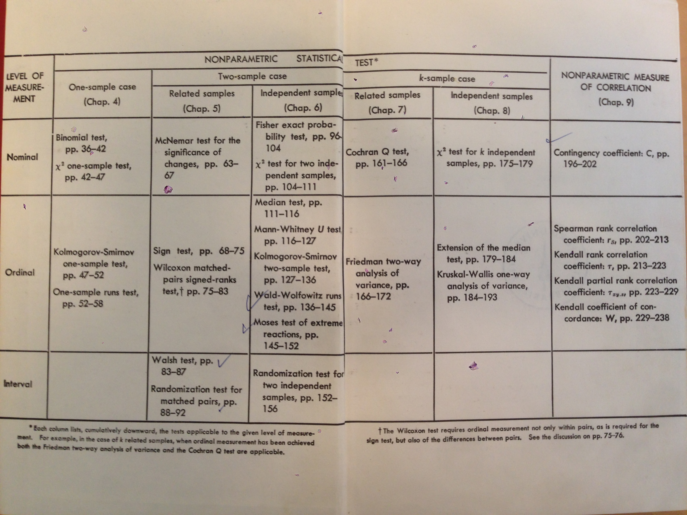

```{r setup, include=FALSE}
knitr::opts_chunk$set(echo = FALSE)
```

## Format Final Project

* You can write your final paper in the format you like: word, latex, R markdown document
* Number of pages: 12
* Included in the 12 pages are:
    * Use a lot of images, plots, and diagrams to explain concepts
* Excluded in the 12 pages are:
    * You should do your statistical analysis using R markdown and attach it to your paper
    * References

## Course Evaluations Now Open

* Axess is now open to complete end-term course evaluations
* You may complete the evaluations until 08:00 AM on Mon, Jun 13
* Online evaluations on **Stanford Axess in Course and Section Evaluations on the Student tab**
* You can view previous quarter evaluation results on the Reports tab
* Motivation: 
    * If you complete all of your evaluations you will see your grades as soon as they have been submitted by the faculty
    * Otherwise, grades in Axess until June 14

## When Is Something Nonparametric?

* Two settings: 
1. Distribution-free (NOT assumption-free)
    * Sign test, Mann–Whitney U test, and Kruskal–Wallis test
    * Boostrap
    * Permutation tests
    * $\chi^2$ tests
    * Rank-Based linear regression
    * Median polish
    * Kaplan estimator
2. Nonparametric models (number of parameters can grow with $n \to \infty$)
    * Nonparametric regression
    * Bayesian nonparametric
    * Wavelets
    * Graphons

## Distribution-Free

* Sample $X_1,\dots,X_n$ from $F$
* Statistic $T(X_1,\dots,X_n)$
* $T$ is distribution-free if 
* $T$ has **same distribution** for any $F$ with some restrictions specific to the test, for example:
* Sign test: $F$ any continuous distribution
* Signed-Rank Test: $F$ any symmetric continuous distribution

## When to Use Nonparametic Tests?

* When the right representation of the "center" is the median
* Very small sample size
* With ordinal data and ranked data
* Data with outliers that cannot easily be removed
* In all other cases use parametric test becaue they are more powerful

## When to Use Nonparametric Models?

* Very sample size is large
* Low dimensional setting otherwise course of dimensionality
* Complex relationship between predictor and response

<!--
## Why Is Categorical Data Nonparametric?

TODO
-->

## Learning Goals

1. The students will learn to apply methods and explain the statistical assumptions of **Monte Carlo simulations** for analytically intractable problems.

* We used Monte Carlo in most topics
    * permutation tests
    * bootstrap
    * rank-based
* As an alternative to asymptotics and exhaustive tests

## Learning Goals

2. The students will learn to apply methods and explain the statistical assumptions of **rank-based methods** for parameter estimation, confidence intervals, and hypothesis testing.

```{r out.width="0.7\\linewidth"}

```

Source: Siegel (1988)

## Learning Goals

3. The students will learn to apply methods and explain the statistical assumptions of **permutation tests for hypothesis testing**.

```{r out.width="0.35\\linewidth"}
knitr::include_graphics("BibleExampleText2.png")
```
Source: Witztum et al. (1994)

## Learning Goals

4. The students will learn to apply methods and explain the statistical assumptions of the **bootstrap for confidence intervals**.

```{r out.width="0.4\\linewidth"}
knitr::include_graphics("RussianDoll.PNG")
```
Source: Hall (1992)

<!--
## Bootstrap vs. Permutation Tests

* Permutations test hypotheses concerning distributions; bootstraps test hypotheses concerning parameters. As a result, the bootstrap entails less-stringent assumptions.
* Bootstrap tests are not exact
* Permutation tests are exact
-->

## Learning Goals (Advanced)

5. The students will build-up an **advanced toolbox of methods** that they can use in practical data analysis problems. Tools include: Nonlinear regression, Bayesian nonparametrics, and wavelets.
6. The students will learn to apply various **data visualization tools for data exploration in nonparametric settings**, such as: association plots, mosaic plots, correspondence analysis, median polish, and Tukey additivity plot.

## Bootstrap

* STATS 208: Introduction to the Bootstrap
    * The bootstrap is a computer-based method for assigning measures of accuracy to statistical estimates. By substituting computation in place of mathematical formulas, it permits the statistical analysis of complicated estimators. Topics: nonparametric assessment of standard errors, biases, and confidence intervals; related resampling methods including the jackknife, cross-validation, and permutation tests. Theory and applications. Prerequisite: course in statistics or probability.

## Wavelets

* STATS 322: Function Estimation in White Noise
    * Gaussian white noise model sequence space form. Hyperrectangles, quadratic convexity, and Pinsker's theorem. Minimax estimation on Lp balls and Besov spaces. Role of wavelets and unconditional bases. Linear and threshold estimators. Oracle inequalities. Optimal recovery and universal thresholding. Stein's unbiased risk estimator and threshold choice. Complexity penalized model selection. Connecting fast wavelet algorithms and theory. Beyond orthogonal bases.

## Hypothesis Testing

* STATS 300C: Theory of Statistics
    * Decision theory formulation of statistical problems. Minimax, admissible procedures. Complete class theorems ("all" minimax or admissible procedures are "Bayes"), Bayes procedures, conjugate priors, hierarchical models. Bayesian non parametrics: diaichlet, tail free, polya trees, bayesian sieves. Inconsistency of bayes rules.
* Maybe start with STATS 300A and B

## Correspondence Analysis

* STATS 306A: Discrete Data Analysis (Art Owen) but listed as
* STATS 306A: Methods for Applied Statistics
    * Regression modeling extended to categorical data. Logistic regression. Loglinear models. Generalized linear models. Discriminant analysis. Categorical data models from information retrieval and Internet modeling. Prerequisite: 305 or equivalent.

## Bayesian Nonparametrics

* STATS 270: Bayesian Statistics I (STATS 370)
    * This is the first of a two course sequence on modern Bayesian statistics. Topics covered include: real world examples of large scale Bayesian analysis; basic tools (models, conjugate priors and their mixtures); Bayesian estimates, tests and credible intervals; foundations (axioms, exchangeability, likelihood principle); Bayesian computations (Gibbs sampler, data augmentation, etc.); prior specification. Prerequisites: statistics and probability at the level of Stats300A, Stats305, and Stats310.

## Bayesian Nonparametrics

* STATS 271: Bayesian Statistics II (STATS 371)
    * This is the second of a two course sequence on modern Bayesian statistics. Topics covered include: Asymptotic properties of Bayesian procedures and consistency (Doobs theorem, frequentists consistency, counter examples); connections between Bayesian methods and classical methods (the complete class theorem); generalization of exchangeability; general versions of the Bayes theorem in the undominated case; non parametric Bayesian methods (Dirichelet and Polya tree priors). Throughout general theory will be illustrated with classical examples. Prerequisites: Stats 270/370.

## ANOVA

* STATS 203: Introduction to Regression Models and Analysis of Variance
* Modeling and interpretation of observational and experimental data using linear and nonlinear regression methods. Model building and selection methods. Multivariable analysis. Fixed and random effects models. Experimental design. Pre- or corequisite: 200.

## Survival Analysis

* STATS 331: Survival Analysis
    * The course introduces basic concepts, theoretical basis and statistical methods associated with survival data. Topics include censoring, Kaplan-Meier estimation, logrank test, proportional hazards regression, accelerated failure time model, multivariate failure time analysis and competing risks. The traditional counting process/martingale methods as well as modern empirical process methods will be covered. Prerequisite: Understanding of basic probability theory and statistical inference methods.
* STATS 215: Statistical Models in Biology
    * Poisson and renewal processes, Markov chains in discrete and continuous time, branching processes, diffusion. Applications to models of nucleotide evolution, recombination, the Wright-Fisher process, coalescence, genetic mapping, sequence analysis. Theoretical material approximately the same as in STATS 217, but emphasis is on examples drawn from applications in biology, especially genetics. Prerequisite: 116 or equivalent.

## Ranked-Set Sampling

* STATS 263: Design of Experiments (STATS 363)
    * Experiments vs observation. Confounding. Randomization. ANOVA.Blocking. Latin squares. Factorials and fractional factorials. Split plot. Response surfaces. Mixture designs. Optimal design. Central composite. Box-Behnken. Taguchi methods. Computer experiments and space filling designs. Prerequisites: probability at STATS 116 level or higher, and at least one course in linear models.

## Graphons

* STATS 300: Advanced Topics in Statistics: Stochastic Block Models and Latent Variable Models
    * Main topic: statistical inference of latent variable models (including SBM), using EM-like algorithms. The critical step is the determination of the conditional distribution of the latent variables given the observed data, which is doable for mixture models and hidden Markov models. For more complex models such as the stochastic block model (SBM: popular in sociology, physics, biology, etc.) variational approximations can be used to derive a generalized version of EM algorithm. This approach can be extended to Bayesian inference (variational Bayes EM algorithm). If time permits, change-point detection models will be introduced. Topics will be illustrated with examples from genomics.

## Background

* PHIL 166: Probability: Ten Great Ideas About Chance (PHIL 266, STATS 167, STATS 267)
    * Foundational approaches to thinking about chance in matters such as gambling, the law, and everyday affairs. Topics include: chance and decisions; the mathematics of chance; frequencies, symmetry, and chance; Bayes great idea; chance and psychology; misuses of chance; and harnessing chance. Emphasis is on the philosophical underpinnings and problems. Prerequisite: exposure to probability or a first course in statistics at the level of STATS 60 or 116.

## References

* Hall (1992). The Bootstrap and Edgeworth Expansion
* Witztum, Rips, and Rosenberg (1994). Equidistant Letter Sequences in the Book of Genesis
* Siegel (1988). Nonparametric Statistics for the Behavioral Sciences

<!--
* Good (2005). Permutations, Parametric, and Boostrap Test of Hypothesis
-->
