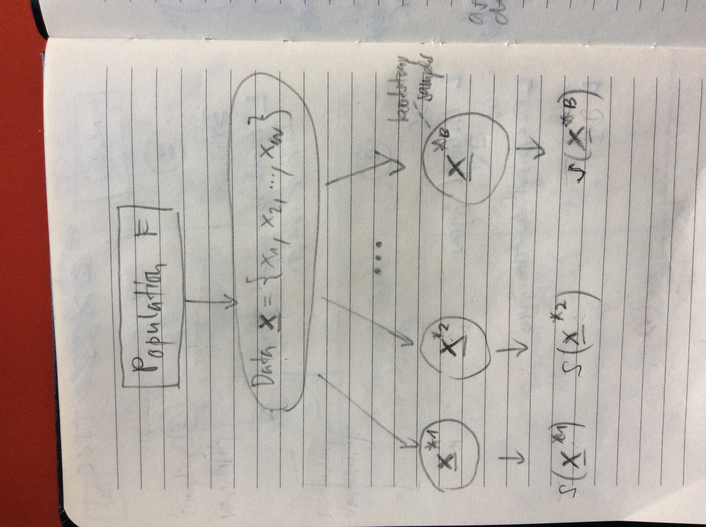
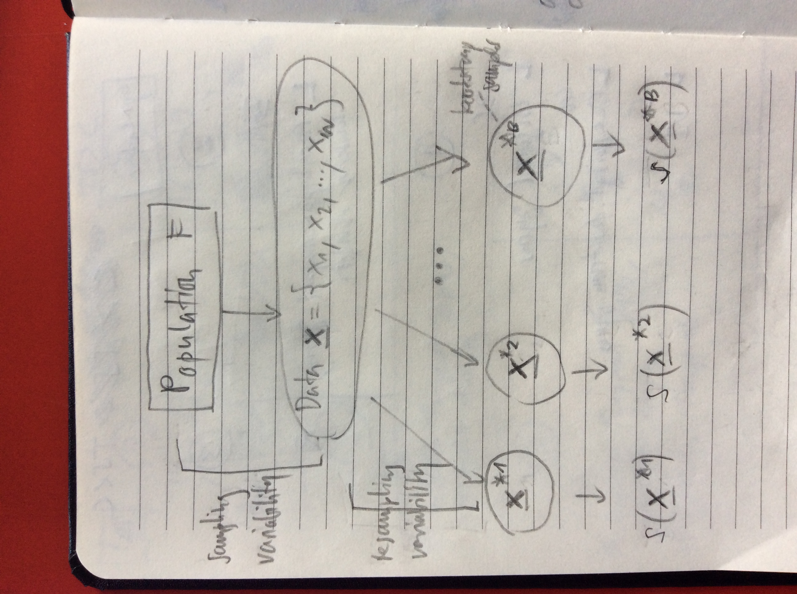

```{r setup, include=FALSE}
knitr::opts_chunk$set(echo = FALSE)
fastMode = FALSE
```

## What Happened So Far

* We want to compute functionals $\theta = T(F)$, e.g. 
    * the mean: $T(F) = \int x \, dF(x) = \int x \, f(x) \, dx$
    * the median: $T(F) = F^{-1}(1/2)$ 
* Parameter of interest $\theta$ is functional of unkown $F$
* We tested $\theta = \theta_0$ from a sample $\boldsymbol{x} = \{ x_1,x_2,\dots,x_n \}$ drawn from distribution $F$ by comparing the observed statistic $s(\boldsymbol{x})$ to the null distribution of test statistics
* We estimated $\theta$ and confidence intervals from a sample and quantified robustness to outliers

----

```{r, out.height = 600, fig.retina = NULL, echo=FALSE}

```

## Background

* Computer more powerful, resampling procedure more widespread
* The bootstrap is a general tool to measure error in an estimate or significance in of a test hypothesis
* Context for sampling distribution of a statistic
* A bootstrap sample is a sample from the original sample taken (with replacement)
* This works when the histogram of the sample is representative of the population
* In other words, the histogram of the sample resembles the pdf of the random variable
* Drawing sample from the histogram is then the same as drawing samples from the population
* Thus yields an estimate of the sampling distribution of the statistic $s(\boldsymbol{x})$

## Plug-in Principle

* The data are drawn independently and identically from a unknown distribution $F$
* The bootstrap supposes that the empirical distribution $F_n$ is a good description of the unknown distribution $F$
* The *plugin-in estimate* of a parameter $\theta = T(F)$ is define as
$$\widehat{\theta} = T(F_n)$$
* This way one can draw as many samples from $F_n$ to compute sample variability of all kinds of \textit{statistics} $s(x_1, x_2, \dots, x_n)$, e.g. the sample mean, sample median
* This is done via choosing $n$ samples with replacement (you can pick the same sample multiple times) 

## Plug-in Principle

* We observe the empirical distribution $F_n$
$$ F_n(t) = \frac{1}{n} \sum_{i=1}^n I(x_i \le t) $$
* In other words, the distribution that puts mass $1/n$ at each $x_i$
* Denote bootstrap sample from $F_n$ (sample with replacement) as 
$$\boldsymbol{x}^* = \left[ x_1^*,x_2^*,\dots,x_n^* \right]^T$$
* Estimate based on original observations $\widehat{\theta}^* = s(\boldsymbol{x}^*)$
* Denote a collection of $B$ bootstrap samples as $\widehat{\theta}^*_1,\widehat{\theta}^*_2,\dots,\widehat{\theta}^*_B$

## Percentile Confidence Intervals

* Order bootstrap samples: $\widehat{\theta}^*_{(1)} \le \widehat{\theta}^*_{(2)} \le \dots \le \widehat{\theta}^*_{(B)}$
* Let $m = \alpha/2 \times B$ then
* we get the approximate $(1-\alpha) \times 100\%$ confidence interval 
$$\left( \widehat{\theta}^*_{(m)},\widehat{\theta}^*_{(B-m)} \right)$$

## Paired Problem

* Consider the paired problem with $d_1,\dots,d_n$ are the differences
* In the bootstrap sample $d_i$ and $-d_i$ each have probability $1/2$ of being selected
* This forms an estimate of the null distribution of the test statistic $T$
* Then
$$\text{p-value } = \frac{\#\{T_i^*\ge T_0\}}{B}$$

## One Sample Location Problem

* Test the hypothesis:
$$ H_0: \theta = \theta_0 \text{ versus } \theta > \theta_0 $$
* We have to make sure that the null hypothesis is true, so we take our bootstrap samples from
$$x_1-\widehat{\theta}+\theta_0,\dots,x_n-\widehat{\theta}+\theta_0$$
* Then
$$\text{p-value } = \frac{\#\{\widehat{\theta}_i^*\ge \widehat{\theta}\}}{B}$$

## Two Sources of Errors

* Sampling variability:   
We only have a sample of size $n$ and not the entire population
* Bootstrap resampling variability:   
We only use $B$ bootstrap samples rather than an infinite number

----

```{r, out.height = 600, fig.retina = NULL, echo=FALSE}

```

## Two Sources of Errors

* The bootstrap estimate of a standard error $\widehat{\operatorname{se}}_B$ of a statistic $s$
$$\widehat{\operatorname{se}}_B = \left( \frac{1}{B} \sum_{b=1}^B (s(\boldsymbol{x}^{*b})-\bar{s})^2 \right)^{1/2}$$
* when $s$ is the sample mean of iid normals, then we get a coeffiecent of variation 
$$\operatorname{cv}(\widehat{\operatorname{se}}_B) = \frac{\operatorname{Var}(\widehat{\operatorname{se}}_B)}{\operatorname{E}(\widehat{\operatorname{se}}_B)}$$
* as a function of $n$ and $B$
$$\operatorname{cv}(\widehat{\operatorname{se}}_B) = \left( \frac{1}{2n} + \frac{1}{2B} \right)^{1/2}$$

## Complete Enumerations

* There are $n^n$ different bootstrap samples
$$\boldsymbol{x}^{*1},\boldsymbol{x}^{*2},\dots,\boldsymbol{x}^{*n^n}$$
but some of them have the same subset
* We group the same bootstrap sample and assign a weight $k_i$ describing the number of times it occurs, so $k_1 + \dots + k_n = n$
* Denote the space of compositions of $n$ into at most $n$ parts as
$$\mathcal{C}_n = \{ \boldsymbol{k} = (k_1,\dots,k_n), k_1+\dots+k_n=n, k_i \ge 0, k_i \text{ integer} \}$$

## Complete Enumerations

* The size of this space is $|\mathcal{C}_n| = \binom{2n-1 }{n-1}$ 
* Place $n-1$ bars inbetween $n$ balls, example $n=3$, for example
* ``` 0|0|0 ``` corresponse to $x_1,x_2,x_3$
* ``` 000|| ``` corresponse to $x_1,x_1,x_1$
* there will be $2n-1$ positions from which to choose the $n-1$ bars positions

## Complete Enumerations

* Multinomial distribution a vector  $(k_1,k_2,...k_n)$, with each of the $n$ categories being equally likely, $p_i=\frac{1}{n}$
    * rolling a dice with $k_1,k_2,\dots,k_n$ sides $n$ times
    * all sides have fixed and equal probability of sucess
    * counts how many times each side comes up successfully
    * multinomial distribution gives the probability of any particular combination of numbers of successes

## Complete Enumerations

* To form an exhaustive bootstrap distribution of statistic $T(\mathcal{X}_n)$, we need to compute  
    * $|\mathcal{C}_n| = \binom{2n-1}{n-1}$ statistics and 
    * associated weights $m_n(k)$
* The shift from $\mathcal{X}_n^n$ to $\mathcal{C}_n$ gives substantial savings 
* For an example with $n = 15$, the number of enumerations reduce from  
$15^{15} \approx 4.38 \times 10^{17}$ to $\binom{29}{14} \approx 7.7 \times 10^7$

## Law Schools Example

```{r echo = TRUE}
library(bootstrap); data(law); t(law)
```

## Law Schools Example

```{r echo=FALSE}
library(ggplot2)
law2 = data.frame(Observation = 1:dim(law)[1],law)
ggplot(law2, aes(x = LSAT, y = GPA)) + 
  geom_text(aes(label = Observation),hjust = 0,vjust = 0)
```

## Law Schools Example

Sample correlation coefficient:

```{r}
theta.hat = cor(law$LSAT,law$GPA)
theta.hat
```

How accurate is this estimate. Let's look at the bootstrap samples:

```{r echo=TRUE}
draw.bootstrap.sample = function() {
  n = dim(law)[1]
  ind = sample(n,replace = TRUE)
  return(cor(law[ind,]$LSAT,law[ind,]$GPA))
}
nrep = 40000
thetastar = replicate(nrep,draw.bootstrap.sample())
thetastar2 = data.frame(cor=thetastar)
```

## Law Schools Example

Evaluate the correlation coefficient using a Monte Carlo simulation:
```{r}
ggplot(thetastar2, aes(cor)) + 
  geom_histogram(binwidth = 0.01) +
  geom_vline(xintercept = theta.hat,colour = "red",size = 1.5)
```

## Law Schools Example

Create matrix of all $\binom{2n-1}{n-1}$ enumerations:
```{r echo=TRUE, eval=TRUE}
library(partitions)
n = 15
allCompositions = compositions(n,n)
```

----

```{r echo=TRUE, eval=TRUE}
allCompositions[,1:10]
```

## Law Schools Example

Check number of compositions:
```{r echo=TRUE, eval=TRUE}
library(assertthat)
nCompositions = dim(allCompositions)[2]
nCompositions
# Check if we get the same value as in theory
nCompositionsTheory = choose(2*n-1,n-1) 
if(!assert_that(nCompositions == nCompositionsTheory)) {
  print("there is a problem with the number of compositions")
} else {
  print("the number of compositions is correct")
}
```

## Law Schools Example

Evaluate the correlation coefficient for all $\binom{2n-1}{n-1}$ bootstrap samples.
```{r echo=TRUE, eval=TRUE}
library(parallel)
if(!file.exists("enumData.Rdata")) {
  ptm = proc.time()
  enumData = mclapply(1:nCompositions, function(i) {
    ind = allCompositions[,i]
    law.list = lapply(1:n,function(j) matrix(rep(law[j,],ind[j]),ncol = 2 ,byrow = TRUE))
    newLaw = do.call(rbind, law.list)
    c(cor(unlist(newLaw[,1]),unlist(newLaw[,2])),dmultinom(ind,prob = rep(1,n)))
    }, mc.cores = 4)
  proc.time() - ptm
  enumData = t(simplify2array(enumData))
  colnames(enumData) = c("cor","weight")
  save(enumData,file = "enumData.Rdata")  
} else {
  load("enumData.Rdata")
}
```

## Law Schools Example

Same plot as before but now with all bootstrap samples:
```{r echo=FALSE, warning=FALSE, eval=TRUE}
enumDataFrame = data.frame(enumData)
if(!fastMode) {
  ggplot(enumDataFrame, aes(cor, weight = weight)) + 
    geom_histogram(binwidth = 0.003) +
    geom_vline(xintercept = theta.hat,colour = "red",size = 1.5)
}
```

## Law Schools Example

Use the library parallel to speedup computations. 

```{r eval=FALSE,echo=TRUE}
library(parallel)
enumData = mclapply(1:nCompositions, function(i) { ... }, mc.cores = 4 )
```

On a laptop with 4 cores this takes about 5 hours to compute.  

We can speedup enumeration by changing only two coordinates at the time using Gray codes.

## Speedup for Enumerations using Gray Codes

* Gray codes are ordered lists of binary $n$-tuples 
* They are ordered so that success values only differ in a single space
* For instance, for $n = 3$, the list of is:
`` 000, 001, 011, 010, 110, 111, 101, 100 ``
* Notice, a computer scientist might intuitively want to write this:
`` 000, 001, 010, 011, 100, 101, 110, 111 ``
* This is wrong
* A better than trying to reorder the wrong elements, we can define recursive algorithm to generate a valid list

## Speedup for Enumerations using Gray Codes

* Start with list for $n = 1$, which is just 0 and 1
* Get two list by putting a zero before each entry and a one before each entry in $L_n$ 
* To get $L_{n+1}$ concatenate the two list by first followed by second in reversed order 
* So from 0 and 1, we get two lists
`` 00, 01 ``
`` 10, 11 ``
* and concatenate
`` 00, 01, 11, 10 ``
* repeat...

## Speedup for Enumerations using Gray Codes

* We can also just add one successor at the time. 
* As we saw before, a computer scientist would encode integer an $m = \sum \epsilon_i 2^i$ using the binary sequence 
$$ \dots \, \epsilon_3 \, \epsilon_2 \, \epsilon_1 \, \epsilon_0 $$
* This can be mapped to gray codes 
$$ \dots \, e_3 \, e_2 \, e_1 \, e_0 $$
using $e_i = \epsilon_i + \epsilon_{i+1} \, (\bmod 2) \text{ for } (i = 0,1,2,\dots)$ 

## Speedup for Enumerations using Gray Codes

* When $n = 4$, the integer 6 in binary code is ``0110`` and using the mapping 
$$ e_0 = 0 + 1 = 1, e_1 = 1 + 1 = 0, e_2 = 1 + 0 = 1, e_3 = 0 + 0 = 0 $$
* we get the corresponding gray code ``0101``

## Exploring the Tails of a Bootstrap Distribution

* Using Markov chain Monte Carlo (MCMC) to inject a small amount of randomness (something between Monte Carlo and complete enumerations)
* We will use MCMC to deriving large deviations estimate such as $P( T \ge t)$ 
* To see how it works, we let's have a look at the Metropolis algorithm
* Consider a the finite sample space
* Think of it as a state space, where each outcome corresponse to a state
* Metropolis can sample from a unormalized probability $\pi(x)$ on finite state space $\mathcal{X}$
* Define a markov transition matrix $J(x,y)$ that defines nonzero probilities of moving from $x$ to $y$ and $y$ to $x$
* Metropolis changes $J(x,y)$ to a new matrix $K(x,y)$ that corresponds to a possibly unnormalized version of $\pi(x)$

## Exploring the Tails of a Bootstrap Distribution

* Recipe: 
    * Pick initial point in sample space $x_0$ 
    * Pick potential next move from $J(x,y)$ with $J(x,y) > 0$ and $J(x,y) < 0$
    * Evaluate $$A(x,y) = \frac{\pi(y)J(y,x)}{\pi(x)J(x,y)}$$
    * If $A(x,y) \ge 1$ move to $y$
    * If $A(x,y) < 1$ flip a coing with this success probability 
        * and move $x$ if success
        * otherwise stay $x$

## Exploring the Tails of a Bootstrap Distribution

* We can write this in matrix form
$$
K(x,y) = 
\begin{cases}
J(x, y) & \text{if } x \ne y, A(x, y) ≥ 1 \\
J(x, y)A(x, y) & \text{if } x \ne y, A(x, y) < 1 \\
J(x, y) + \sum_{z:A(x,z)<1} J(x, z)(1 − A(x, z)) & \text{if } x = y
\end{cases}
$$
* Then we can use the Fundamental Theorem of Markov Chains to prove that 
$$ K^n(x, y) \to \pi(y) \text{ for each } x,y \in \mathcal{X} $$
* or in other words, the matrix $K^n = K^1 K^2 \cdots K^n$ converges to a matrix 
$$\pi K = \lambda \pi = \pi K = \pi$$
with one left eigenvector $\pi$ and one eigenvalue $\lambda = 1$

## Exploring the Tails of a Bootstrap Distribution

* Once converged, we can just reapplying the matrix $K^n$ to our current point in state space $x_t$
* To obtain new samples $x_{t+1}$ from the distribution $\pi$
* A nice introduction to MCMC is [here](https://math.uchicago.edu/~shmuel/Network-course-readings/MCMCRev.pdf).

## Exploring the Tails of a Bootstrap Distribution

We construct a Markov chain to sample from $P( T \ge t)$: 

* Pick $I$ between $1 \le I \le n$ uniformly, and
* Replace $x_I^*$ with new value from origin data $\{ x_1, x_2, \dots, x_n \}$
* If new sample vector $\tilde{x}$ satisfies $T(\tilde{x}) \ge t$ then change is made 
* otherwise the chain stays at new sample vector 

## Exploring the Tails of a Bootstrap Distribution

Then to estimate $P( T \ge t)$:

* Choose a grid $t_0 < t_1 < \dots < t_l < t$ with $t_0$ chosen in the middle of distribution of $T$ and $t_i$ chosen so that $P(T \ge t_{i+1} | T \ge t_i)$ is not too small 
* Estimate $P( T \ge t_0 )$ by ordinary Monte Carlo 
* Estimate $P( T \ge t_1 | T \ge t_0)$ by running the Markov chain on $\{ \tilde{x}: T(\tilde{x}^*) \ge t_0) \}$ and count what proportion of values satisfy the constrain $T \ge t_1$
* Multiplying these estimates gives the conditional probability:
$$ \widehat{P}(T \ge t) = \widehat{P}(T \ge t_0) \widehat{P}(T \ge t_1 | T \ge t_0) \cdots \widehat{P}(T \ge t | T \ge t_l) $$
and joint probability $\widehat{P}(T \ge t) = \widehat{P}(T \ge t_0,T \ge t_1, \dots, T \ge t_l, T \ge t)$

## Theoretical Underpinnings of the Bootstrap

For background on statistical functionals and asymptotics of the boostrap:

* Lehmann 1999   
*Elements of Large-Sample Theory*   
Chapter 6   
[Stanford library link](!https://searchworks.stanford.edu/view/4010023)
* Van der Vaart 1998   
*Asymptotic Statistics*   
Chapter 23   
[Stanford library link](!https://searchworks.stanford.edu/view/4109687)
