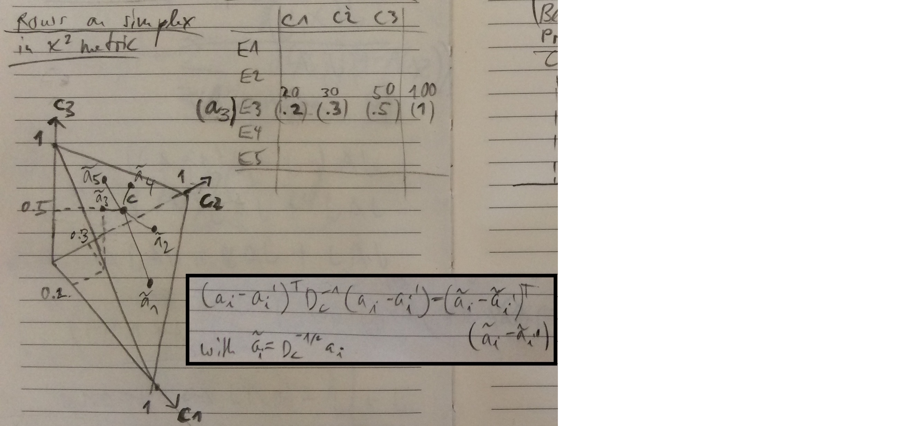

```{r setup, include=FALSE}
knitr::opts_chunk$set(echo = FALSE)
set.seed(1234)
```

## Test of Independence

* Observations are two measurements on the same subject (e.g. eye color and hair color)
* Random samples $(X_1,Y_1),\dots,(X_n,Y_n)$
* $X$ and $Y$ with different ranges $\{1,2,\dots,I\}$ and $\{1,2,\dots,J\}$
* Consider hyothesis test:
$$
\begin{align}
H_0: P(X=i,Y=j) & = P(X=i)P(Y=j) \text{ for all } i \text{ and } j \\
H_A: P(X=i,Y=j) & \ne P(X=i)P(Y=j) \text{ for some } i \text{ and } j 
\end{align}
$$
* Construct contingency table of $n$ observations 
$$O_{ij} = \#_{1 \le l \le n} \{ (X_l,Y_l) = (i,j) \}$$

## Test of Independence

Some definitions:

$$
\begin{align}
\text{Row sum:} & O_{i+} \\
\text{Column sum:} & O_{+ j} \\
\text{Total sum:} & O_{++} \\
\text{Row vector i:} & O_i \\
\text{Column vector j:} & O_j
\end{align}
$$

## Test of Independence {.build}

Expected frequencies under independence assumption are product of marginals
$$\widehat{E}_{ij} = O_{++} \frac{O_{i+}}{O_{++}} \frac{O_{+ j}}{O_{++}}$$
```{r}
library(ca)
HairEye = margin.table(HairEyeColor, c(1, 2)); HairEye
```

Test statistics $\chi^2 = \sum_i \sum_j \frac{(O_{ij}-\widehat{E}_{ij})^2}{\widehat{E}_{ij}}$

Asymptotically $\chi^2$ with $(I−1)(J−1)$ degrees of freedom

## Test of Independence

* This is a goodness-of-fit test
* Quantifies how well the independence model fits observations
* Measures discrepancy between observed values and expected values under the model
* Rather than reject this global null hypthesis, can we find what is driving the statistic?
* Can we visualize this?
* Two ways:
    * Visualization of contingency table with association and mosaic plots
    * Visualization of deviation from model with correspondence analysis

## Hair and Eye Color of Statistics Students

Survey of students at the University of Delaware reported by Snee (1974)
 
```{r}
HairEye = margin.table(HairEyeColor, c(1, 2))
```

```{r echo=TRUE}
HairEye
```

*Rows* hair color of 592 statistics students   
*Columns* eye color of the same 592 statistics students

## Hair and Eye Color of Statistics Students  {.build}

```{r echo=TRUE}
chisq.test(HairEye)
```

## Association Plots

* This is a followup on $\chi^2$ tests when they are rejected
* Pearson residuals
$$r_{ij} = \frac{O_{ij}-E_{ij}}{\sqrt{E_{ij}}}$$
* $\chi^2$ statistics is squaring and summing over all cells
$$\chi^2 = \sum_j \sum_i r_{ij}^2$$

## Association Plots

* Each cell of contingency table is represented by a rectangle encoding information in width, height, location, and color of the rectangle
* *Height:* Proportional to Pearson residual $\frac{O_{ij}-E_{ij}}{\sqrt{E_{ij}}}$
* *Width:*  Proportional to $\sqrt{E_{ij}}$
* *Area:* Proportional to $O_{ij}-E_{ij}$
* *Baseline:* 
    * If $O_{ij} > E_{ij}$, then rectanble above
    * otherwise rectangle below
* *Color:* Standardized Pearson residuals that are asymptotically standard normal

## Association Plots

```{r message=FALSE,fig.height=6}
library(vcd); assoc(HairEye,shade = TRUE)
```

## Mosaic Plots

* Cell frequency $O_{ij}$, cell probability $p_{ij} = O_{ij} / O_{++}$
* Take unit square
* Divide unit square vertically into rectangles 
    * *Height* proportional to observed marginal frequencies $O_{i+}$
    * which is proportional to marginal probabilities $p_i = O_{i+} / O_{++}$
* Subdivide resulting rectangles horizontally 
    * *Width* proportional to $p_{j|i} = O_{ij}/O_{i+}$
    * which is the conditional probabilities of the second variable given the first
* *Area* is proportional to the observed cell frequency and probability
$p_{ij} = p_{i} \times p_{j|i} = ( O_{i+}/O_{++} ) \times ( O_{ij} / O_{i+} )$

## Mosaic Plots

* The order of conditioning matters
* *Color:* Standardized Pearson residuals that are asymptotically standard normal

<!--
* Placing explanatory variable(s) first shows how the response(s) depend on them
-->

## Mosaic Plots

Marginal probabilities of first variable

```{r echo=TRUE}
frequency = rowSums(HairEye)
proportions = frequency/sum(frequency)
data.frame(frequency=round(frequency,0),proportions=round(proportions,2))
```

## Mosaic Plots

Marginal probabilities of second given first variable

```{r echo=TRUE}
HairEye/rowSums(HairEye)
```

## Mosaic Plots

```{r fig.height=6.5}
mosaic(HairEye,shade = TRUE)
```

## Mosaic Plots

If hair color and eye color were independent $p_{ij} =p_i \times p_j$, then then the tiles in each row would all align

<div class="columns-2">

```{r fig.height=5.5}
mosaic(HairEye,shade = TRUE)
```

```{r fig.height=5.5}
mosaic(chisq.test(HairEye)$expected,shade = TRUE)
```

</div>

## Correspondence Analysis

* Exploratory data analysis for non-negative data matrices
* Converts matrix into a plot where rows and columns are depicted as points
* Its algebraic form first appeared in 1935
* Actively developped in 1965 in France
* We focus on the application of correspondence analysis for contingency tables
* Analogous to principal components analysis, but appropriate to categorical rather than to continuous variables

## Correspondence Analysis

* Define a distance between rows
* Use the distance $d_{\chi^2}(\boldsymbol{x},\boldsymbol{y})$ between two vector $\boldsymbol{x}$ and $\boldsymbol{y}$ as
$$d_{\chi^2}(\boldsymbol{x},\boldsymbol{y}) = (\boldsymbol{x}-\boldsymbol{y})^T D_c^{-1} (\boldsymbol{x}-\boldsymbol{y})$$
* where $D_c$ is a diagonal matrix with 
$$\operatorname{diag}(D_c) = \boldsymbol{c} = \sum_i p_i \boldsymbol{a_i}$$
* with $\boldsymbol{a_i} = (p_{j|i})$ being the probability vector conditioned on row $i$
* and the *centroid* $\boldsymbol{c}$ being the weighted average of row probabilities

-----

```{r, out.height = 480, fig.retina = NULL, echo=FALSE}

```
Greenacre and Hastie (1987)  
The Geometric Interpretation of Correspondence Analysis

## Correspondence Analysis

* Compare $d_{\chi^2}(\boldsymbol{x},\boldsymbol{y})$ metric 
$$d_{\chi^2}(\boldsymbol{x},\boldsymbol{y}) = (\boldsymbol{x}-\boldsymbol{y})^T D_c^{-1} (\boldsymbol{x}-\boldsymbol{y})$$
* to $\chi^2$ statistic 
$$\chi^2 = O_{++} \sum_i p_i (\boldsymbol{a_i}-\boldsymbol{c})^T D_c^{-1} (\boldsymbol{a_i}-\boldsymbol{c})$$
* $\chi^2/O_{++}$ is weighted average of $d_{\chi^2}(\boldsymbol{a_i},\boldsymbol{c})$ distances of conditional row probabilities $\boldsymbol{a_i}$ to their row centroid $\boldsymbol{c}$

<!--
* It is the Mahalanobis metric between row vectors based on their estimated covariance matrix under the homogeneity assumption
-->

## Correspondence Analysis

* First "principle component" is best line fit trough cloud of conditional row probabilities
* Modify standard Principal Component Analysis (PCA) to incorporate point weights and weighted metric
* Use $p_i$ as weights, which provides decomposition of $\chi^2$ statistics into components
* After translating points to the origin $\boldsymbol{c}$, the best fit line is the principle eigenvector of matrix
$$\sum_i p_i (\boldsymbol{a_i} - \boldsymbol{c}) (\boldsymbol{a_i} - \boldsymbol{c})^T D_c^{-1}$$
* The trace of this matrix is equal to $\chi^2/O_{++}$

-----

```{r, out.height = 480, fig.retina = NULL, echo=FALSE}
knitr::include_graphics("GeometryCorrespondenceAnalysisProjection.JPG")
```
Greenacre and Hastie (1987)  
The Geometric Interpretation of Correspondence Analysis

## Correspondence Analysis

* Repeat same for column marginal proportions
* Can be done in one step by Generalized Singular Value Decomposition (GSVD)
$$D_r^{-1/2} \left( \left( p_{ij} \right) - \boldsymbol{r}\boldsymbol{c}^T \right) D_c^{-1/2} = X D_{\alpha} Y^T$$
with constrains $X^TX = Y^TY = \operatorname{Id}$
* Singular values are the square roots of the principal inertias $D_{\alpha} = D_{\lambda}^{1/2}$
* Principal axes of row $D_r^{1/2}Y$
* Principal axes of column $D_c^{1/2}X$

## Correspondence Analysis

* Row and column projection are usually displayed in same plot 
* Row-to-column distances are meaningless
* In standard PCA, principle components explain variance
* In CA, principle components explain devation from independence

<!--
* Principal inertia is the weighted average of $\chi^2$ distances from the centroid to the projections of the row/column marginal proportions
-->

<!--
## Correspondence Analysis {.smaller}

```{r}
library(ca)
ca.res = ca(HairEye); ca.res
```
-->

## Correspondence Analysis

```{r fig.width=10, fig.height=5}
plot(ca.res)
```

Color code: <span style="color:blue">Rows: Hair</span>, <span style="color:red">Columns: Eye</span>

## Mosaic Plots

```{r fig.height=6.5}
mosaic(HairEye,shade = TRUE)
```

## Mosaic Plots

```{r fig.height=6.5}
mosaic(t(HairEye),shade = TRUE)
```

## Test of Independence and Test of Homogeneity

* The null hypothesis of row-column independence: $p_{ij} = p_i \times p_j$
* is equivalent to the hypothesis of homogeneity of the rows: 
$$p_{j|i=1} = p_{j|i=2} = \dots = p_{j|i=I}$$
* Each row of $O$ follows a multinomial distribution
* Under homogeneity assumption, this distribution has common probability vector
* Maximum likelihood estimates of probability vector is equal to centroid $\boldsymbol{c}$
* Thus a significant $\chi^2$ is a significant deviation of rows from their centroid

## Test of Independence and Test of Homogeneity

* Several discrete random variables with same categories $1,\dots,I$
    * Test of homogeneity
    * Are the observations generated from one multinomial distribution with common probability vector?
    * Possibly different sample size among random variables
    * E.g. crime example, types of crimes (theft, fraud, etc.) commited by alcoholic and non-alcoholic criminals
* Two discrete random variables with different categories $1,\dots,I$ and $1,\dots,J$
    * Test of independence
    * Are the pairwise observations independent?
    * Paired random variables, so same sample size
    * E.g. hair color, eye color example
