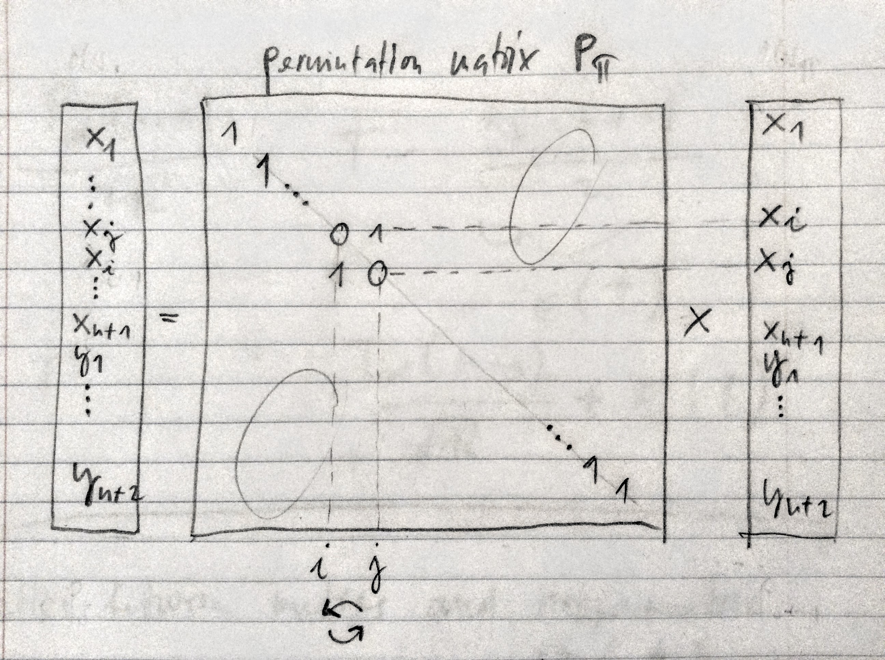

```{r setup, include=FALSE}
knitr::opts_chunk$set(echo = FALSE)
set.seed(1234)
```

## Two-Sample Problems

* Two populations
* From each population, we have one sample
* Infer whether or not there is a difference in location between populations
* Measure (with standard error) the difference (size of the effect) between populations
* Test: *Wilcoxon two-sample rank test*
* Estimation procedure: *Hodges–Lehmann estimate*

## Example

```{r message=FALSE,echo=TRUE}
library(HSAUR2); head(USmelanoma)
```

Data: Fisher and van Belle (1993) report mortality rates due to malignant melanoma of the skin for white males during the period 1950-1969, for each state on the US mainland

Mortality: Number of white males died due to malignant melanoma 1950-1969 per one million inhabitants

## Example

Question: Is there a difference in mortality for ocean states and non-ocean states?

```{r}
library(ggplot2)
ggplot(USmelanoma, aes(factor(ocean), mortality)) + geom_boxplot(width = 0.3)
```

## Wilcoxon for Stochastic Ordering of Alternatives

* Random sample $X_1,\dots,X_{n_1}$ with cdf $F$
* Random sample $Y_1,\dots,Y_{n_2}$ with cdf $G$
* Hypothesis test: $$H_0: F(t) = G(t) \hspace{1cm} \text{versus} \hspace{1cm} H_A: F(t) \le G(t)$$
* For the alternative, $X$ is stochastically larger than $Y$: $$\operatorname{P}(X > t) \ge \operatorname{P}(Y > t)$$

## Wilcoxon for Stochastic Ordering of Alternatives

```{r}
library(ggplot2)
library(reshape2)
t = seq(0,20,0.01)
df = data.frame(t=t,
                G=pgamma(t,shape = 9,scale = 0.5),
                F=pgamma(t,shape = 7.5,scale = 1))
df = melt(df,id = "t")
ggplot(data = df,aes(x=t,y=value,group=variable,colour=variable)) + geom_line(size=1)
```

## Wilcoxon for Stochastic Ordering of Alternatives

```{r}
df = data.frame(t=t,
                g=dgamma(t,shape = 9,scale = 0.5),
                f=dgamma(t,shape = 7.5,scale = 1))
df = melt(df,id = "t")
ggplot(data = df,aes(x=t,y=value,group=variable,colour=variable)) + geom_line(size=1)
```

## Wilcoxon for Stochastic Ordering of Alternatives

```{r}
t = seq(0,10,0.01)
df = data.frame(t=t,
                G=pnorm(t,mean = 3,sd = 0.7),
                F=pnorm(t,mean = 5,sd = 0.7))
df = melt(df,id = "t")
ggplot(data = df,aes(x=t,y=value,group=variable,colour=variable)) + geom_line(size=1)
```

## Wilcoxon for Stochastic Ordering of Alternatives

```{r}
df = data.frame(t=t,
                g=dnorm(t,mean = 3,sd = 0.7),
                f=dnorm(t,mean = 5,sd = 0.7))
df = melt(df,id = "t")
ggplot(data = df,aes(x=t,y=value,group=variable,colour=variable)) + geom_line(size=1)
```

## Wilcoxon for Stochastic Ordering of Alternatives

* Both samples are combined in one sample
* Combinded sample ranked from $1$ to $n = n_1+n_2$ (low to high)
* Denote $\operatorname{R}(Y_j)$ rank of observation $j$ in combined sample
* The Wilcoxon test statistics
$$ T = \sum_{j=1}^{n_2} \operatorname{R}(Y_j)$$
* $H_0$ is rejected for small values of $T$
* Under $H_0$ the two sample are from the same population:  
Any subset of ranks is equaliy likely as any other of the same size

## Wilcoxon for Stochastic Ordering of Alternatives

* For example, the probability that a subset of $n_2$ rankings is assigned to $Y$'s is $$\frac{1}{n \choose n_2}$$
* There is no mention of the population distribution, so this test is *distriubiton free*
* So $p$-value can be calculated exactly by looking at the distribution of $T$ or aproximated asymptotically in case of large $n_1+n_2$

## Wilcoxon for Stochastic Ordering of Alternatives Example

Data: Case-control study of esophageal cancer in Ile-et-Vilaine, France (Breslow et al. 1980)

Hypothesis: Alcohol consumption same in the two groups

```{r echo=TRUE}
library(datasets); data(esoph); head(esoph)
```

## Wilcoxon for Stochastic Ordering of Alternatives Example

```{r}
x = rep(esoph$alcgp,esoph$ncases)
y = rep(esoph$alcgp,esoph$ncontrols)
z = c(x,y)
w = c(rep(1,length(x)),rep(0,length(y)))
barplot(table(z,w),names.arg=c('Cases','Controls'), legend.text=levels(esoph$alcgp))
x = as.numeric(x)
y = as.numeric(y)
```

## Wilcoxon for Stochastic Ordering of Alternatives Example

```{r echo=TRUE}
wilcox.test(x,y,alternative = "greater")
```

Conclusion: Reject the null hypothesis in favor of the alternative that alcohol consumption is higher in participants who suffer from esophageal cancer

## Analyses for a Shift in Location

* Now for two-sample location problem
* The parameter $\Delta$, for $-\infty < \Delta < \infty$ is shift in location
$$ G(t) = F(t - \Delta) \hspace{1cm} \text{and} \hspace{1cm} g(t) = f(t - \Delta)$$
* For example, difference in means and medians
* Location model assume that the scale parameter of $X$ and $Y$ are the same (e.g. variance in normal distribution)

## Analyses for a Shift in Location

```{r}
df = data.frame(t=t,
                g=dnorm(t,mean = 3,sd = 0.7),
                f=dnorm(t,mean = 5,sd = 0.7))
df = melt(df,id = "t")
ggplot(data = df,aes(x=t,y=value,group=variable,colour=variable)) + geom_line(size=1)
```

## Analyses for a Shift in Location

* Random sample $X_1,\dots,X_{n_1}$ with cdf $F(t)$ and pdf $f(t)$
* Random sample $Y_1,\dots,Y_{n_2}$ with cdf $F(t-\Delta)$ and pdf $f(t-\Delta)$
* Hypothesis test: $$H_0: \Delta = 0 \hspace{1cm} \text{versus} \hspace{1cm} H_A: \Delta \ne 0$$
* Additionally, we can esimate $\widehat{\Delta}$ and form confidence intervals

## Analyses for a Shift in Location

* Wilcoxon test statistics (same as before):
$$ T = \sum_{j=1}^{n_2} \operatorname{R}(Y_j)$$
among the combined samples $X_1,\dots,X_{n1},Y_1,\dots,Y_{n2}$
* Mann–Whitney test statistic (equivalent):
$$ T^+ = \#_{i,j}\{ X_i < Y_j \} $$
among $n_1 n_2$ possible pairs
* Relating the two:
$$ T^+ = T + \frac{n_2(n_2+1)}{2}$$

<!--
* Ties are assigned the average of the ranks of tied observations
-->

## Equivalence between $T$ and $T^+$

* Show that $T^+ = T + \frac{n_2(n_2+1)}{2}$
* Rank of $Y_j$ is equal to the number of $X$'s less than $Y_j$  
plus the number of $Y$'s less than $Y_j$ plus one
$$ \operatorname{R}(Y_j) = \#_i\{ X_i < Y_j \} + \#_{j'}\{ Y_{j'} < Y_j \} + 1 $$
* Substituting in $T = \sum_{j=1}^{n_2} \operatorname{R}(Y_j)$ gives
$$ T^+ = \#_{j,i}\{ X_i < Y_j \} + \#_{j,j'}\{ Y_{j'} < Y_j \} + n_2 $$
* First term is $T$
* Second term is $\{0 + 1 + 2 + \dots + n_2 - 1\} + n_2 = \frac{n_2(n_2+1)}{2}$

## Analyses for a Shift in Location Example

$t$-distribution with 5 degrees of freedom and  
a true shift parameter $\Delta$ was set at the value $8$ 
```{r echo=TRUE}
n1 = 42
n2 = 50
trails = 10
x = round(rt(11,5)*trails+n1,1)
y = round(rt(9,5)*trails+n2,1)
sort(x)
sort(y)
```

## Analyses for a Shift in Location Example

Use exact null distribution of $T+$:
```{r echo=TRUE}
wilcox.test(x,y,exact=TRUE,correct=TRUE)
```

## Analyses for a Shift in Location Example

Use asymptotics: 
```{r echo=TRUE}
wilcox.test(x,y,exact=FALSE,correct=FALSE)
```

<!--
## Asymptotic Distribution of $T$

Show that 
$$\operatorname{E}(T) = \frac{n_2(n+1)}{2} $$
$$\operatorname{Var}(T) = \frac{n_1 n_2 (n+1)}{12}$$

TODO: page 125, comment 6 in red book
-->

## Permutations and Mann-Whitney

* Rank all $n_1+n_2$ observations
* Color the first sample red and the second sample blue 
* Count how many moves it takes to unscramble the two populations
* *Moves:* pairwise adjacent transpositions
* *Unscrable:* bring all the reds to the left
* Few moves, things were pretty well sorted, we have grounds for believing the numbers were drawn from different populations
* If observations were drawn from the same population, they should be well intermingled and require many moves to unscramble
* This test which is equivalent to the popular Mann Whitney statistic
* Reference: Critchlow (1986), *A Unified Approach to Constructing Nonparametric Rank Tests* [(Link)](https://statistics.stanford.edu/research/unified-approach-constructing-nonparametric-rank-tests)

-----

```{r, out.height = 550, fig.retina = NULL, echo=FALSE}

```
